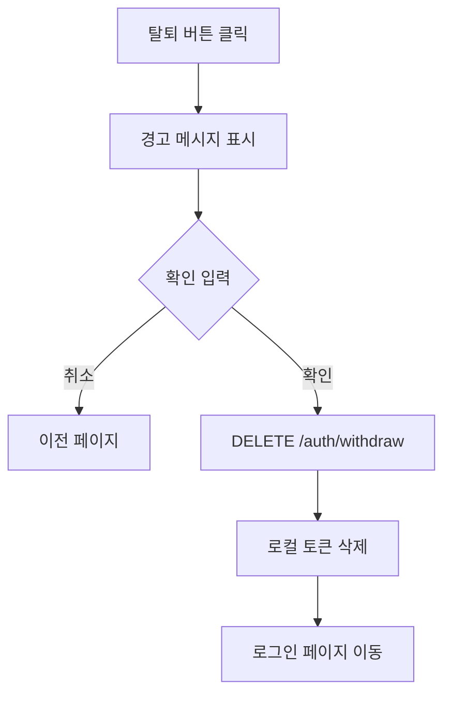

# 회원 탈퇴


💡 User가 자신의 계정을 삭제하여 서비스에서 탈퇴할 수 있습니다.


## 개요

회원 탈퇴(Withdraw)는 User가 자신의 계정을 삭제하는 기능입니다. 탈퇴하면 세션이 종료되고 인증 정보가 삭제됩니다.

***

## 회원 탈퇴

### DELETE /v1/auth/withdraw



```bash
curl -X DELETE https://api-client.bkend.ai/v1/auth/withdraw \
  -H "Authorization: Bearer {accessToken}" \
  -H "X-Project-Id: {project_id}" \
  -H "X-Environment: dev"
```


```javascript
const response = await fetch('https://api-client.bkend.ai/v1/auth/withdraw', {
  method: 'DELETE',
  headers: {
    'Authorization': `Bearer ${accessToken}`,
    'X-Project-Id': '{project_id}',
    'X-Environment': 'dev',
  },
});

if (response.ok) {
  // 로컬 토큰 삭제 및 로그인 페이지로 이동
  localStorage.removeItem('accessToken');
  localStorage.removeItem('refreshToken');
  window.location.href = '/login';
}
```




🚨 **위험** — 회원 탈퇴는 되돌릴 수 없습니다. 탈퇴 전에 User에게 확인을 요청하세요.


***

## 탈퇴 시 처리 사항

| 항목 | 처리 |
|------|------|
| 세션 | 모든 활성 세션 종료 |
| 토큰 | Access Token, Refresh Token 무효화 |
| 연동 계정 | 소셜 로그인 연결 해제 |
| 사용자 데이터 | 소프트 삭제 처리 |

***

## 탈퇴 확인 UI 구현 권장

탈퇴 기능을 구현할 때는 다음과 같은 확인 단계를 추가하는 것이 좋습니다.



***

## 에러 응답

| 에러 코드 | HTTP | 설명 |
|----------|:----:|------|
| `auth/unauthorized` | 401 | 인증이 필요함 |

***

## 다음 단계

- [이메일 회원가입](02-email-signup.md) — 새 계정 생성
- [세션 관리](10-session-management.md) — 세션 종료
- [인증 시스템 개요](01-overview.md) — 인증 흐름 이해
