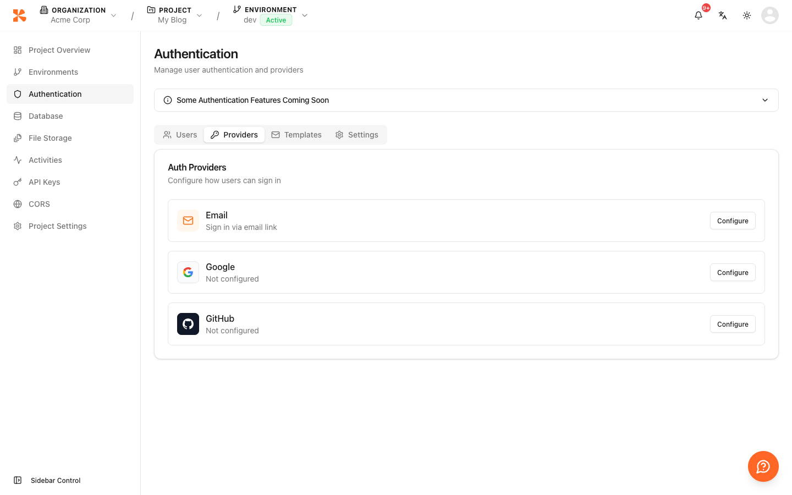

# 인증 제공자 설정


💡 이메일 인증 정책과 OAuth 제공자(Google, GitHub)를 프로젝트별로 설정하세요.


## 개요

인증 제공자 설정은 프로젝트의 인증 방식을 관리하는 기능입니다. 비밀번호 정책, 매직 링크 활성화 여부, OAuth 제공자별 Client ID/Secret 등을 설정할 수 있습니다.


⚠️ 제공자 설정은 관리 작업입니다. **콘솔** 또는 **MCP 도구**를 사용하여 설정하세요. 클라이언트 앱에서 직접 호출할 수 있는 API가 아닙니다.


***

## 이메일 인증 설정

이메일 기반 인증의 비밀번호 정책과 매직 링크 설정을 관리합니다.





✅ **AI에게 이렇게 말해보세요**
"현재 이메일 인증 설정을 보여줘."



✅ **AI에게 이렇게 말해보세요**
"비밀번호 정책을 최소 10자, 대소문자/숫자/특수문자 필수로 변경하고, 매직 링크를 30분 만료로 활성화해줘."





1. 콘솔에서 프로젝트로 이동하세요
2. **Authentication** > **Providers**로 이동하세요
3. **Email** 제공자를 선택하세요
4. 비밀번호 정책과 매직 링크 설정을 구성하세요
5. **Save**를 클릭하세요

<!-- 📸 IMG: 이메일 제공자 설정 화면 -->
<figure><figcaption></figcaption></figure>




### 비밀번호 정책 파라미터

| 파라미터 | 타입 | 설명 |
|---------|------|------|
| `minLength` | `number` | 최소 비밀번호 길이 |
| `requireUppercase` | `boolean` | 대문자 필수 |
| `requireLowercase` | `boolean` | 소문자 필수 |
| `requireNumbers` | `boolean` | 숫자 필수 |
| `requireSpecialChars` | `boolean` | 특수문자 필수 |
| `expirationDays` | `number` | 비밀번호 만료 기간 (일, 선택) |

### 매직 링크 파라미터

| 파라미터 | 타입 | 설명 |
|---------|------|------|
| `magicLinkEnabled` | `boolean` | 매직 링크 활성화 여부 |
| `magicLinkExpirationMinutes` | `number` | 링크 만료 시간 (분) |

***

## OAuth 제공자 설정

소셜 로그인을 위한 OAuth 제공자(Google, GitHub)의 Client ID와 Secret을 설정합니다.





✅ **AI에게 이렇게 말해보세요**
"현재 OAuth 제공자 설정을 보여줘."



✅ **AI에게 이렇게 말해보세요**
"Google OAuth를 client ID 'xxx', client secret 'yyy'로 설정해줘. openid, email, profile 스코프로 활성화해줘."



✅ **AI에게 이렇게 말해보세요**
"GitHub OAuth 설정을 삭제해줘."





### OAuth 제공자 추가 또는 수정

1. 콘솔에서 프로젝트로 이동하세요
2. **Authentication** > **Providers**로 이동하세요
3. OAuth 제공자(예: **Google**, **GitHub**)를 선택하세요
4. 해당 제공자의 개발자 콘솔에서 발급받은 **Client ID**와 **Client Secret**을 입력하세요
5. **Redirect URI**가 올바른지 확인하세요
6. **Enabled**를 활성화하세요
7. **Save**를 클릭하세요

### OAuth 제공자 삭제

1. **Authentication** > **Providers**로 이동하세요
2. 삭제할 OAuth 제공자를 선택하세요
3. **Delete**를 클릭하고 확인하세요




### OAuth 파라미터

| 파라미터 | 타입 | 필수 | 설명 |
|---------|------|:----:|------|
| `clientId` | `string` | ✅ | OAuth Client ID |
| `clientSecret` | `string` | ✅ | OAuth Client Secret (암호화 저장) |
| `redirectUri` | `string` | ✅ | 콜백 URL |
| `scopes` | `string[]` | ✅ | 요청 권한 범위 |
| `enabled` | `boolean` | ✅ | 활성화 여부 |


💡 보안을 위해 `clientSecret`은 응답에 포함되지 않습니다. 설정 또는 수정만 가능합니다.


***

## 에러 응답

| 에러 코드 | HTTP | 설명 |
|----------|:----:|------|
| `auth/unauthorized` | 401 | 인증이 필요함 |
| `auth/unsupported-provider` | 400 | 지원하지 않는 제공자 |
| `auth/oauth-not-configured` | 400 | OAuth 설정이 완료되지 않음 |

***

## 다음 단계

- [Google OAuth](06-social-google.md) — Google 로그인 구현
- [GitHub OAuth](07-social-github.md) — GitHub 로그인 구현
- [이메일 템플릿](18-email-templates.md) — 인증 이메일 커스터마이징
