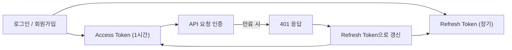
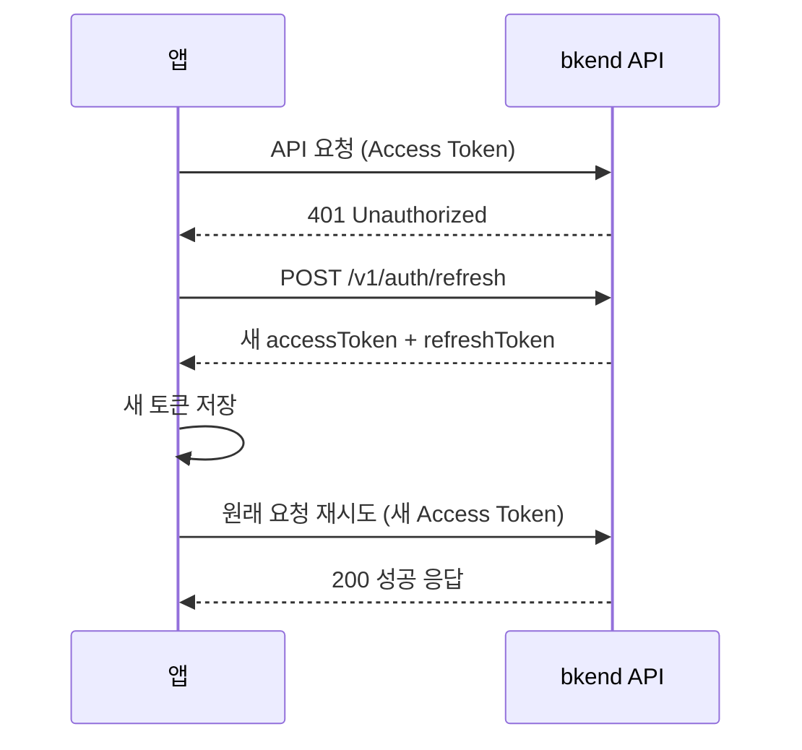
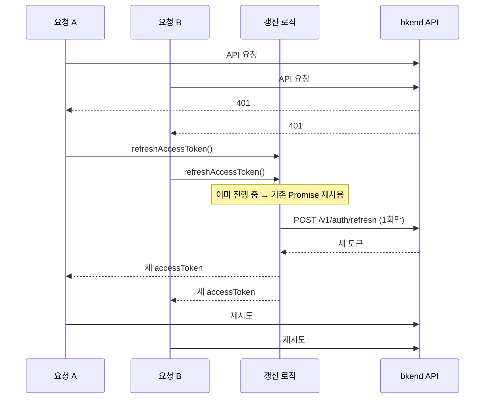

# 토큰 저장 및 갱신


💡 Access Token과 Refresh Token을 안전하게 저장하고, 만료 시 자동으로 갱신하는 방법을 알아보세요.


## 개요

bkend 인증은 JWT 기반의 Access Token / Refresh Token 쌍을 사용합니다. Access Token은 API 요청 인증에 사용되며 1시간(3600초) 후 만료됩니다. 만료된 Access Token은 Refresh Token으로 갱신할 수 있습니다.

이 문서에서는 토큰 저장 위치, 자동 갱신 로직, 로그아웃 시 토큰 정리, 그리고 이 모든 것을 하나의 fetch 래퍼 함수로 구현하는 방법을 다룹니다.

***

## 토큰 구조



| 토큰 | 용도 | 만료 |
|------|------|------|
| `accessToken` | API 요청의 `Authorization` 헤더에 사용 | 3600초 (1시간) |
| `refreshToken` | 만료된 Access Token 갱신 | 장기 (서버 설정에 따라 다름) |

***

## 토큰 저장

로그인 또는 회원가입 성공 시 반환되는 토큰을 저장하세요.

```javascript
function saveTokens({ accessToken, refreshToken }) {
  localStorage.setItem('accessToken', accessToken);
  localStorage.setItem('refreshToken', refreshToken);
}

function getAccessToken() {
  return localStorage.getItem('accessToken');
}

function getRefreshToken() {
  return localStorage.getItem('refreshToken');
}
```


⚠️ `localStorage`는 XSS(Cross-Site Scripting) 공격에 취약할 수 있습니다. 프로덕션 환경에서는 다음 사항을 반드시 지키세요:
- 사용자 입력을 HTML에 직접 삽입하지 마세요.
- 신뢰할 수 없는 서드파티 스크립트를 삽입하지 마세요.
- Content Security Policy(CSP) 헤더를 설정하세요.


***

## 토큰 갱신 API

### POST /v1/auth/refresh

Access Token이 만료되었을 때 Refresh Token으로 새 토큰 쌍을 발급받습니다.



```bash
curl -X POST https://api-client.bkend.ai/v1/auth/refresh \
  -H "Content-Type: application/json" \
  -H "X-Project-Id: {project_id}" \
  -H "X-Environment: dev" \
  -d '{
    "refreshToken": "{refresh_token}"
  }'
```


```javascript
const response = await fetch('https://api-client.bkend.ai/v1/auth/refresh', {
  method: 'POST',
  headers: {
    'Content-Type': 'application/json',
    'X-Project-Id': '{project_id}',
    'X-Environment': 'dev',
  },
  body: JSON.stringify({
    refreshToken: localStorage.getItem('refreshToken'),
  }),
});

const { accessToken, refreshToken } = await response.json();
saveTokens({ accessToken, refreshToken });
```



| 파라미터 | 타입 | 필수 | 설명 |
|---------|------|:----:|------|
| `refreshToken` | `string` | ✅ | JWT Refresh Token |

**성공 응답:**

```json
{
  "accessToken": "eyJhbGciOiJIUzI1NiIs...",
  "refreshToken": "eyJhbGciOiJIUzI1NiIs...",
  "tokenType": "Bearer",
  "expiresIn": 3600
}
```


🚨 **Refresh Token 회전 정책** — 토큰 갱신 시 새 Refresh Token이 발급되며, 이전 Refresh Token은 즉시 무효화됩니다. 반드시 새 토큰 쌍을 저장하세요.


***

## 자동 갱신 로직

API 요청 중 `401` 응답을 받으면 자동으로 토큰을 갱신하고 원래 요청을 재시도하는 패턴입니다.



### bkendFetch 래퍼 함수

아래 함수는 모든 API 요청에 인증 헤더를 자동으로 추가하고, 토큰 만료 시 갱신 후 재시도합니다. 앱 전체에서 `fetch` 대신 이 함수를 사용하세요.


💡 `bkendFetch`의 프로젝트 설정 및 초기화 방법은 [앱에서 bkend 연동하기](../getting-started/06-app-integration.md)를 참고하세요.


```javascript
const BKEND_BASE_URL = 'https://api-client.bkend.ai';
const PROJECT_ID = '{project_id}';
const ENVIRONMENT = 'dev';

// 토큰 갱신 중복 방지
let refreshPromise = null;

async function refreshAccessToken() {
  // 이미 갱신 중이면 기존 Promise 재사용
  if (refreshPromise) return refreshPromise;

  refreshPromise = (async () => {
    const refreshToken = getRefreshToken();
    if (!refreshToken) {
      throw new Error('Refresh Token이 없습니다.');
    }

    const response = await fetch(`${BKEND_BASE_URL}/v1/auth/refresh`, {
      method: 'POST',
      headers: {
        'Content-Type': 'application/json',
        'X-Project-Id': PROJECT_ID,
        'X-Environment': ENVIRONMENT,
      },
      body: JSON.stringify({ refreshToken }),
    });

    if (!response.ok) {
      clearTokens();
      throw new Error('토큰 갱신에 실패했습니다.');
    }

    const tokens = await response.json();
    saveTokens(tokens);
    return tokens.accessToken;
  })();

  try {
    return await refreshPromise;
  } finally {
    refreshPromise = null;
  }
}

async function bkendFetch(path, options = {}) {
  const url = `${BKEND_BASE_URL}${path}`;

  const headers = {
    'Content-Type': 'application/json',
    'X-Project-Id': PROJECT_ID,
    'X-Environment': ENVIRONMENT,
    ...options.headers,
  };

  const accessToken = getAccessToken();
  if (accessToken) {
    headers['Authorization'] = `Bearer ${accessToken}`;
  }

  // 첫 번째 요청
  let response = await fetch(url, { ...options, headers });

  // 401이면 토큰 갱신 후 재시도
  if (response.status === 401 && getRefreshToken()) {
    try {
      const newToken = await refreshAccessToken();
      headers['Authorization'] = `Bearer ${newToken}`;
      response = await fetch(url, { ...options, headers });
    } catch (error) {
      // 갱신 실패 → 로그인 페이지로 이동
      window.location.href = '/login';
      throw error;
    }
  }

  return response;
}
```

### 사용 예시

```javascript
// GET 요청
const me = await bkendFetch('/v1/auth/me');
const user = await me.json();

// POST 요청
const result = await bkendFetch('/v1/data/{table_name}', {
  method: 'POST',
  body: JSON.stringify({ name: '새 항목' }),
});
```

***

## 동시 요청 처리

여러 API 요청이 동시에 `401`을 받을 경우, 토큰 갱신이 중복으로 발생할 수 있습니다. 위 `bkendFetch` 구현에서는 `refreshPromise` 변수로 이를 방지합니다.



***

## 로그아웃

로그아웃 시 서버 측 세션을 종료하고 로컬 토큰을 삭제하세요.

### POST /v1/auth/signout

```bash
curl -X POST https://api-client.bkend.ai/v1/auth/signout \
  -H "Authorization: Bearer {accessToken}" \
  -H "X-Project-Id: {project_id}" \
  -H "X-Environment: dev"
```

### 로그아웃 구현

```javascript
function clearTokens() {
  localStorage.removeItem('accessToken');
  localStorage.removeItem('refreshToken');
}

async function signOut() {
  try {
    await bkendFetch('/v1/auth/signout', { method: 'POST' });
  } finally {
    // API 호출 실패 여부와 관계없이 로컬 토큰 삭제
    clearTokens();
    window.location.href = '/login';
  }
}
```


⚠️ 로그아웃 시 반드시 서버 API를 호출한 뒤 로컬 토큰을 삭제하세요. 서버 호출 없이 로컬 토큰만 삭제하면 Refresh Token이 서버에 유효한 상태로 남아 있을 수 있습니다.


***

## 에러 응답

| 에러 코드 | HTTP | 설명 |
|----------|:----:|------|
| `auth/unauthorized` | 401 | 인증이 필요함 |
| `auth/invalid-token` | 401 | 토큰이 유효하지 않음 |
| `auth/token-expired` | 401 | Refresh Token이 만료됨 |

***

## 다음 단계

- [인증 폼 구현 패턴](21-auth-form-patterns.md) — 회원가입/로그인 폼 구현
- [세션 관리](10-session-management.md) — 세션 목록 조회 및 원격 종료
- [보안 모범 사례](../security/07-best-practices.md) — 토큰 보안 권장 사항
