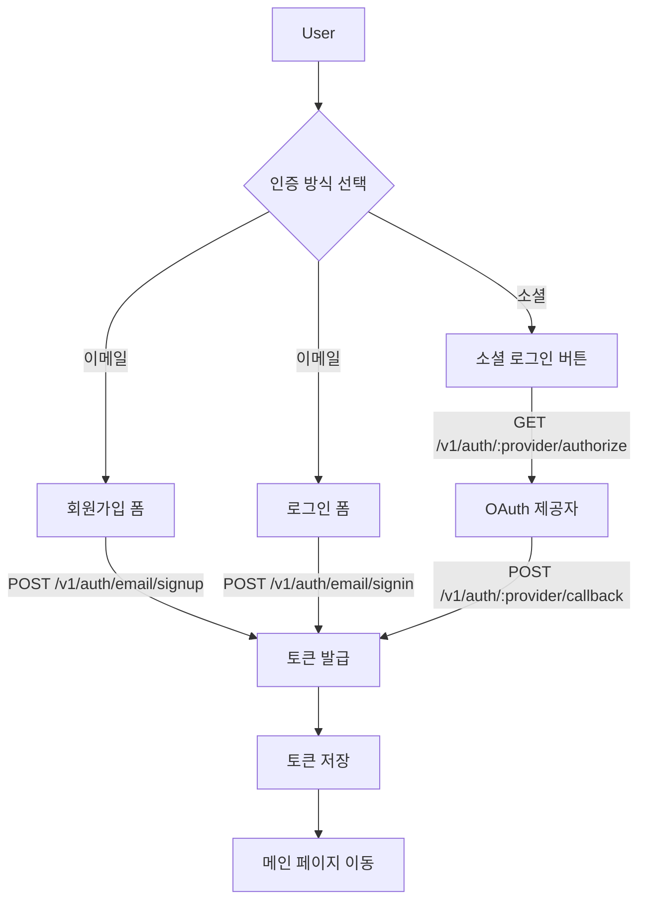
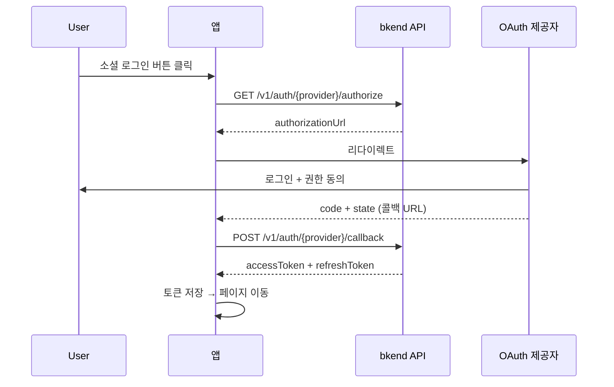
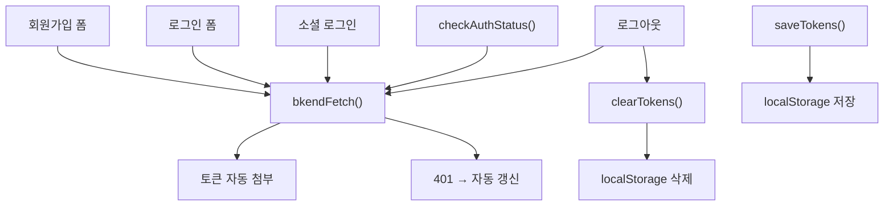

# 인증 폼 구현 패턴


💡 회원가입, 로그인, 소셜 로그인 폼을 JavaScript로 구현하는 실전 패턴을 알아보세요.


## 개요

이 문서에서는 프레임워크에 의존하지 않는 순수 JavaScript 기반의 인증 폼 구현 패턴을 다룹니다. React, Vue, Svelte 등 어떤 프레임워크에서든 동일한 API 호출 로직을 적용할 수 있습니다.

모든 예제는 `bkendFetch` 래퍼 함수가 앱에 설정되어 있다고 가정합니다. 설정 방법은 [토큰 저장 및 갱신](20-token-management.md)을 참고하세요.

***

## 인증 흐름 요약



***

## 회원가입 폼

### POST /v1/auth/email/signup

이메일, 비밀번호, 이름을 입력받아 새 User 계정을 생성합니다.

### HTML 구조

```html
<form id="signup-form">
  <input type="text" name="name" placeholder="이름" required />
  <input type="email" name="email" placeholder="이메일" required />
  <input type="password" name="password" placeholder="비밀번호 (8자 이상)" required />
  <button type="submit">회원가입</button>
  <p id="signup-error" style="color: red;"></p>
</form>
```

### JavaScript 구현

```javascript
const signupForm = document.getElementById('signup-form');
const signupError = document.getElementById('signup-error');

signupForm.addEventListener('submit', async (e) => {
  e.preventDefault();
  signupError.textContent = '';

  const formData = new FormData(signupForm);
  const name = formData.get('name');
  const email = formData.get('email');
  const password = formData.get('password');

  try {
    const response = await bkendFetch('/v1/auth/email/signup', {
      method: 'POST',
      body: JSON.stringify({
        method: 'password',
        email,
        password,
        name,
      }),
    });

    if (!response.ok) {
      const { error } = await response.json();
      throw error;
    }

    const { accessToken, refreshToken } = await response.json();
    saveTokens({ accessToken, refreshToken });

    // 회원가입 성공 → 메인 페이지로 이동
    window.location.href = '/';
  } catch (error) {
    signupError.textContent = getSignupErrorMessage(error.code);
  }
});

function getSignupErrorMessage(code) {
  const messages = {
    'auth/invalid-email': '올바른 이메일 주소를 입력하세요.',
    'auth/invalid-password-format': '비밀번호는 8자 이상이어야 합니다.',
    'auth/email-already-exists': '이미 가입된 이메일입니다.',
  };
  return messages[code] || '회원가입에 실패했습니다. 다시 시도하세요.';
}
```

### 요청 파라미터

| 파라미터 | 타입 | 필수 | 설명 |
|---------|------|:----:|------|
| `method` | `string` | ✅ | `"password"` 고정 |
| `email` | `string` | ✅ | 사용자 이메일 주소 |
| `password` | `string` | ✅ | 비밀번호 (최소 8자) |
| `name` | `string` | ✅ | 사용자 이름 |

### 에러 처리

| 에러 코드 | HTTP | 설명 | 사용자 메시지 예시 |
|----------|:----:|------|-----------------|
| `auth/invalid-email` | 400 | 이메일 형식 오류 | "올바른 이메일 주소를 입력하세요." |
| `auth/invalid-password-format` | 400 | 비밀번호 정책 위반 | "비밀번호는 8자 이상이어야 합니다." |
| `auth/email-already-exists` | 409 | 이미 등록된 이메일 | "이미 가입된 이메일입니다." |

***

## 로그인 폼

### POST /v1/auth/email/signin

등록된 이메일과 비밀번호로 로그인합니다.

### HTML 구조

```html
<form id="signin-form">
  <input type="email" name="email" placeholder="이메일" required />
  <input type="password" name="password" placeholder="비밀번호" required />
  <button type="submit">로그인</button>
  <p id="signin-error" style="color: red;"></p>
</form>
```

### JavaScript 구현

```javascript
const signinForm = document.getElementById('signin-form');
const signinError = document.getElementById('signin-error');

signinForm.addEventListener('submit', async (e) => {
  e.preventDefault();
  signinError.textContent = '';

  const formData = new FormData(signinForm);
  const email = formData.get('email');
  const password = formData.get('password');

  try {
    const response = await bkendFetch('/v1/auth/email/signin', {
      method: 'POST',
      body: JSON.stringify({
        method: 'password',
        email,
        password,
      }),
    });

    if (!response.ok) {
      const { error } = await response.json();
      throw error;
    }

    const { accessToken, refreshToken } = await response.json();
    saveTokens({ accessToken, refreshToken });

    // 로그인 성공 → 메인 페이지로 이동
    window.location.href = '/';
  } catch (error) {
    signinError.textContent = getSigninErrorMessage(error.code);
  }
});

function getSigninErrorMessage(code) {
  const messages = {
    'auth/invalid-email': '올바른 이메일 주소를 입력하세요.',
    'auth/invalid-credentials': '이메일 또는 비밀번호가 올바르지 않습니다.',
    'auth/mfa-required': 'MFA 인증이 필요합니다.',
    'auth/account-banned': '이용이 정지된 계정입니다.',
  };
  return messages[code] || '로그인에 실패했습니다. 다시 시도하세요.';
}
```

### 에러 처리

| 에러 코드 | HTTP | 설명 | 사용자 메시지 예시 |
|----------|:----:|------|-----------------|
| `auth/invalid-email` | 400 | 이메일 형식 오류 | "올바른 이메일 주소를 입력하세요." |
| `auth/invalid-credentials` | 401 | 이메일 또는 비밀번호 불일치 | "이메일 또는 비밀번호가 올바르지 않습니다." |
| `auth/mfa-required` | 403 | MFA 코드 필요 | "MFA 인증이 필요합니다." |
| `auth/account-banned` | 403 | 정지된 계정 | "이용이 정지된 계정입니다." |


⚠️ 보안을 위해 "이메일이 존재하지 않습니다"와 "비밀번호가 틀렸습니다"를 구분하지 마세요. `auth/invalid-credentials` 에러에는 "이메일 또는 비밀번호가 올바르지 않습니다"처럼 통합된 메시지를 표시하세요.


***

## 소셜 로그인

### OAuth 흐름

소셜 로그인은 리다이렉트 기반 OAuth 흐름을 따릅니다.



### 소셜 로그인 버튼

```html
<div id="social-login">
  <button onclick="socialLogin('google')">Google로 계속하기</button>
  <button onclick="socialLogin('github')">GitHub로 계속하기</button>
</div>
```

```javascript
async function socialLogin(provider) {
  try {
    const redirectUrl = encodeURIComponent(window.location.origin + '/auth/callback');

    const response = await bkendFetch(
      `/v1/auth/${provider}/authorize?redirect=${redirectUrl}`
    );

    if (!response.ok) {
      const { error } = await response.json();
      throw error;
    }

    const { authorizationUrl } = await response.json();

    // OAuth 제공자 페이지로 이동
    window.location.href = authorizationUrl;
  } catch (error) {
    alert('소셜 로그인을 시작할 수 없습니다. 다시 시도하세요.');
  }
}
```

### 콜백 페이지 구현

OAuth 제공자에서 인증이 완료되면 콜백 URL(`/auth/callback`)로 리다이렉트됩니다. 이 페이지에서 authorization code를 bkend API에 전달하여 토큰을 발급받으세요.

```javascript
// /auth/callback 페이지에서 실행
async function handleOAuthCallback() {
  const urlParams = new URLSearchParams(window.location.search);
  const code = urlParams.get('code');
  const state = urlParams.get('state');
  const provider = detectProvider(); // URL 경로 또는 state에서 provider 추출

  if (!code) {
    window.location.href = '/login?error=oauth-failed';
    return;
  }

  try {
    const response = await bkendFetch(`/v1/auth/${provider}/callback`, {
      method: 'POST',
      body: JSON.stringify({ code, state }),
    });

    if (!response.ok) {
      const { error } = await response.json();
      throw error;
    }

    const { accessToken, refreshToken, is_new_user } = await response.json();
    saveTokens({ accessToken, refreshToken });

    if (is_new_user) {
      // 신규 User → 온보딩 페이지
      window.location.href = '/onboarding';
    } else {
      // 기존 User → 메인 페이지
      window.location.href = '/';
    }
  } catch (error) {
    window.location.href = '/login?error=oauth-failed';
  }
}

// 페이지 로드 시 자동 실행
handleOAuthCallback();
```

### 소셜 로그인 에러 처리

| 에러 코드 | HTTP | 설명 |
|----------|:----:|------|
| `auth/unsupported-provider` | 400 | 지원하지 않는 OAuth 제공자 |
| `auth/oauth-not-configured` | 400 | OAuth 설정이 완료되지 않음 |
| `auth/invalid-oauth-code` | 401 | authorization code가 유효하지 않음 |
| `auth/oauth-callback-failed` | 500 | OAuth 콜백 처리 실패 |

***

## 로그인 상태 확인

### GET /v1/auth/me

페이지 로드 시 현재 로그인 상태를 확인하여 인증 여부에 따라 UI를 분기합니다.

```javascript
async function checkAuthStatus() {
  const accessToken = getAccessToken();
  if (!accessToken) {
    return null;
  }

  try {
    const response = await bkendFetch('/v1/auth/me');

    if (!response.ok) {
      return null;
    }

    return await response.json();
  } catch (error) {
    return null;
  }
}

// 페이지 로드 시 실행
async function initApp() {
  const user = await checkAuthStatus();

  if (user) {
    // 로그인 상태 → 메인 UI 표시
    showMainContent(user);
  } else {
    // 비로그인 상태 → 로그인 페이지로 이동
    window.location.href = '/login';
  }
}
```

**응답 예시:**

```json
{
  "id": "550e8400-e29b-41d4-a716-446655440000",
  "role": "user",
  "name": "홍길동",
  "email": "user@example.com",
  "emailVerified": "2025-01-15T09:30:00.000Z",
  "image": "https://example.com/avatar.jpg",
  "onboardingStatus": "completed",
  "createdAt": "2025-01-01T00:00:00.000Z"
}
```

***

## 전체 구조 예시

인증 관련 코드를 하나의 모듈로 구성하면 다음과 같습니다.



```javascript
// auth.js — 인증 유틸리티 모듈

// ── 토큰 저장/조회 ──
function saveTokens({ accessToken, refreshToken }) {
  localStorage.setItem('accessToken', accessToken);
  localStorage.setItem('refreshToken', refreshToken);
}

function getAccessToken() {
  return localStorage.getItem('accessToken');
}

function getRefreshToken() {
  return localStorage.getItem('refreshToken');
}

function clearTokens() {
  localStorage.removeItem('accessToken');
  localStorage.removeItem('refreshToken');
}

// ── 로그아웃 ──
async function signOut() {
  try {
    await bkendFetch('/v1/auth/signout', { method: 'POST' });
  } finally {
    clearTokens();
    window.location.href = '/login';
  }
}

// ── 로그인 상태 확인 ──
async function checkAuthStatus() {
  const accessToken = getAccessToken();
  if (!accessToken) return null;

  try {
    const response = await bkendFetch('/v1/auth/me');
    if (!response.ok) return null;
    return await response.json();
  } catch {
    return null;
  }
}
```


💡 `bkendFetch` 함수의 전체 구현은 [토큰 저장 및 갱신](20-token-management.md)에서 확인하세요.


***

## 다음 단계

- [토큰 저장 및 갱신](20-token-management.md) — `bkendFetch` 래퍼 함수 구현
- [비밀번호 관리](08-password-management.md) — 비밀번호 재설정 폼
- [다중 인증 (MFA)](11-mfa.md) — MFA 코드 입력 폼
- [소셜 계정 연동](12-account-linking.md) — 기존 계정에 소셜 로그인 추가
