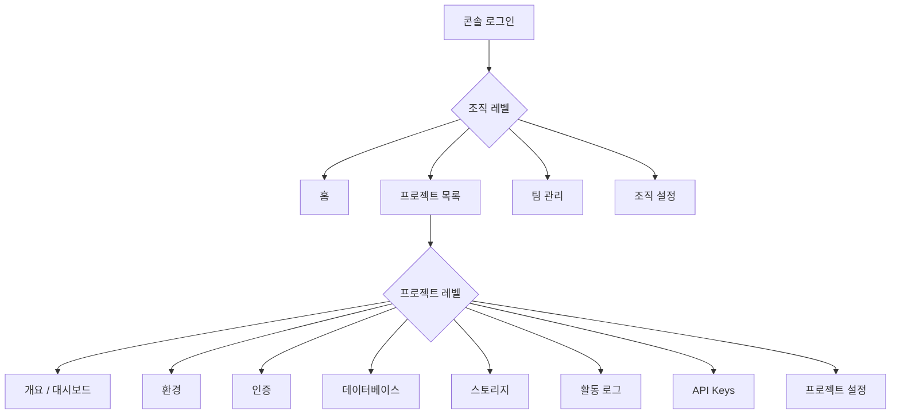

# 콘솔 개요


💡 bkend 콘솔은 프로젝트, 데이터베이스, 인증, 스토리지를 시각적으로 관리하는 웹 기반 관리 도구입니다.


## 개요

bkend 콘솔(`https://console.bkend.ai`)에서 Organization, Project, Environment를 관리하고, 테이블 설계, 인증 설정, API Key 발급 등 모든 설정 작업을 수행합니다.

***

## 콘솔 구조

콘솔은 **조직 레벨**과 **프로젝트 레벨** 두 단계로 구성됩니다.

***

## 조직 레벨 메뉴

조직을 선택하면 다음 메뉴를 사용할 수 있습니다.

| 메뉴 | 설명 | 문서 |
|------|------|------|
| **홈** | 조직 대시보드 | 이 문서 |
| **프로젝트** | 프로젝트 목록 및 생성 | [프로젝트 관리](04-project-management.md) |
| **팀** | 팀원 초대 및 역할 관리 | [팀원 관리](06-team-management.md) |
| **조직 설정** | 조직 이름, 결제, 삭제 | [조직 관리](03-org-management.md) |

***

## 프로젝트 레벨 메뉴

프로젝트를 선택하면 다음 메뉴를 사용할 수 있습니다.

| 메뉴 | 설명 | 문서 |
|------|------|------|
| **프로젝트 개요** | 프로젝트 대시보드, 통계 | [대시보드](10-dashboard.md) |
| **환경** | dev/staging/prod 환경 관리 | [환경 관리](05-environment.md) |
| **인증** | 인증 제공자, 사용자 목록 | [인증 개요](../authentication/01-overview.md) |
| **데이터베이스** | 테이블 목록, 데이터 조회 | [테이블 관리](07-table-management.md) |
| **스토리지** | 파일 목록, 업로드 | [스토리지 개요](../storage/01-overview.md) |
| **활동 로그** | 활동 로그 | - |
| **API Keys** | Publishable / Secret 키 관리 | [API 키 관리](11-api-keys.md) |
| **프로젝트 설정** | 프로젝트 정보, 삭제 | [프로젝트 설정](12-settings.md) |

***

## 콘솔 접속하기

1. [https://console.bkend.ai](https://console.bkend.ai)에 접속하세요.
2. **Google**, **GitHub**, 또는 **매직 링크**로 로그인하세요.
3. 조직을 선택하거나 새 조직을 생성하세요.


⚠️ 콘솔 로그인 계정은 Tenant 전용입니다. User(앱 사용자)의 계정과는 완전히 별도의 시스템입니다.


***

## 다음 단계

- [콘솔 회원가입 & 로그인](02-signup-login.md) — 콘솔 계정 생성
- [조직 관리](03-org-management.md) — 조직 생성 및 설정
- [프로젝트 관리](04-project-management.md) — 프로젝트 생성
- [빠른 시작](../getting-started/02-quickstart.md) — 10분 만에 첫 프로젝트 만들기
