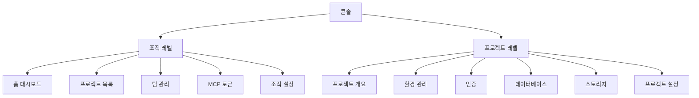

# 콘솔 개요


💡 bkend 콘솔은 프로젝트, 데이터베이스, 인증, 스토리지를 시각적으로 관리하는 웹 기반 관리 도구입니다.


## 개요

bkend 콘솔(`https://console.bkend.ai`)은 Tenant가 서비스를 구축하고 운영하는 데 필요한 모든 관리 기능을 제공합니다. 코드 없이 테이블을 설계하고, 환경을 관리하고, 팀원을 초대할 수 있습니다.

***

## 콘솔 구조

콘솔은 **조직 레벨**과 **프로젝트 레벨**, 두 가지 레벨로 구성됩니다.

***

## 조직 레벨 메뉴

조직을 선택하면 왼쪽 사이드바에 다음 메뉴가 표시됩니다.

| 메뉴 | 설명 |
|------|------|
| **홈** | 조직 대시보드 — 통계, 최근 프로젝트, 활동 로그 |
| **프로젝트** | 프로젝트 목록 — 생성, 검색, 필터, 삭제 |
| **팀** | 팀원 관리 — 초대, 역할 변경, 제거 |
| **MCP** | 접근 토큰 관리 — 토큰 생성, 권한 설정, 취소 |
| **설정** | 조직 설정 — 이름 변경, 감사 로그, 위험 영역 |

<!-- 📸 IMG: 조직 레벨 사이드바 -->

***

## 프로젝트 레벨 메뉴

프로젝트를 선택하면 사이드바가 프로젝트 전용 메뉴로 전환됩니다.

| 메뉴 | 설명 |
|------|------|
| **개요** | 프로젝트 대시보드 — 통계, 정보, 빠른 액션 |
| **환경** | 환경 관리 — dev, staging, prod 환경 조회 |
| **인증** | 인증 설정 — 제공자, 이메일 템플릿 |
| **데이터베이스** | 테이블 관리 — 생성, 스키마 편집, 데이터 조회 |
| **스토리지** | 파일 관리 — 업로드, 다운로드, 삭제 |
| **설정** | 프로젝트 설정 — 이름 변경, 삭제 |

***

## 사이드바

사이드바는 세 가지 모드를 지원합니다.

| 모드 | 설명 |
|------|------|
| **펼침** | 메뉴 이름과 아이콘이 함께 표시됩니다 |
| **접힘** | 아이콘만 표시됩니다 |
| **호버** | 접힌 상태에서 마우스를 올리면 펼쳐집니다 |


💡 모바일에서는 항상 펼침 모드로 표시됩니다.


***

## 다음 단계

- [콘솔 회원가입 & 로그인](02-signup-login.md) — 콘솔에 로그인하세요
- [조직 관리](03-org-management.md) — 조직을 생성하고 관리하세요
- [프로젝트 관리](04-project-management.md) — 프로젝트를 생성하세요
