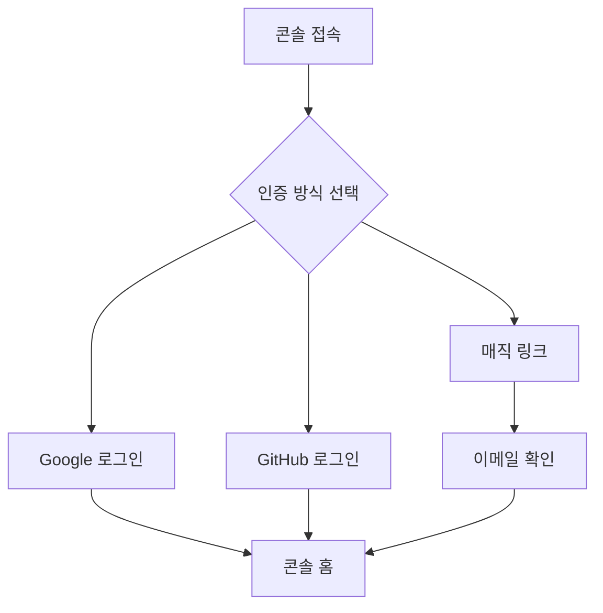

# 콘솔 회원가입 & 로그인


💡 bkend 콘솔에 가입하고 로그인하는 방법을 안내합니다.


## 개요

bkend 콘솔은 두 가지 인증 방식을 지원합니다. 소셜 로그인 또는 매직 링크 중 편한 방식을 선택하세요.

***

## 인증 흐름

***

## 회원가입하기

1. [bkend 콘솔](https://console.bkend.ai)에 접속하세요.
2. **Sign Up** 페이지에서 인증 방식을 선택하세요.

<!-- 📸 IMG: 회원가입 화면 -->

### 소셜 로그인으로 가입하기

**Continue with Google** 또는 **Continue with GitHub** 버튼을 클릭하세요. OAuth 인증 후 자동으로 계정이 생성됩니다.

### 매직 링크로 가입하기

1. 이메일 주소를 입력하세요.
2. **약관 동의** 체크박스를 선택하세요.
3. **Send Magic Link** 버튼을 클릭하세요.
4. 수신한 이메일의 링크를 클릭하면 이메일 인증이 완료되고 로그인됩니다.


⚠️ 소셜 로그인으로 가입한 계정은 매직 링크를 사용할 수 없습니다. 해당 소셜 계정으로 로그인하세요.


***

## 로그인하기

1. [bkend 콘솔](https://console.bkend.ai)에 접속하세요.
2. **Sign In** 페이지에서 가입할 때 사용한 인증 방식으로 로그인하세요.

<!-- 📸 IMG: 로그인 화면 -->

***

## 다음 단계

- [조직 관리](03-org-management.md) — 첫 조직을 생성하세요
- [프로젝트 관리](04-project-management.md) — 프로젝트를 만들어보세요
