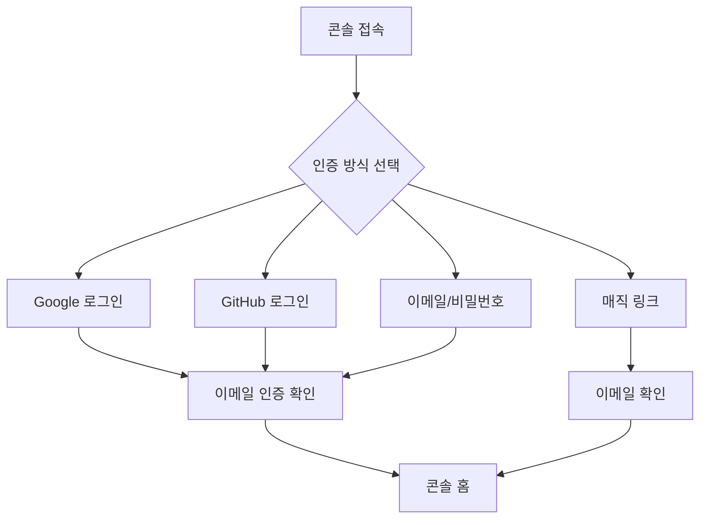

# 콘솔 회원가입 & 로그인


💡 bkend 콘솔에 가입하고 로그인하는 방법을 안내합니다.


## 개요

bkend 콘솔은 세 가지 인증 방식을 지원합니다. 소셜 로그인, 매직 링크, 이메일/비밀번호 중 편한 방식을 선택하세요.

***

## 인증 흐름

***

## 회원가입하기

1. [bkend 콘솔](https://console.bkend.ai)에 접속하세요.
2. **Sign Up** 페이지에서 인증 방식을 선택하세요.

<!-- 📸 IMG: 회원가입 화면 -->

### 소셜 로그인으로 가입하기

**Continue with Google** 또는 **Continue with GitHub** 버튼을 클릭하세요. OAuth 인증 후 자동으로 계정이 생성됩니다.

### 이메일/비밀번호로 가입하기

다음 정보를 입력하세요.

| 필드 | 필수 | 설명 |
|------|:----:|------|
| **이름** | ✅ | 2~50자 |
| **이메일** | ✅ | 유효한 이메일 주소 |
| **비밀번호** | ✅ | 8~72자, 대/소문자, 숫자, 특수문자 포함 |
| **약관 동의** | ✅ | 서비스 약관 및 개인정보보호정책 동의 |


💡 비밀번호 강도 지표가 실시간으로 표시됩니다. 모든 요건을 충족해야 가입할 수 있습니다.


### 매직 링크로 가입하기

1. **Send Magic Link** 버튼을 클릭하세요.
2. 이메일 주소를 입력하세요.
3. 수신한 이메일의 링크를 클릭하면 자동으로 로그인됩니다.


⚠️ 소셜 로그인으로 가입한 계정은 매직 링크를 사용할 수 없습니다. 해당 소셜 계정으로 로그인하세요.


***

## 로그인하기

1. [bkend 콘솔](https://console.bkend.ai)에 접속하세요.
2. **Sign In** 페이지에서 가입할 때 사용한 인증 방식으로 로그인하세요.

<!-- 📸 IMG: 로그인 화면 -->

***

## 이메일 인증

이메일/비밀번호로 가입한 경우, 이메일 인증이 필요합니다.

1. 가입 시 입력한 이메일로 인증 링크가 발송됩니다.
2. 이메일의 링크를 클릭하세요.
3. 인증이 완료되면 콘솔을 사용할 수 있습니다.


💡 이메일을 받지 못했다면 **Resend** 버튼을 클릭하세요.


***

## 비밀번호 재설정

1. 로그인 페이지에서 **Forgot password?** 링크를 클릭하세요.
2. 가입한 이메일 주소를 입력하세요.
3. 수신한 이메일의 링크를 클릭하세요.
4. 새 비밀번호를 입력하고 확인하세요.

***

## 다음 단계

- [조직 관리](03-org-management.md) — 첫 조직을 생성하세요
- [프로젝트 관리](04-project-management.md) — 프로젝트를 만들어보세요
