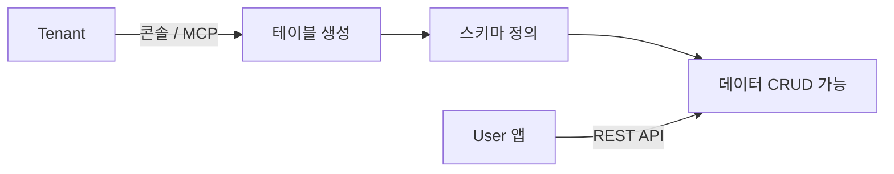

# 테이블 관리


💡 콘솔에서 데이터베이스 테이블을 생성하고 관리하세요. 테이블은 데이터를 저장하는 기본 단위입니다.


## 개요

데이터베이스 테이블은 콘솔 UI 또는 MCP 도구로 생성하고 관리합니다. 테이블을 생성하면 해당 환경에서 REST API로 데이터를 CRUD할 수 있습니다.

***

## 테이블 목록 조회하기

1. 프로젝트를 선택하세요.
2. 사이드바에서 **데이터베이스**를 클릭하세요.
3. 상단 탭에서 환경을 선택하세요 (dev / staging / prod).

<!-- 📸 IMG: 테이블 목록 화면 -->

### 테이블 목록 컬럼

| 컬럼 | 설명 |
|------|------|
| 이름 | 테이블명 |
| 상태 | deployed, deploying, updating, failed |
| 행 수 | 테이블에 저장된 데이터 건수 |
| 업데이트됨 | 마지막 수정 날짜 |


💡 검색창에 테이블 이름을 입력하여 빠르게 찾을 수 있습니다.


***

## 테이블 생성하기

1. **테이블 생성** 버튼을 클릭하세요.
2. 테이블 이름을 입력하세요.
3. 필드를 추가하세요.
4. **생성**을 클릭하세요.

<!-- 📸 IMG: 테이블 생성 모달 -->

### 테이블 이름 규칙

- 소문자, 숫자, 언더스코어(`_`)만 사용 가능
- 반드시 영문자로 시작
- 예: `posts`, `user_profiles`, `order_items`

### 시스템 필드

모든 테이블에 자동으로 생성되는 필드입니다. 수정하거나 삭제할 수 없습니다.

| 필드명 | 타입 | 설명 |
|--------|------|------|
| `_id` | String | 문서 고유 ID |
| `createdBy` | String | 생성자 ID |
| `createdAt` | Date | 생성 시간 |
| `updatedAt` | Date | 마지막 수정 시간 |

### 커스텀 필드 추가

**필드 추가** 버튼을 클릭하고 다음 정보를 입력하세요.

| 항목 | 설명 |
|------|------|
| **필드명** | 영문자로 시작, 영문/숫자/언더스코어 허용 |
| **타입** | String, Number, Boolean, Date, Array, Object, Mixed |
| **Required** | 필수 여부 체크 |

### 기본 권한

테이블 생성 시 다음 기본 역할이 자동으로 설정됩니다.

| 역할 | 생성 | 읽기 | 수정 | 삭제 |
|------|:----:|:----:|:----:|:----:|
| admin | ✅ | ✅ | ✅ | ✅ |
| user | ✅ | ✅ | ✅ | ❌ |
| guest | ❌ | ✅ | ❌ | ❌ |


💡 AI 도구에서도 자연어로 테이블을 생성할 수 있습니다. 자세한 내용은 [Database MCP 도구](../ai-tools/12-mcp-db-tools.md)를 참고하세요.


***

## 테이블 상세 보기

테이블을 클릭하면 상세 페이지가 표시됩니다. 다음 탭으로 구성됩니다.

| 탭 | 설명 |
|-----|------|
| **Data** | 테이블 데이터 조회 및 편집 |
| **Schema** | 필드 정의 관리 |
| **Indexes** | 인덱스 생성 및 관리 |
| **Permissions** | 역할별 CRUD 권한 설정 |
| **API Docs** | REST API 문서 |

***

## 테이블 삭제하기


🚨 **위험** — 테이블을 삭제하면 모든 데이터가 영구적으로 제거됩니다. 이 작업은 되돌릴 수 없습니다.


1. 테이블 상세 페이지에서 **더보기(⋯)** 메뉴를 클릭하세요.
2. **Delete Table**을 선택하세요.
3. 테이블 이름을 입력하여 확인하세요.
4. **삭제**를 클릭하세요.

***

## 다음 단계

- [스키마 편집기](08-schema-editor.md) — 필드를 추가하고 수정하세요
- [인덱스 관리](09-index-management.md) — 인덱스를 생성하세요
- [데이터 생성](../database/03-insert.md) — REST API로 데이터를 삽입하세요
