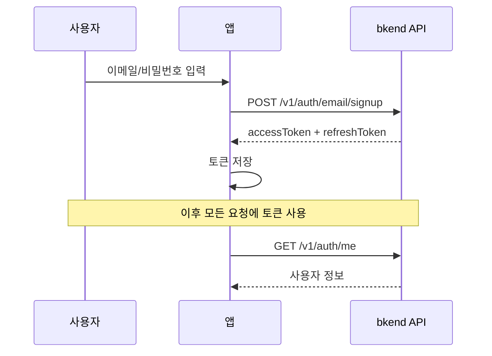

# 01. 인증


💡 이메일 회원가입/로그인으로 레시피 앱의 인증을 설정하세요.


## 이 장에서 배우는 것

- 이메일/비밀번호 회원가입
- 이메일/비밀번호 로그인
- bkendFetch 헬퍼 설정
- 내 프로필 확인

***

## 인증 흐름

레시피 앱은 이메일/비밀번호 방식으로 인증합니다. 회원가입 후 로그인하면 Access Token을 발급받고, 이후 모든 API 요청에 이 토큰을 사용합니다.



***

## 1단계: 회원가입

이메일과 비밀번호로 새 계정을 생성하세요.





✅ **AI에게 이렇게 말해보세요**
"레시피 앱의 이메일 회원가입과 로그인 코드를 만들어줘. bkendFetch 헬퍼를 사용해서 구현해줘."



💡 회원가입과 로그인은 사용자가 앱에서 직접 수행하는 기능입니다. AI에게 코드 생성을 요청하고, 생성된 코드를 앱에 추가하세요. 구현 코드는 **콘솔 + REST API** 탭에서도 확인할 수 있습니다.





```bash
curl -X POST https://api-client.bkend.ai/v1/auth/email/signup \
  -H "Content-Type: application/json" \
  -H "X-API-Key: {pk_publishable_key}" \
  -d '{
    "method": "password",
    "email": "chef@example.com",
    "password": "abc123",
    "name": "김셰프"
  }'
```

**응답:**

```json
{
  "accessToken": "eyJhbGciOiJIUzI1NiIs...",
  "refreshToken": "eyJhbGciOiJIUzI1NiIs...",
  "tokenType": "Bearer",
  "expiresIn": 3600
}
```




### 요청 파라미터

| 파라미터 | 타입 | 필수 | 설명 |
|---------|------|:----:|------|
| `method` | `string` | ✅ | `"password"` 고정 |
| `email` | `string` | ✅ | 사용자 이메일 주소 |
| `password` | `string` | ✅ | 비밀번호 (아래 정책 참고) |
| `name` | `string` | ✅ | 사용자 이름 |

### 비밀번호 정책

| 조건 | 요구사항 |
|------|---------|
| 최소 길이 | 6자 이상 |


⚠️ 비밀번호 정책을 충족하지 않으면 `400 Bad Request` 에러가 발생합니다.


***

## 2단계: 로그인

등록한 이메일과 비밀번호로 로그인하세요.





✅ **AI에게 이렇게 말해보세요**
"로그인 후 토큰을 localStorage에 저장하고, 401 에러 시 자동 갱신하는 코드를 만들어줘."



💡 AI가 토큰 관리 로직이 포함된 완성 코드를 생성합니다. 생성된 코드의 상세 구현은 **콘솔 + REST API** 탭을 참고하세요.





```bash
curl -X POST https://api-client.bkend.ai/v1/auth/email/signin \
  -H "Content-Type: application/json" \
  -H "X-API-Key: {pk_publishable_key}" \
  -d '{
    "method": "password",
    "email": "chef@example.com",
    "password": "abc123"
  }'
```

**응답:**

```json
{
  "accessToken": "eyJhbGciOiJIUzI1NiIs...",
  "refreshToken": "eyJhbGciOiJIUzI1NiIs...",
  "tokenType": "Bearer",
  "expiresIn": 3600
}
```




### 요청 파라미터

| 파라미터 | 타입 | 필수 | 설명 |
|---------|------|:----:|------|
| `method` | `string` | ✅ | `"password"` 고정 |
| `email` | `string` | ✅ | 등록된 이메일 주소 |
| `password` | `string` | ✅ | 비밀번호 |
| `mfaCode` | `string` | 조건부 | MFA 활성화 시 6자리 TOTP 코드 |

### 응답 파라미터

| 필드 | 타입 | 설명 |
|------|------|------|
| `accessToken` | `string` | API 인증에 사용하는 JWT 토큰 |
| `refreshToken` | `string` | Access Token 갱신용 토큰 |
| `tokenType` | `string` | 토큰 타입 (`"Bearer"`) |
| `expiresIn` | `number` | Access Token 유효 시간 (초) |

***

## 3단계: bkendFetch 헬퍼 설정

발급받은 토큰을 저장하고, 이후 모든 API 요청에 자동으로 포함되도록 헬퍼 함수를 설정하세요.

```javascript
// bkend.js — 프로젝트에 이 파일을 추가하세요

const BASE_URL = 'https://api-client.bkend.ai';
const PUBLISHABLE_KEY = '{pk_publishable_key}';

async function bkendFetch(endpoint, options = {}) {
  const accessToken = localStorage.getItem('accessToken');

  const response = await fetch(`${BASE_URL}${endpoint}`, {
    ...options,
    headers: {
      'Content-Type': 'application/json',
      'X-API-Key': PUBLISHABLE_KEY,
      ...(accessToken && { 'Authorization': `Bearer ${accessToken}` }),
      ...options.headers,
    },
  });

  if (response.status === 401) {
    // Access Token 만료 시 갱신 시도
    const refreshed = await refreshAccessToken();
    if (refreshed) {
      return bkendFetch(endpoint, options);
    }
    // 갱신 실패 시 로그인 페이지로 이동
    window.location.href = '/login';
    return;
  }

  return response.json();
}
```

### 토큰 저장 예시

로그인 성공 후 토큰을 저장하세요.

```javascript
async function login(email, password) {
  const result = await bkendFetch('/v1/auth/email/signin', {
    method: 'POST',
    body: {
      method: 'password',
      email,
      password,
    },
  });

  // 토큰 저장
  localStorage.setItem('accessToken', result.accessToken);
  localStorage.setItem('refreshToken', result.refreshToken);
  return result;
}
```

### 토큰 갱신

Access Token이 만료되면 Refresh Token으로 갱신하세요.

```javascript
async function refreshAccessToken() {
  const refreshToken = localStorage.getItem('refreshToken');
  if (!refreshToken) return false;

  try {
    const response = await fetch(`${BASE_URL}/v1/auth/refresh`, {
      method: 'POST',
      headers: {
        'Content-Type': 'application/json',
        'X-API-Key': PUBLISHABLE_KEY,
      },
      body: JSON.stringify({ refreshToken }),
    });

    const result = await response.json();

    if (result.accessToken) {
      localStorage.setItem('accessToken', result.accessToken);
      localStorage.setItem('refreshToken', result.refreshToken);
      return true;
    }
  } catch (error) {
    console.error('토큰 갱신 실패:', error);
  }

  localStorage.removeItem('accessToken');
  localStorage.removeItem('refreshToken');
  return false;
}
```

### 토큰 유효 시간

| 토큰 | 유효 시간 | 용도 |
|------|:---------:|------|
| Access Token | 1시간 | API 인증 |
| Refresh Token | 30일 | Access Token 갱신 |


💡 bkendFetch 헬퍼에 대한 자세한 내용은 [앱에서 bkend 연동하기](../../../getting-started/06-app-integration.md) 문서를 참고하세요.


***

## 4단계: 프로필 확인

로그인 후 현재 사용자 정보를 확인하세요.





✅ **AI에게 이렇게 말해보세요**
"현재 로그인한 사용자 정보를 표시하는 프로필 컴포넌트를 만들어줘. /v1/auth/me API를 사용해줘."





```bash
curl -X GET https://api-client.bkend.ai/v1/auth/me \
  -H "X-API-Key: {pk_publishable_key}" \
  -H "Authorization: Bearer {accessToken}"
```

**응답:**

```json
{
  "id": "user_abc123",
  "email": "chef@example.com",
  "name": "김셰프",
  "emailVerified": false,
  "createdAt": "2025-01-15T10:00:00Z"
}
```

JavaScript에서는 bkendFetch 헬퍼를 사용하세요.

```javascript
const me = await bkendFetch('/v1/auth/me');
console.log(me.name); // "김셰프"
```




***

## 에러 처리

### 인증 관련 에러 코드

| HTTP 상태 | 에러 코드 | 설명 | 해결 방법 |
|:---------:|----------|------|----------|
| 400 | `auth/validation-error` | 필수 파라미터 누락/형식 오류 | 요청 파라미터 확인 |
| 401 | `auth/invalid-credentials` | 이메일 또는 비밀번호 오류 | 입력값 확인 |
| 401 | `auth/token-expired` | Access Token 만료 | 토큰 갱신 또는 재로그인 |
| 409 | `auth/email-already-exists` | 이미 가입된 이메일 | 로그인 시도 |
| 429 | `auth/rate-limit` | 요청 횟수 초과 | 잠시 후 재시도 |

### Rate Limiting

| 작업 | 제한 |
|------|------|
| 로그인 시도 | 15분 내 5회 |
| 회원가입 | 1시간 내 3회 |
| 토큰 갱신 | 분당 10회 |

### 에러 처리 예시

```javascript
async function handleAuth(email, password) {
  try {
    const result = await login(email, password);
    // 로그인 성공 → 홈 화면으로 이동
    window.location.href = '/';
  } catch (error) {
    if (error.message.includes('auth/invalid-credentials')) {
      alert('이메일 또는 비밀번호가 올바르지 않습니다.');
    } else if (error.message.includes('auth/rate-limit')) {
      alert('요청 횟수를 초과했습니다. 잠시 후 다시 시도하세요.');
    } else {
      alert('로그인에 실패했습니다. 다시 시도하세요.');
    }
  }
}
```

***

## 참고 문서

- [이메일 회원가입](../../../authentication/02-email-signup.md) — 회원가입 API 상세
- [이메일 로그인](../../../authentication/03-email-signin.md) — 로그인 API 상세
- [토큰 관리](../../../authentication/20-token-management.md) — Access Token/Refresh Token 관리

***

## 다음 단계

[02. 레시피](02-recipes.md)에서 레시피 CRUD와 이미지 첨부를 학습하세요.
