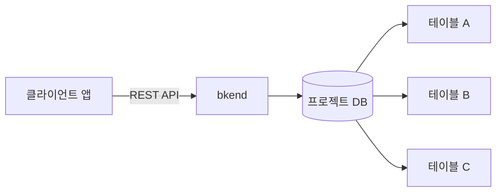
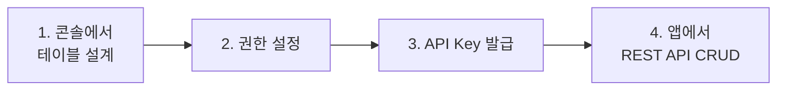

# 데이터베이스 개요


💡 bkend의 데이터베이스 시스템을 이해하고, REST API로 데이터를 관리하는 방법을 알아보세요.


## 데이터베이스란?

bkend는 프로젝트별로 독립된 데이터베이스를 제공합니다. 별도의 서버 설정 없이 테이블을 생성하고, REST API로 데이터를 생성 · 조회 · 수정 · 삭제(CRUD)할 수 있습니다.

***

## 핵심 특징

### 프로젝트별 격리

각 프로젝트는 독립된 데이터베이스를 사용합니다. 환경(dev/staging/prod)별로도 별도의 데이터가 관리되어 개발 · 운영 데이터가 혼재되지 않습니다.

### 스키마 기반 검증

테이블에 정의된 스키마에 따라 데이터가 자동으로 검증됩니다. 필수 필드, 타입, 패턴, 범위 등의 제약 조건이 적용됩니다.

### 역할 기반 권한

테이블마다 역할별 접근 권한을 설정할 수 있습니다.

| 역할 | 설명 |
|------|------|
| `admin` | 모든 데이터 접근 가능 |
| `user` | 테이블 권한 설정에 따라 접근 |
| `guest` | 테이블 권한 설정에 따라 접근 (인증 불필요) |
| `self` | 본인이 생성한 데이터만 접근 |

### 시스템 필드

모든 데이터에는 다음 시스템 필드가 자동으로 추가됩니다.

| 필드 | 타입 | 설명 |
|------|------|------|
| `id` | `string` | 데이터 고유 ID |
| `createdBy` | `string` | 생성자 ID |
| `createdAt` | `string` | 생성 일시 (ISO 8601) |
| `updatedAt` | `string` | 최종 수정 일시 (ISO 8601) |

***

## API 구조

데이터베이스 API는 두 가지 경로를 지원합니다.

| 경로 | 설명 |
|------|------|
| `/v1/data/:tableName` | 표준 경로 |
| `/v1/:tableName` | 단축 경로 |

두 경로는 동일하게 동작합니다. 문서에서는 표준 경로(`/v1/data/:tableName`)를 사용합니다.

### 필수 헤더

| 헤더 | 필수 | 설명 |
|------|:----:|------|
| `X-Project-Id` | ✅ | 프로젝트 ID |
| `X-Environment` | ✅ | `dev` / `staging` / `prod` |
| `Authorization` | 조건부 | `Bearer {accessToken}` — 권한에 따라 필요 |

***

## 개발 흐름

데이터베이스를 사용하는 전체 흐름입니다. 콘솔에서 구조를 설계하고, REST API로 앱에서 데이터를 관리합니다.

| 단계 | 도구 | 작업 | 확인 위치 |
|:----:|------|------|----------|
| 1 | 콘솔 | 테이블 생성, 컬럼 정의 | 콘솔 → **데이터베이스** |
| 2 | 콘솔 | 역할별 CRUD 권한 설정 | 콘솔 → **데이터베이스** → 테이블 → **Permissions** |
| 3 | 콘솔 | API Key (Bearer Token) 발급 | 콘솔 → **MCP** → **새 토큰 생성** |
| 4 | REST API | 앱에서 데이터 CRUD | `POST/GET/PATCH/DELETE /v1/data/:tableName` |


💡 **Project ID**는 콘솔 → **프로젝트 설정**에서, **X-Environment** 값은 콘솔 → **환경** 탭에서 확인할 수 있습니다.


앱에서 REST API를 처음 연동한다면 [앱에서 bkend 연동하기](../getting-started/06-app-integration.md)를 먼저 참고하세요.

***

## 테이블 관리

테이블 생성, 스키마 편집, 인덱스 관리는 **콘솔**에서 수행합니다.

- [테이블 관리](../console/07-table-management.md) — 콘솔에서 테이블 생성/관리
- [스키마 편집기](../console/08-schema-editor.md) — 컬럼과 제약 조건 설정
- [인덱스 관리](../console/09-index-management.md) — 성능 최적화를 위한 인덱스

AI 도구를 사용하는 경우 MCP 도구로도 테이블을 관리할 수 있습니다.

- [Database MCP 도구](../ai-tools/12-mcp-db-tools.md) — AI를 통한 테이블 관리

***

## 이 섹션 구성

| 문서 | 설명 |
|------|------|
| [데이터 모델 이해](02-data-model.md) | 스키마, 권한, 시스템 필드 |
| [데이터 생성](03-insert.md) | POST — 새 데이터 추가 |
| [단건 조회](04-select.md) | GET — ID로 데이터 조회 |
| [목록 조회](05-list.md) | GET — 데이터 목록 조회 |
| [데이터 수정](06-update.md) | PATCH — 데이터 업데이트 |
| [데이터 삭제](07-delete.md) | DELETE — 데이터 삭제 |
| [필터링](08-filtering.md) | AND/OR 필터, 검색 |
| [정렬 & 페이지네이션](09-sorting-pagination.md) | 정렬, 페이징 |
| [테이블 스키마 조회](10-table-spec.md) | 테이블 구조 확인 |
| [API 레퍼런스](11-api-reference.md) | 전체 엔드포인트 목록 |
| [데이터 CRUD 앱 패턴](12-crud-app-patterns.md) | 앱에서 CRUD 구현하기 |


💡 **실전으로 배우기**: 데이터 CRUD를 실전 프로젝트에서 활용하는 방법은 [쿡북](../../cookbooks/README.md)을 참고하세요.

