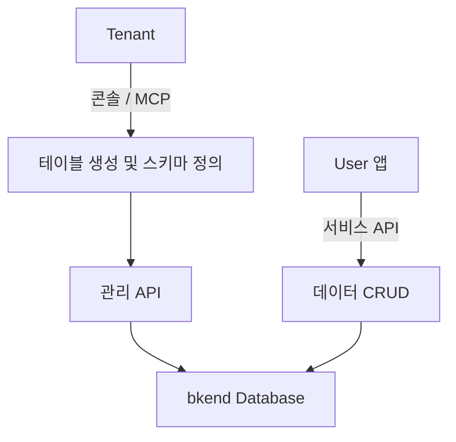
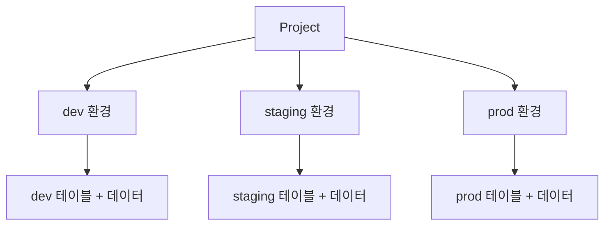

# Database 개요

> bkend의 Database 기능으로 테이블을 생성하고, 데이터를 관리하는 방법을 소개합니다.

## 개요

bkend Database는 동적으로 테이블을 생성하고, AI 도구나 REST API를 통해 데이터를 CRUD할 수 있는 관리형 데이터베이스입니다. 테이블 스키마 정의, 인덱스 관리, 권한 설정을 모두 콘솔이나 MCP를 통해 수행할 수 있습니다.

---

## 주요 기능

| 기능 | 설명 |
|------|------|
| **테이블 생성** | 콘솔 또는 MCP로 테이블을 동적으로 생성합니다 |
| **스키마 관리** | 컬럼 타입, 제약 조건, 기본값을 정의합니다 |
| **데이터 CRUD** | Insert, Select, Update, Delete 작업을 수행합니다 |
| **필터링 & 검색** | AND/OR 필터, 텍스트 검색을 지원합니다 |
| **정렬 & 페이지네이션** | 정렬 기준과 페이지 단위 조회를 지원합니다 |
| **인덱스** | 조회 성능을 위한 인덱스를 생성하고 관리합니다 |
| **스키마 버전 관리** | 스키마 변경 이력을 추적하고 롤백할 수 있습니다 |
| **권한 설정** | 그룹별(admin, user, self, guest) CRUD 권한을 설정합니다 |
| **환경별 격리** | dev, staging, prod 환경별로 데이터가 완전히 격리됩니다 |

---

## 지원하는 컬럼 타입

| 타입 | 설명 | 옵션 |
|------|------|------|
| `String` | 문자열 | `minLength`, `maxLength` |
| `Number` | 숫자 (정수/실수) | `min`, `max` |
| `Boolean` | 참/거짓 | - |
| `Date` | 날짜/시간 | - |
| `Array` | 배열 | `itemType` (필수) |
| `Object` | 중첩 객체 | 중첩 스키마 |
| `Mixed` | 혼합 타입 | - |

> 💡 **Tip** - 자세한 컬럼 타입 정보는 [컬럼 타입](04-column-types.md)을 참고하세요.

---

## 시스템 필드

모든 테이블에는 다음 시스템 필드가 자동으로 생성됩니다:

| 필드 | 타입 | 설명 |
|------|------|------|
| `_id` | String | 고유 식별자 (자동 생성) |
| `createdBy` | String | 생성자 ID |
| `createdAt` | Date | 생성 일시 |
| `updatedAt` | Date | 수정 일시 |

> ⚠️ **주의** - 시스템 필드는 수정하거나 삭제할 수 없습니다.

---

## 데이터 접근 권한

테이블별로 그룹 기반 CRUD 권한을 설정할 수 있습니다:

| 그룹 | 설명 | 기본 권한 |
|------|------|----------|
| **admin** | 관리자 User | 전체 CRUD |
| **user** | 인증된 일반 User | 생성, 조회 |
| **self** | 자신의 데이터만 | 조회, 수정, 삭제 |
| **guest** | 비인증 User | 조회만 |

---

## API 구조

bkend Database는 두 가지 API를 통해 접근합니다:

| API | 용도 | 인증 |
|-----|------|------|
| **관리 API** | 테이블 생성, 스키마 관리, 인덱스 관리 | OAuth 2.1 |
| **서비스 API** | 데이터 CRUD (Insert, Select, Update, Delete) | JWT / API Key |

---

## 환경별 데이터 격리

각 Environment(dev, staging, prod)의 데이터는 완전히 격리됩니다. 한 환경에서 생성한 테이블과 데이터는 다른 환경에서 접근할 수 없습니다.

---

## 관련 문서

- [콘솔에서 DB 관리](02-console-ui.md) — 콘솔 UI로 Database 관리하기
- [테이블 생성](03-create-table.md) — 테이블 생성 가이드
- [컬럼 타입](04-column-types.md) — 지원하는 데이터 타입 상세
- [데이터 삽입](06-insert.md) — 데이터 추가 가이드
- [필터링 & 검색](10-filtering.md) — 데이터 검색 가이드
- [인덱스 & 성능](14-indexes.md) — 인덱스 관리 가이드
