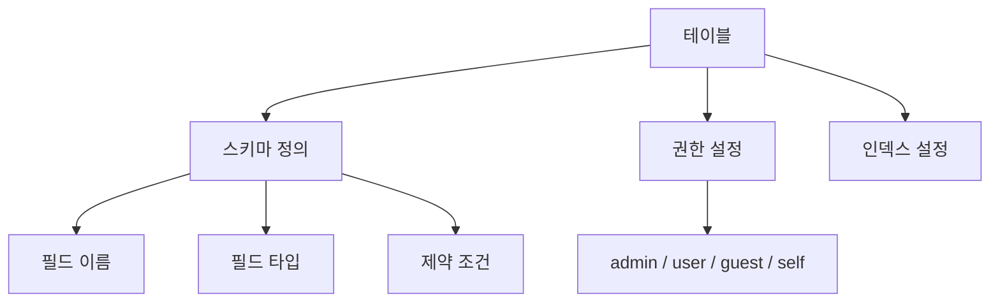
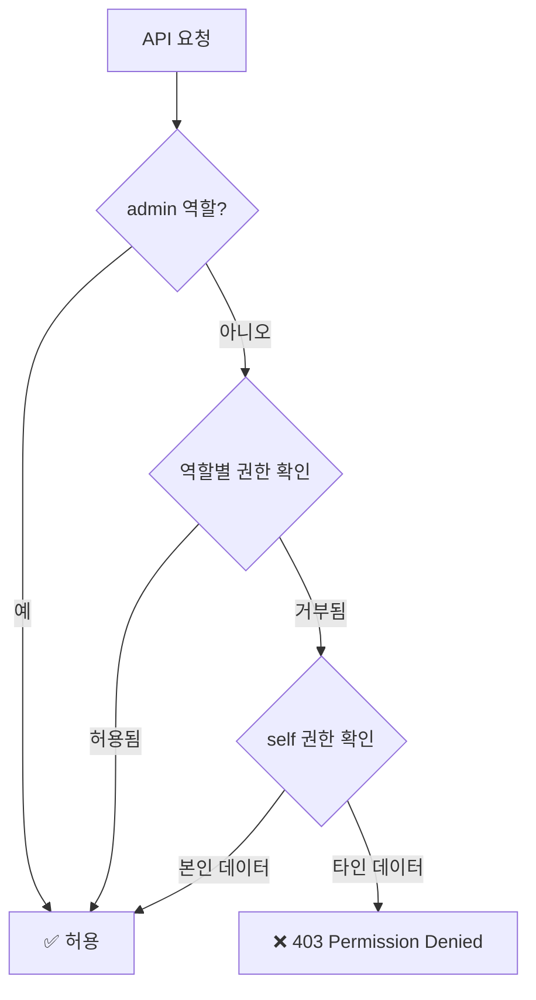

# 데이터 모델 이해


💡 bkend 데이터베이스의 스키마, 권한, 시스템 필드를 이해하세요.


## 개요

bkend의 데이터베이스는 **동적 테이블** 기반입니다. 콘솔이나 MCP 도구로 테이블을 생성하고, REST API로 데이터를 CRUD합니다. 각 테이블에는 스키마 검증과 역할 기반 권한이 적용됩니다.

***

## 테이블 구조



### 스키마

테이블의 스키마는 각 필드의 타입과 제약 조건을 정의합니다.

```json
{
  "bsonType": "object",
  "required": ["email", "name"],
  "properties": {
    "email": {
      "bsonType": "string",
      "pattern": "^[a-zA-Z0-9._%+-]+@[a-zA-Z0-9.-]+\\.[a-zA-Z]{2,}$"
    },
    "name": {
      "bsonType": "string"
    },
    "age": {
      "bsonType": "int",
      "minimum": 0,
      "maximum": 150
    },
    "tags": {
      "bsonType": "array",
      "items": { "bsonType": "string" }
    }
  }
}
```

### 지원 타입

| 타입 | 설명 | 예시 |
|------|------|------|
| `string` | 문자열 | `"hello"` |
| `int` | 정수 | `42` |
| `double` | 실수 | `3.14` |
| `bool` | 불리언 | `true` |
| `date` | 날짜 | `"2025-01-01T00:00:00Z"` |
| `object` | 중첩 객체 | `{ "key": "value" }` |
| `array` | 배열 | `[1, 2, 3]` |

### 제약 조건

| 제약 | 적용 대상 | 설명 |
|------|----------|------|
| `required` | 전체 | 필수 필드 목록 |
| `pattern` | `string` | 정규식 패턴 |
| `minimum` / `maximum` | `int`, `double` | 범위 제한 |
| `minLength` / `maxLength` | `string` | 길이 제한 |
| `enum` | `string` | 허용 값 목록 |
| `items` | `array` | 배열 요소 타입 |

***

## 시스템 필드

모든 데이터에는 시스템 필드가 자동으로 포함됩니다. 이 필드는 직접 수정할 수 없습니다.

| 필드 | 타입 | 설명 | 자동 설정 |
|------|------|------|:--------:|
| `id` | `string` | 고유 식별자 | ✅ |
| `createdBy` | `string` | 생성자 User ID | ✅ |
| `createdAt` | `string` | 생성 일시 (ISO 8601) | ✅ |
| `updatedAt` | `string` | 최종 수정 일시 (ISO 8601) | ✅ |


💡 `createdBy`는 요청자의 User ID로 자동 설정됩니다. 게스트 요청의 경우 빈 문자열이 될 수 있습니다.


***

## 권한 모델

각 테이블에는 역할별 CRUD 권한이 설정됩니다.

### 역할

| 역할 | 결정 기준 | 설명 |
|------|----------|------|
| `admin` | 관리자 권한 보유 | 모든 데이터 접근 |
| `user` | 인증된 일반 사용자 | 설정된 권한에 따라 접근 |
| `guest` | 인증 없는 요청 | 설정된 권한에 따라 접근 |
| `self` | 본인 데이터 | `createdBy`가 본인인 데이터만 접근 |

### CRUD 권한

| 권한 | 설명 |
|------|------|
| `create` | 데이터 생성 |
| `read` | 단건 데이터 조회 |
| `list` | 목록 데이터 조회 |
| `update` | 데이터 수정 |
| `delete` | 데이터 삭제 |

### 권한 설정 예시

```json
{
  "admin": {
    "create": true,
    "read": true,
    "list": true,
    "update": true,
    "delete": true
  },
  "user": {
    "create": true,
    "read": true,
    "list": true,
    "update": false,
    "delete": false
  },
  "guest": {
    "read": true,
    "list": true
  },
  "self": {
    "read": true,
    "update": true,
    "delete": true
  }
}
```

### 권한 검사 흐름




⚠️ `self` 권한이 설정된 경우, `list` 요청 시 자동으로 `createdBy` 필터가 추가되어 본인 데이터만 반환됩니다.


***

## 시스템 테이블

이름이 `_`(언더스코어)로 시작하는 테이블은 시스템 테이블입니다. `admin` 역할만 접근할 수 있으며, 일반 사용자는 접근이 제한됩니다.

***

## 다음 단계

- [데이터 생성](03-insert.md) — 첫 번째 데이터 추가
- [테이블 관리](../console/07-table-management.md) — 콘솔에서 테이블 생성
- [RLS 정책](../security/05-rls-policies.md) — 세밀한 접근 제어
