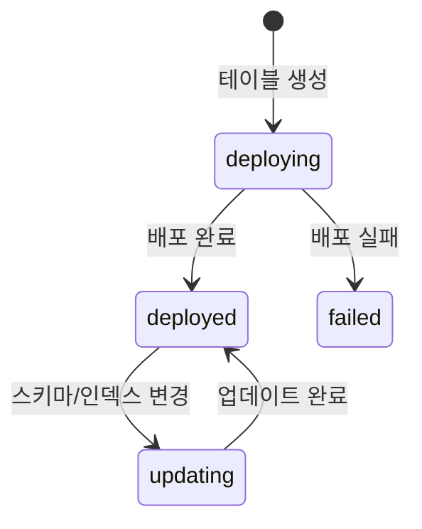

# 테이블 생성하기

> bkend에서 테이블을 생성하고 스키마를 정의하는 방법을 안내합니다.

## 개요

테이블은 데이터를 저장하는 기본 단위입니다. 콘솔, MCP(AI 도구), REST API를 통해 테이블을 생성할 수 있습니다.

---

## 콘솔에서 생성하기

1. **Database** 메뉴로 이동하세요.
2. 환경 탭에서 원하는 환경을 선택하세요.
3. **+ 테이블 생성** 버튼을 클릭하세요.
4. 테이블 이름과 필드를 정의하세요.
5. **생성** 버튼을 클릭하세요.

---

## MCP 도구로 생성하기

AI 도구에서 자연어로 요청하세요:

```
"users 테이블을 만들어줘.
- name: 문자열 (필수)
- email: 문자열 (필수, 유니크)
- age: 숫자
- active: 불리언 (기본값: true)"
```

실행되는 MCP 도구:

```json
{
  "tool": "backend_table_create",
  "arguments": {
    "projectId": "{project_id}",
    "environment": "dev",
    "tableName": "users",
    "schema": {
      "name": { "type": "String", "required": true },
      "email": { "type": "String", "required": true, "unique": true },
      "age": { "type": "Number" },
      "active": { "type": "Boolean", "default": true }
    }
  }
}
```

---

## REST API로 생성하기

### 요청

```bash
curl -X POST "https://api.bkend.ai/v1/projects/{project_id}/environments/{environment}/tables" \
  -H "Authorization: Bearer {your_token}" \
  -H "Content-Type: application/json" \
  -d '{
    "tableName": "users",
    "displayName": "사용자",
    "description": "사용자 정보 테이블",
    "schema": {
      "name": { "type": "String", "required": true },
      "email": { "type": "String", "required": true, "unique": true },
      "age": { "type": "Number", "min": 0 },
      "active": { "type": "Boolean", "default": true }
    },
    "permissions": {
      "admin": { "create": true, "read": true, "update": true, "delete": true },
      "user": { "create": true, "read": true, "update": false, "delete": false },
      "guest": { "create": false, "read": true, "update": false, "delete": false }
    }
  }'
```

### 응답

```json
{
  "id": "tbl_abc123",
  "identifier": {
    "projectId": "{project_id}",
    "environment": "dev",
    "tableName": "users"
  },
  "description": "사용자 정보 테이블",
  "schema": { ... },
  "indexes": [],
  "permissions": { ... },
  "deployment": {
    "status": "deploying",
    "createdAt": "2026-02-06T10:00:00Z"
  },
  "stats": { "rowCount": 0 },
  "createdAt": "2026-02-06T10:00:00Z",
  "updatedAt": "2026-02-06T10:00:00Z"
}
```

---

## 파라미터

| 파라미터 | 타입 | 필수 | 설명 |
|---------|------|------|------|
| `tableName` | string | ✅ | 테이블명 (영문자 시작, `[a-z][a-z0-9_]*`) |
| `displayName` | string | - | 표시 이름 (최대 100자) |
| `description` | string | - | 설명 (최대 1,000자) |
| `schema` | object | - | 필드 스키마 정의 (기본값: `{}`) |
| `permissions` | object | - | 그룹별 CRUD 권한 |

---

## 테이블 이름 규칙

| 규칙 | 설명 |
|------|------|
| 시작 문자 | 소문자 영문 (`a-z`) |
| 허용 문자 | 소문자 영문, 숫자, 언더스코어 (`[a-z0-9_]`) |
| 유일성 | 같은 환경 내에서 고유해야 합니다 |

> ⚠️ **주의** - 테이블 이름은 생성 후 변경할 수 없습니다. 신중하게 입력하세요.

---

## 배포 상태

테이블 생성 후 배포 과정을 거칩니다:



| 상태 | 설명 |
|------|------|
| `deploying` | 배포 중 (데이터 조작 불가) |
| `deployed` | 배포 완료 (정상 사용 가능) |
| `updating` | 스키마/인덱스 변경 중 |
| `failed` | 배포 실패 |

---

## 에러 응답

| 에러 코드 | 설명 | 해결 방법 |
|----------|------|----------|
| `table-already-exists` | 같은 이름의 테이블이 이미 존재합니다 | 다른 이름을 사용하세요 |
| `schema-validation-failed` | 스키마 형식이 올바르지 않습니다 | 필드 타입과 제약 조건을 확인하세요 |
| `permission-denied` | 테이블 생성 권한이 없습니다 | Organization Admin 이상 역할이 필요합니다 |

---

## 관련 문서

- [컬럼 타입](04-column-types.md) — 지원하는 데이터 타입
- [제약 조건](05-constraints.md) — 필드 제약 조건 설정
- [콘솔에서 DB 관리](02-console-ui.md) — 콘솔 UI 가이드
- [인덱스 & 성능](14-indexes.md) — 인덱스 설정
