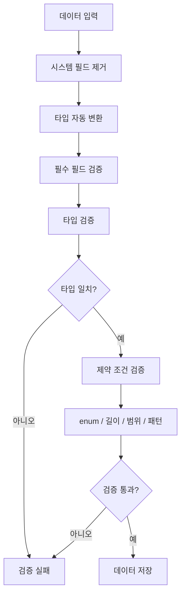

# 제약 조건

> 테이블 필드에 적용할 수 있는 제약 조건과 검증 규칙을 안내합니다.

## 개요

제약 조건(Constraint)은 필드에 저장되는 데이터의 유효성을 보장합니다. bkend는 필수 필드, 유니크, 길이/범위 제한, 패턴, 열거형 등 다양한 제약 조건을 지원합니다.

---

## 제약 조건 목록

| 제약 조건 | 적용 타입 | 설명 |
|----------|----------|------|
| `required` | 모든 타입 | 필수 입력 필드 |
| `unique` | String, Number | 중복 값 불가 |
| `minLength` | String | 최소 문자 길이 |
| `maxLength` | String | 최대 문자 길이 |
| `pattern` | String | 정규식 패턴 검증 |
| `minimum` | Number | 최솟값 |
| `maximum` | Number | 최댓값 |
| `enum` | 모든 타입 | 허용 값 목록 |

---

## required (필수)

필수 필드로 지정하면 데이터 생성 시 해당 필드가 반드시 포함되어야 합니다.

### 설정 방법

**REST API:**

```json
{
  "schema": {
    "bsonType": "object",
    "required": ["name", "email"],
    "properties": {
      "name": { "bsonType": "string" },
      "email": { "bsonType": "string" }
    }
  }
}
```

### 검증 동작

- `null`, `undefined`, 또는 필드 자체가 누락되면 검증 실패
- 시스템 필드(`_id`, `createdBy`, `createdAt`, `updatedAt`)는 필수 검증에서 제외됩니다

### 에러 예시

```json
{
  "error": {
    "code": "data/validation-error",
    "message": "필수 필드 'name'이(가) 누락되었습니다"
  }
}
```

---

## unique (유니크)

동일한 테이블 내에서 중복 값을 허용하지 않습니다. MongoDB 유니크 인덱스로 구현됩니다.

### 설정 방법

콘솔에서 필드 정의 시 **유니크** 체크박스를 선택하세요.

### 에러 예시

```json
{
  "error": {
    "code": "data/duplicate-value",
    "message": "이미 존재하는 값입니다"
  }
}
```

> 💡 **Tip** - unique 제약 조건은 MongoDB E11000 Duplicate Key 에러를 감지하여 처리합니다.

---

## minLength / maxLength (문자열 길이)

문자열 필드의 최소/최대 길이를 제한합니다.

### 설정 방법

```json
{
  "username": {
    "bsonType": "string",
    "minLength": 3,
    "maxLength": 30
  }
}
```

### 에러 예시

```json
{
  "error": {
    "code": "data/validation-error",
    "message": "username: 최소 3자 이상이어야 합니다"
  }
}
```

---

## pattern (정규식 패턴)

문자열 값이 지정된 정규식 패턴과 일치하는지 검증합니다.

### 설정 방법

```json
{
  "phone": {
    "bsonType": "string",
    "pattern": "^010-[0-9]{4}-[0-9]{4}$"
  },
  "slug": {
    "bsonType": "string",
    "pattern": "^[a-z0-9-]+$"
  }
}
```

### 에러 예시

```json
{
  "error": {
    "code": "data/validation-error",
    "message": "phone: 형식이 올바르지 않습니다"
  }
}
```

---

## minimum / maximum (숫자 범위)

숫자 필드의 최솟값/최댓값을 제한합니다.

### 설정 방법

```json
{
  "age": {
    "bsonType": "number",
    "minimum": 0,
    "maximum": 150
  },
  "rating": {
    "bsonType": "number",
    "minimum": 1,
    "maximum": 5
  }
}
```

### 에러 예시

```json
{
  "error": {
    "code": "data/validation-error",
    "message": "age: 0 이상이어야 합니다"
  }
}
```

---

## enum (열거형)

허용된 값의 목록을 지정합니다. 목록에 없는 값은 검증에 실패합니다.

### 설정 방법

```json
{
  "role": {
    "bsonType": "string",
    "enum": ["admin", "editor", "viewer"]
  },
  "priority": {
    "bsonType": "number",
    "enum": [1, 2, 3, 4, 5]
  }
}
```

### 에러 예시

```json
{
  "error": {
    "code": "data/validation-error",
    "message": "role: 허용되지 않은 값입니다. 허용 값: admin, editor, viewer"
  }
}
```

---

## 검증 순서

데이터 생성/수정 시 다음 순서로 검증이 수행됩니다:



1. **시스템 필드 제거** — `_id`, `createdBy`, `createdAt`, `updatedAt` 등을 입력에서 제거
2. **타입 자동 변환** — 문자열 숫자 → Number, `"true"` → Boolean, ISO 문자열 → Date
3. **필수 필드 검증** — `required` 배열에 포함된 필드 존재 여부 확인
4. **타입 검증** — 필드 값이 지정된 BSON 타입과 일치하는지 확인
5. **제약 조건 검증** — enum, minLength, maxLength, minimum, maximum, pattern 순서로 검증

> 💡 **Tip** - 타입이 일치하지 않으면 나머지 제약 조건 검증은 건너뜁니다.

---

## 수정 시 검증 (부분 검증)

데이터 수정(Update) 시에는 **수정할 필드만** 검증합니다. 요청에 포함되지 않은 필드의 필수 여부는 확인하지 않습니다.

---

## 에러 응답

| 에러 코드 | 설명 | HTTP 상태 |
|----------|------|----------|
| `data/validation-error` | 스키마 검증 실패 | 400 |
| `data/duplicate-value` | 유니크 제약 위반 | 409 |

---

## 관련 문서

- [컬럼 타입](04-column-types.md) — 지원하는 데이터 타입
- [데이터 삽입](06-insert.md) — 데이터 추가 가이드
- [테이블 생성](03-create-table.md) — 테이블 생성 가이드
