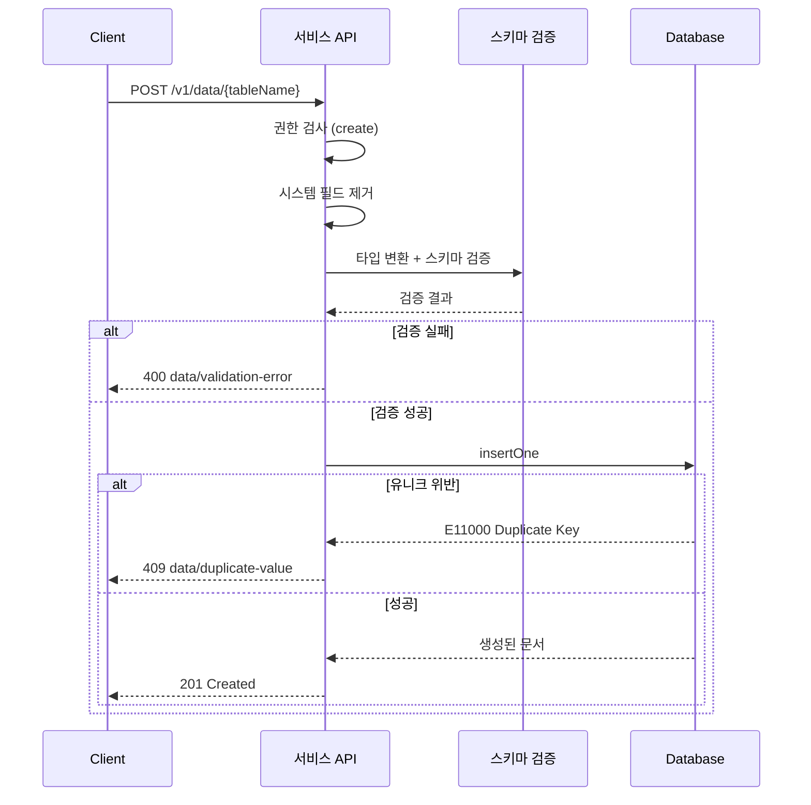

# 데이터 삽입

> 테이블에 새 데이터를 추가하는 방법을 안내합니다.

## 개요

테이블에 데이터를 삽입(Insert)하려면 콘솔, MCP 도구, 또는 서비스 API를 사용하세요. 데이터 삽입 시 스키마 검증과 권한 검사가 자동으로 수행됩니다.

---

## 콘솔에서 삽입하기

1. **Database** 메뉴에서 테이블을 선택하세요.
2. **Data** 탭으로 이동하세요.
3. **행 추가** 버튼을 클릭하세요.
4. 각 필드에 값을 입력하세요.
5. **저장**을 클릭하세요.

---

## MCP 도구로 삽입하기

AI 도구에서 자연어로 데이터를 추가할 수 있습니다:

```
"users 테이블에 데이터를 추가해줘:
- name: 홍길동
- email: hong@example.com
- age: 30
- active: true"
```

---

## REST API로 삽입하기

### 요청

```bash
curl -X POST "https://api.bkend.ai/v1/data/{tableName}" \
  -H "x-project-id: {project_id}" \
  -H "x-environment: dev" \
  -H "Authorization: Bearer {token}" \
  -H "Content-Type: application/json" \
  -d '{
    "name": "홍길동",
    "email": "hong@example.com",
    "age": 30,
    "active": true
  }'
```

> 💡 **Tip** - 요청 본문에 데이터 필드를 직접 포함합니다. 별도의 `data` wrapper가 필요하지 않습니다.

### 응답 (201 Created)

```json
{
  "id": "data_550e8400-e29b-41d4-a716-446655440000",
  "name": "홍길동",
  "email": "hong@example.com",
  "age": 30,
  "active": true,
  "createdBy": "user_abc123",
  "createdAt": "2026-02-06T10:00:00Z",
  "updatedAt": "2026-02-06T10:00:00Z"
}
```

---

## 필수 헤더

| 헤더 | 필수 | 설명 |
|------|------|------|
| `x-project-id` | ✅ | 프로젝트 ID |
| `x-environment` | - | 환경 이름 (기본값: `development`) |
| `Authorization` | ✅ | `Bearer {JWT 또는 Access Token}` |
| `Content-Type` | ✅ | `application/json` |

---

## 처리 흐름



1. **권한 검사** — 요청자의 그룹(admin, user, guest)에 `create` 권한이 있는지 확인
2. **시스템 필드 제거** — `_id`, `createdBy`, `createdAt`, `updatedAt` 등 시스템 필드를 입력에서 자동 제거
3. **타입 변환** — 문자열 숫자 → Number, `"true"/"false"` → Boolean, ISO 문자열 → Date
4. **스키마 검증** — 필수 필드, 타입, 제약 조건(길이, 범위, 패턴, enum) 검증
5. **데이터 저장** — MongoDB에 문서 삽입, 시스템 필드(`_id`, `createdBy`, `createdAt`, `updatedAt`) 자동 생성

---

## 자동 생성 필드

| 필드 | 값 | 설명 |
|------|-----|------|
| `_id` | `data_{uuid}` | 고유 식별자 |
| `createdBy` | 요청자 ID | 데이터를 생성한 User |
| `createdAt` | 현재 시간 | 생성 일시 |
| `updatedAt` | 현재 시간 | 수정 일시 (생성 시 createdAt과 동일) |

---

## 에러 응답

| 에러 코드 | HTTP 상태 | 설명 | 해결 방법 |
|----------|----------|------|----------|
| `data/validation-error` | 400 | 스키마 검증 실패 | 필수 필드와 타입을 확인하세요 |
| `data/duplicate-value` | 409 | 유니크 제약 위반 | 중복되지 않는 값을 입력하세요 |
| `data/permission-denied` | 403 | create 권한 없음 | 권한 설정을 확인하세요 |
| `data/table-not-found` | 404 | 테이블이 존재하지 않음 | 테이블 이름을 확인하세요 |
| `data/invalid-header` | 400 | 필수 헤더 누락 | `x-project-id` 헤더를 확인하세요 |

---

## 관련 문서

- [제약 조건](05-constraints.md) — 필드 제약 조건
- [데이터 조회](07-select.md) — 삽입한 데이터 조회
- [컬럼 타입](04-column-types.md) — 지원하는 데이터 타입
