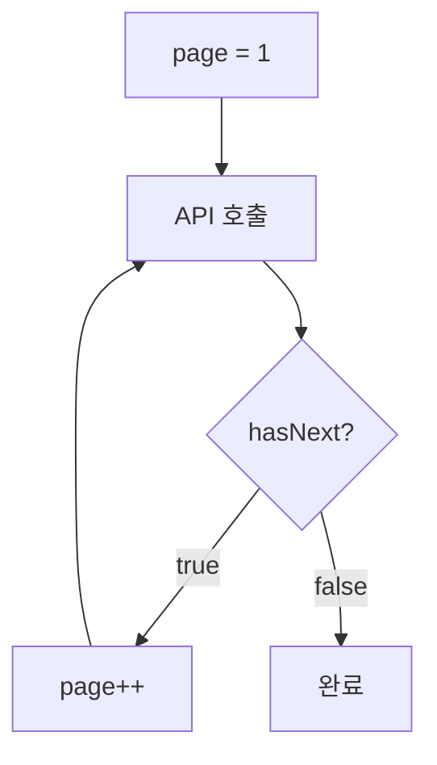

# 정렬 & 페이지네이션

> 데이터 목록 조회 시 정렬과 페이지네이션을 적용하는 방법을 안내합니다.

## 개요

데이터 목록 조회 시 정렬(Sorting)과 페이지네이션(Pagination)을 사용하여 원하는 순서와 범위의 데이터를 조회할 수 있습니다.

---

## 정렬

### 파라미터

| 파라미터 | 타입 | 기본값 | 설명 |
|---------|------|--------|------|
| `sortBy` | string | `createdAt` | 정렬 기준 필드 |
| `sortDirection` | string | `desc` | 정렬 방향 (`asc` 또는 `desc`) |

### 정렬 방향

| 값 | 설명 | 예시 |
|-----|------|------|
| `asc` | 오름차순 (작은 값 → 큰 값) | A→Z, 1→9, 과거→최신 |
| `desc` | 내림차순 (큰 값 → 작은 값) | Z→A, 9→1, 최신→과거 |

### 사용 예시

**최신순 정렬 (기본값):**

```bash
curl "https://api.bkend.ai/v1/data/posts?sortBy=createdAt&sortDirection=desc" \
  -H "x-project-id: {project_id}" \
  -H "x-environment: dev" \
  -H "Authorization: Bearer {token}"
```

**이름 오름차순 정렬:**

```bash
curl "https://api.bkend.ai/v1/data/users?sortBy=name&sortDirection=asc" \
  -H "x-project-id: {project_id}" \
  -H "x-environment: dev" \
  -H "Authorization: Bearer {token}"
```

**가격 높은 순:**

```bash
curl "https://api.bkend.ai/v1/data/products?sortBy=price&sortDirection=desc" \
  -H "x-project-id: {project_id}" \
  -H "x-environment: dev" \
  -H "Authorization: Bearer {token}"
```

> 💡 **Tip** - `sortBy`를 지정하지 않으면 `createdAt` 내림차순(최신순)으로 정렬됩니다.

---

## 페이지네이션

### 파라미터

| 파라미터 | 타입 | 기본값 | 범위 | 설명 |
|---------|------|--------|------|------|
| `page` | number | `1` | 1 이상 | 페이지 번호 |
| `limit` | number | `20` | 1~100 | 페이지당 데이터 건수 |

### 사용 예시

**첫 페이지 (20건):**

```bash
curl "https://api.bkend.ai/v1/data/users?page=1&limit=20" \
  -H "x-project-id: {project_id}" \
  -H "x-environment: dev" \
  -H "Authorization: Bearer {token}"
```

**두 번째 페이지 (50건씩):**

```bash
curl "https://api.bkend.ai/v1/data/users?page=2&limit=50" \
  -H "x-project-id: {project_id}" \
  -H "x-environment: dev" \
  -H "Authorization: Bearer {token}"
```

### 응답 구조

```json
{
  "items": [ ... ],
  "pagination": {
    "total": 150,
    "page": 2,
    "limit": 50,
    "totalPages": 3,
    "hasNext": true,
    "hasPrev": true
  }
}
```

### pagination 필드 설명

| 필드 | 타입 | 설명 |
|------|------|------|
| `total` | number | 전체 데이터 건수 (필터 적용 후) |
| `page` | number | 현재 페이지 번호 |
| `limit` | number | 페이지 크기 |
| `totalPages` | number | 총 페이지 수 (`Math.ceil(total / limit)`) |
| `hasNext` | boolean | 다음 페이지가 있으면 `true` |
| `hasPrev` | boolean | 이전 페이지가 있으면 `true` |

---

## 정렬 + 필터 + 페이지네이션 조합

정렬, 필터링, 페이지네이션을 함께 사용할 수 있습니다:

```bash
curl -X GET "https://api.bkend.ai/v1/data/products" \
  -H "x-project-id: {project_id}" \
  -H "x-environment: dev" \
  -H "Authorization: Bearer {token}" \
  -H "Content-Type: application/json" \
  -d '{
    "andFilters": {
      "category": "electronics",
      "price": { "$gte": 1000 }
    },
    "sortBy": "price",
    "sortDirection": "asc",
    "page": 1,
    "limit": 10
  }'
```

위 요청은:
1. `category`가 "electronics"이고 `price`가 1,000 이상인 데이터를 필터링
2. `price` 오름차순으로 정렬
3. 첫 번째 페이지의 10건을 반환

---

## 페이지 순회 패턴

전체 데이터를 순회하려면 `hasNext`를 확인하며 페이지를 증가시키세요:



---

## 관련 문서

- [필터링 & 검색](10-filtering.md) — 필터링 가이드
- [데이터 조회](07-select.md) — 기본 데이터 조회
- [인덱스 & 성능](14-indexes.md) — 정렬 필드에 인덱스 적용
