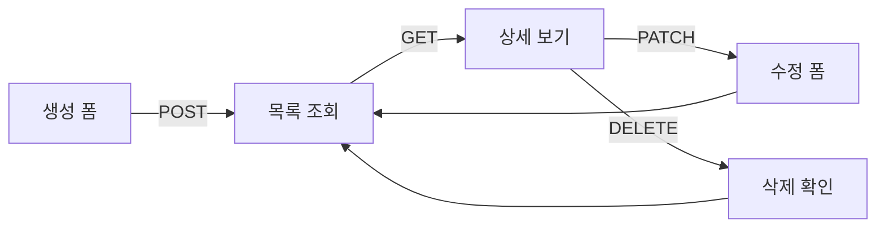

# 데이터 CRUD 앱 패턴


💡 게시판, 할 일 목록 등 데이터 CRUD 기능을 앱에 구현하는 패턴을 안내합니다.


## 개요

이 문서에서는 bkend 데이터 API를 활용하여 **생성 → 목록 조회 → 수정 → 삭제** 흐름을 앱에 구현하는 방법을 설명합니다. `bkendFetch` 헬퍼 함수가 설정되어 있다고 가정합니다.


⚠️ `bkendFetch` 설정이 완료되지 않았다면 [앱에서 bkend 연동하기](../getting-started/06-app-integration.md)를 먼저 참고하세요.




***

## 전체 흐름

CRUD 앱은 다음 4가지 API를 조합하여 구현합니다.

| 기능 | 메서드 | 엔드포인트 | 설명 |
|------|:------:|-----------|------|
| 생성 | `POST` | `/v1/data/{tableName}` | 새 데이터 추가 |
| 목록 조회 | `GET` | `/v1/data/{tableName}` | 페이지네이션 목록 |
| 수정 | `PATCH` | `/v1/data/{tableName}/{id}` | 필드 부분 수정 |
| 삭제 | `DELETE` | `/v1/data/{tableName}/{id}` | 데이터 삭제 |


💡 모든 엔드포인트는 단축 경로도 지원합니다. `/v1/data/posts`와 `/v1/posts`는 동일하게 동작합니다.


***

## 1. 데이터 생성 폼

사용자 입력을 받아 `POST /v1/data/{tableName}`으로 전송합니다. 요청 본문에 필드를 직접 포함하면 됩니다.

### HTML 폼

```html
<form id="createForm">
  <input type="text" name="title" placeholder="제목" required />
  <textarea name="content" placeholder="내용" required></textarea>
  <select name="category">
    <option value="notice">공지</option>
    <option value="general">일반</option>
  </select>
  <button type="submit">작성</button>
</form>
```

### JavaScript 처리

```javascript
document.getElementById('createForm').addEventListener('submit', async (e) => {
  e.preventDefault();
  const form = new FormData(e.target);

  try {
    const data = await bkendFetch('/v1/data/posts', {
      method: 'POST',
      body: JSON.stringify({
        title: form.get('title'),
        content: form.get('content'),
        category: form.get('category'),
      }),
    });

    console.log('생성 완료:', data.id);
    // 목록 페이지로 이동
    loadList();
  } catch (error) {
    handleError(error);
  }
});
```

### 응답 (201 Created)

```json
{
  "id": "507f1f77bcf86cd799439011",
  "title": "첫 번째 게시글",
  "content": "안녕하세요, bkend입니다.",
  "category": "notice",
  "createdBy": "user-uuid-1234",
  "createdAt": "2025-01-15T10:30:00.000Z"
}
```

***

## 2. 목록 조회 + 페이지네이션

`GET /v1/data/{tableName}`으로 목록을 조회하고, `page`와 `limit` 파라미터로 페이지를 제어합니다.

### JavaScript 구현

```javascript
let currentPage = 1;
const PAGE_SIZE = 10;

async function loadList(page = 1) {
  const params = new URLSearchParams({
    page: String(page),
    limit: String(PAGE_SIZE),
    sortBy: 'createdAt',
    sortDirection: 'desc',
  });

  const result = await bkendFetch(`/v1/data/posts?${params}`);

  renderList(result.items);
  renderPagination(result.pagination);
  currentPage = page;
}

function renderList(items) {
  const container = document.getElementById('list');
  container.innerHTML = items
    .map(
      (item) => `
      <div class="item" data-id="${item.id}">
        <h3>${item.title}</h3>
        <p>${item.content}</p>
        <span>${new Date(item.createdAt).toLocaleDateString()}</span>
        <button onclick="openEdit('${item.id}')">수정</button>
        <button onclick="confirmDelete('${item.id}')">삭제</button>
      </div>
    `
    )
    .join('');
}

function renderPagination(pagination) {
  const { page, totalPages, hasNext, hasPrev } = pagination;
  const container = document.getElementById('pagination');

  container.innerHTML = `
    <button onclick="loadList(${page - 1})" ${!hasPrev ? 'disabled' : ''}>이전</button>
    <span>${page} / ${totalPages} (총 ${pagination.total}건)</span>
    <button onclick="loadList(${page + 1})" ${!hasNext ? 'disabled' : ''}>다음</button>
  `;
}
```

### 응답 구조

```json
{
  "items": [
    {
      "id": "507f1f77bcf86cd799439011",
      "title": "첫 번째 게시글",
      "content": "안녕하세요, bkend입니다.",
      "category": "notice",
      "createdAt": "2025-01-15T10:30:00.000Z"
    }
  ],
  "pagination": {
    "total": 42,
    "page": 1,
    "limit": 10,
    "totalPages": 5,
    "hasNext": true,
    "hasPrev": false
  }
}
```

### 검색 기능 추가

목록 조회에 `search` 파라미터를 추가하면 키워드 검색을 구현할 수 있습니다.

```javascript
async function searchPosts(keyword) {
  const params = new URLSearchParams({
    page: '1',
    limit: String(PAGE_SIZE),
    search: keyword,
  });

  const result = await bkendFetch(`/v1/data/posts?${params}`);
  renderList(result.items);
  renderPagination(result.pagination);
}
```

***

## 3. 수정 폼

기존 데이터를 `GET /v1/data/{tableName}/{id}`로 조회한 후, 변경된 필드만 `PATCH`로 전송합니다.

### JavaScript 구현

```javascript
async function openEdit(postId) {
  // 1. 기존 데이터 조회
  const post = await bkendFetch(`/v1/data/posts/${postId}`);

  // 2. 폼에 기존 값 채우기
  document.getElementById('editTitle').value = post.title;
  document.getElementById('editContent').value = post.content;
  document.getElementById('editCategory').value = post.category;

  // 3. 수정 폼 표시
  document.getElementById('editModal').style.display = 'block';
  document.getElementById('editForm').dataset.postId = postId;
}

document.getElementById('editForm').addEventListener('submit', async (e) => {
  e.preventDefault();
  const postId = e.target.dataset.postId;

  try {
    const updated = await bkendFetch(`/v1/data/posts/${postId}`, {
      method: 'PATCH',
      body: JSON.stringify({
        title: document.getElementById('editTitle').value,
        content: document.getElementById('editContent').value,
        category: document.getElementById('editCategory').value,
      }),
    });

    console.log('수정 완료:', updated.updatedAt);
    document.getElementById('editModal').style.display = 'none';
    loadList(currentPage);
  } catch (error) {
    handleError(error);
  }
});
```

### 응답 (200 OK)

```json
{
  "id": "507f1f77bcf86cd799439011",
  "title": "수정된 제목",
  "content": "수정된 내용입니다.",
  "category": "general",
  "createdAt": "2025-01-15T10:30:00.000Z",
  "updatedAt": "2025-01-15T14:20:00.000Z"
}
```


⚠️ 시스템 필드(`id`, `createdBy`, `createdAt`)는 수정할 수 없습니다. `updatedAt`은 자동으로 갱신됩니다.


***

## 4. 삭제 확인

사용자에게 확인을 요청한 후 `DELETE /v1/data/{tableName}/{id}`를 호출합니다.

### JavaScript 구현

```javascript
async function confirmDelete(postId) {
  if (!confirm('정말 삭제하시겠습니까? 삭제된 데이터는 복구할 수 없습니다.')) {
    return;
  }

  try {
    await bkendFetch(`/v1/data/posts/${postId}`, {
      method: 'DELETE',
    });

    console.log('삭제 완료');
    loadList(currentPage);
  } catch (error) {
    handleError(error);
  }
}
```


🚨 **위험** — 삭제된 데이터는 복구할 수 없습니다. 삭제 전 반드시 사용자에게 확인을 요청하세요.


***

## 권한별 에러 처리

사용자 역할에 따라 CRUD 작업이 제한될 수 있습니다. `403` 에러를 적절히 처리하세요.

```javascript
function handleError(error) {
  if (error.status === 403) {
    alert('이 작업을 수행할 권한이 없습니다.');
    return;
  }

  if (error.status === 404) {
    alert('데이터를 찾을 수 없습니다.');
    loadList(currentPage);
    return;
  }

  if (error.status === 400) {
    alert('입력값을 확인해주세요.');
    return;
  }

  if (error.status === 409) {
    alert('중복된 값이 존재합니다.');
    return;
  }

  alert('오류가 발생했습니다. 다시 시도해주세요.');
  console.error(error);
}
```

### 에러 코드 요약

| 에러 코드 | HTTP | 발생 상황 |
|----------|:----:|----------|
| `data/table-not-found` | 404 | 테이블이 존재하지 않음 |
| `data/not-found` | 404 | 데이터를 찾을 수 없음 |
| `data/validation-error` | 400 | 스키마 검증 실패 (필수 필드 누락, 타입 불일치 등) |
| `data/duplicate-value` | 409 | Unique 제약 위반 |
| `data/permission-denied` | 403 | 해당 작업의 권한 없음 |
| `data/invalid-header` | 400 | 필수 헤더 누락 |

### 역할별 CRUD 권한

| 역할 | Create | List | Update | Delete |
|------|:------:|:----:|:------:|:------:|
| `admin` | ✅ | ✅ | ✅ | ✅ |
| `user` | 테이블 설정 | 테이블 설정 | 테이블 설정 | 테이블 설정 |
| `guest` | 테이블 설정 | 테이블 설정 | 테이블 설정 | 테이블 설정 |
| `self` | - | 본인 데이터만 | 본인 데이터만 | 본인 데이터만 |


💡 역할별 권한은 테이블의 `permissions` 설정에 따라 달라집니다. 자세한 내용은 [데이터 모델](02-data-model.md)을 참고하세요.


***

## 전체 예제

아래는 위의 모든 패턴을 조합한 간단한 게시판 앱의 전체 코드입니다.

```html
<!DOCTYPE html>
<html lang="ko">
<head>
  <meta charset="UTF-8" />
  <title>bkend 게시판</title>
</head>
<body>
  <!-- 목록 -->
  <div id="list"></div>
  <div id="pagination"></div>

  <!-- 생성 폼 -->
  <form id="createForm">
    <input type="text" name="title" placeholder="제목" required />
    <textarea name="content" placeholder="내용" required></textarea>
    <button type="submit">작성</button>
  </form>

  <!-- 수정 모달 -->
  <div id="editModal" style="display:none">
    <form id="editForm">
      <input type="text" id="editTitle" required />
      <textarea id="editContent" required></textarea>
      <select id="editCategory">
        <option value="notice">공지</option>
        <option value="general">일반</option>
      </select>
      <button type="submit">저장</button>
      <button type="button" onclick="document.getElementById('editModal').style.display='none'">
        취소
      </button>
    </form>
  </div>

  <script type="module">
    import { bkendFetch } from './bkend.js';

    // bkendFetch를 전역에서 사용할 수 있도록 설정
    window.bkendFetch = bkendFetch;

    const PAGE_SIZE = 10;
    let currentPage = 1;

    // 목록 조회
    window.loadList = async function (page = 1) {
      const params = new URLSearchParams({
        page: String(page),
        limit: String(PAGE_SIZE),
        sortBy: 'createdAt',
        sortDirection: 'desc',
      });
      const result = await bkendFetch(`/v1/data/posts?${params}`);
      renderList(result.items);
      renderPagination(result.pagination);
      currentPage = page;
    };

    function renderList(items) {
      document.getElementById('list').innerHTML = items
        .map(
          (item) => `
          <div>
            <h3>${item.title}</h3>
            <p>${item.content}</p>
            <button onclick="openEdit('${item.id}')">수정</button>
            <button onclick="confirmDelete('${item.id}')">삭제</button>
          </div>`
        )
        .join('');
    }

    function renderPagination(p) {
      document.getElementById('pagination').innerHTML = `
        <button onclick="loadList(${p.page - 1})" ${!p.hasPrev ? 'disabled' : ''}>이전</button>
        <span>${p.page} / ${p.totalPages}</span>
        <button onclick="loadList(${p.page + 1})" ${!p.hasNext ? 'disabled' : ''}>다음</button>
      `;
    }

    // 생성
    document.getElementById('createForm').addEventListener('submit', async (e) => {
      e.preventDefault();
      const form = new FormData(e.target);
      await bkendFetch('/v1/data/posts', {
        method: 'POST',
        body: JSON.stringify({
          title: form.get('title'),
          content: form.get('content'),
        }),
      });
      e.target.reset();
      loadList();
    });

    // 수정
    window.openEdit = async function (postId) {
      const post = await bkendFetch(`/v1/data/posts/${postId}`);
      document.getElementById('editTitle').value = post.title;
      document.getElementById('editContent').value = post.content;
      document.getElementById('editForm').dataset.postId = postId;
      document.getElementById('editModal').style.display = 'block';
    };

    document.getElementById('editForm').addEventListener('submit', async (e) => {
      e.preventDefault();
      const postId = e.target.dataset.postId;
      await bkendFetch(`/v1/data/posts/${postId}`, {
        method: 'PATCH',
        body: JSON.stringify({
          title: document.getElementById('editTitle').value,
          content: document.getElementById('editContent').value,
        }),
      });
      document.getElementById('editModal').style.display = 'none';
      loadList(currentPage);
    });

    // 삭제
    window.confirmDelete = async function (postId) {
      if (!confirm('삭제하시겠습니까?')) return;
      await bkendFetch(`/v1/data/posts/${postId}`, { method: 'DELETE' });
      loadList(currentPage);
    };

    // 초기 로드
    loadList();
  </script>
</body>
</html>
```

***


💡 **실전 예제**: 블로그, 소셜 네트워크 등 실전 프로젝트에서 CRUD 패턴을 활용하는 방법은 [쿡북](../../cookbooks/README.md)을 참고하세요.


## 다음 단계

- [필터링](08-filtering.md) — AND/OR 필터로 고급 검색 구현
- [정렬 & 페이지네이션](09-sorting-pagination.md) — 정렬 옵션 추가
- [테이블 스펙](10-table-spec.md) — 테이블 제약 조건 이해
- [API 레퍼런스](11-api-reference.md) — 전체 데이터 API 목록
- 예제 프로젝트 — [blog-web](../../examples/blog-web/) · [recipe-web](../../examples/recipe-web/) · [shopping-mall-web](../../examples/shopping-mall-web/)에서 CRUD 구현 코드 확인
