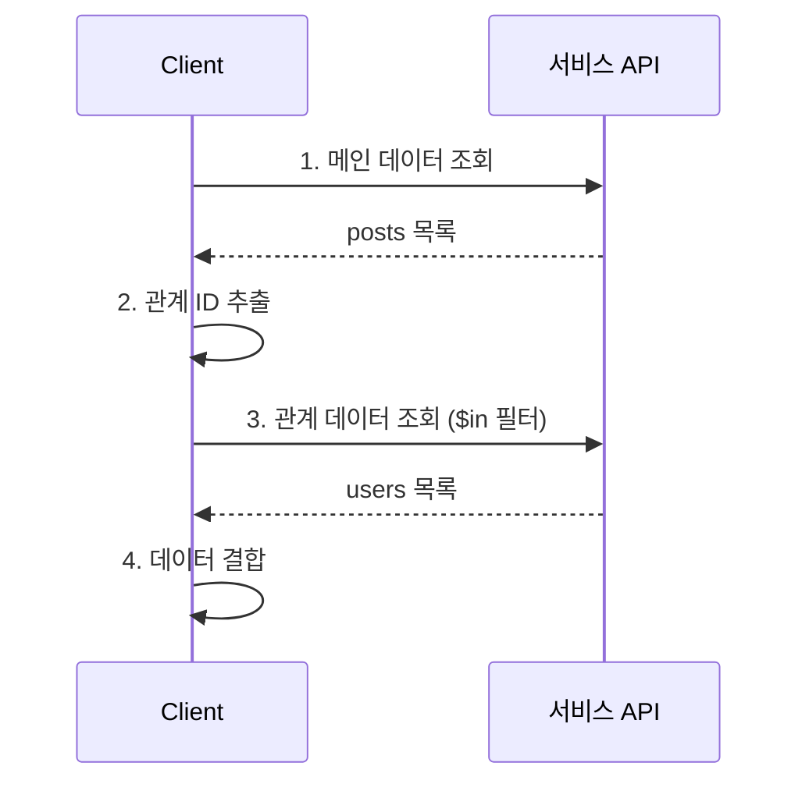

# 조인 쿼리

> 여러 테이블의 데이터를 결합하여 조회하는 방법을 안내합니다.

## 개요

bkend Database는 클라이언트 사이드 조인 방식을 사용합니다. 여러 API 호출의 결과를 클라이언트에서 결합하여 관계 데이터를 조회합니다.

---

## 클라이언트 사이드 조인

### 기본 패턴



1. 메인 테이블의 데이터를 조회합니다
2. 응답에서 관계 ID(외래 키)를 추출합니다
3. 추출한 ID로 관계 테이블을 조회합니다
4. 클라이언트에서 두 결과를 결합합니다

---

## 사용 예시

### 1:N 조인 — 게시글 + 작성자

**시나리오**: `posts` 테이블의 게시글과 `users` 테이블의 작성자 정보를 함께 조회

**1단계: 게시글 목록 조회**

```bash
curl "https://api.bkend.ai/v1/data/posts?page=1&limit=10&sortBy=createdAt&sortDirection=desc" \
  -H "x-project-id: {project_id}" \
  -H "x-environment: dev" \
  -H "Authorization: Bearer {token}"
```

응답:

```json
{
  "items": [
    { "id": "data_post1", "title": "첫 번째 글", "authorId": "data_user1" },
    { "id": "data_post2", "title": "두 번째 글", "authorId": "data_user2" },
    { "id": "data_post3", "title": "세 번째 글", "authorId": "data_user1" }
  ],
  "pagination": { "total": 3, "page": 1, "limit": 10, "totalPages": 1, "hasNext": false, "hasPrev": false }
}
```

**2단계: 작성자 ID 추출 + 사용자 조회**

```bash
curl -X GET "https://api.bkend.ai/v1/data/users" \
  -H "x-project-id: {project_id}" \
  -H "x-environment: dev" \
  -H "Authorization: Bearer {token}" \
  -H "Content-Type: application/json" \
  -d '{
    "andFilters": {
      "_id": { "$in": ["data_user1", "data_user2"] }
    }
  }'
```

**3단계: 클라이언트에서 결합**

```typescript
// 사용자를 Map으로 변환
const userMap = new Map(users.items.map(u => [u.id, u]))

// 게시글에 작성자 정보 결합
const postsWithAuthor = posts.items.map(post => ({
  ...post,
  author: userMap.get(post.authorId)
}))
```

---

### N:M 조인 — 학생 + 수업

**시나리오**: 특정 학생이 수강하는 수업 목록을 조회

**1단계: 수강 정보 조회**

```bash
curl "https://api.bkend.ai/v1/data/enrollments?andFilters[studentId]=data_student1" \
  -H "x-project-id: {project_id}" \
  -H "x-environment: dev" \
  -H "Authorization: Bearer {token}"
```

**2단계: 수업 ID 추출 + 수업 상세 조회**

```bash
curl -X GET "https://api.bkend.ai/v1/data/courses" \
  -H "x-project-id: {project_id}" \
  -H "x-environment: dev" \
  -H "Authorization: Bearer {token}" \
  -H "Content-Type: application/json" \
  -d '{
    "andFilters": {
      "_id": { "$in": ["data_course1", "data_course2", "data_course3"] }
    }
  }'
```

**3단계: 클라이언트에서 결합**

```typescript
const courseMap = new Map(courses.items.map(c => [c.id, c]))

const studentCourses = enrollments.items.map(enrollment => ({
  ...enrollment,
  course: courseMap.get(enrollment.courseId)
}))
```

---

## 조인 최적화

### `$in` 연산자 활용

여러 ID를 한 번에 조회할 때 `$in` 연산자를 사용하세요. 개별 API 호출 대신 한 번의 호출로 여러 레코드를 조회할 수 있습니다.

```json
{
  "andFilters": {
    "_id": { "$in": ["data_id1", "data_id2", "data_id3"] }
  }
}
```

### ID 중복 제거

같은 ID를 여러 번 조회하지 않도록 중복을 제거하세요:

```typescript
const uniqueAuthorIds = [...new Set(posts.items.map(p => p.authorId))]
```

### 필요한 페이지만 조회

전체 데이터를 한 번에 가져오지 말고, 현재 페이지에 필요한 관계 데이터만 조회하세요.

---

## MCP 도구로 조인하기

AI 도구에서 자연어로 조인 조회를 요청할 수 있습니다:

```
"posts 테이블의 최신 글 10개와 각 글의 작성자 정보(users 테이블)를 함께 보여줘"
```

MCP 도구가 여러 테이블을 순차적으로 조회하고 결과를 결합하여 보여줍니다.

---

## 관련 문서

- [관계 설정](12-relations.md) — 테이블 간 관계 설계
- [필터링 & 검색](10-filtering.md) — `$in` 연산자 등 필터 사용법
- [인덱스 & 성능](14-indexes.md) — 외래 키 필드 인덱스
