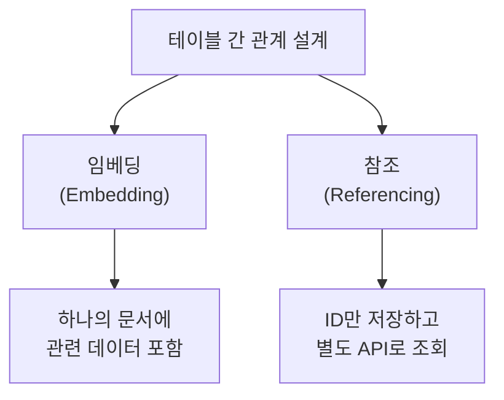
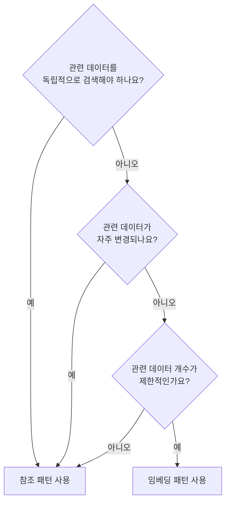
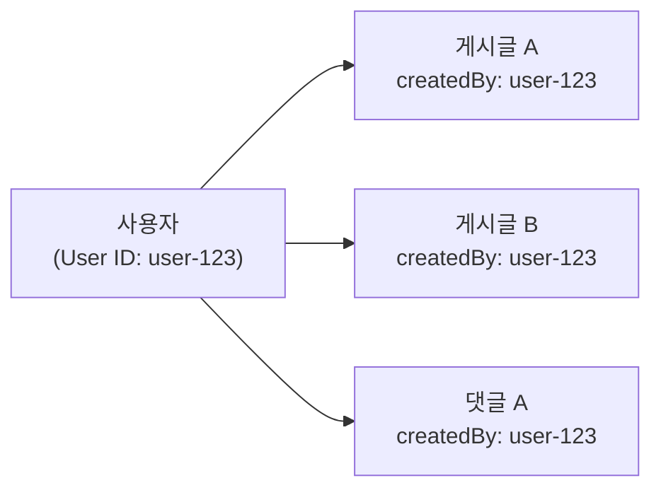

# 테이블 간 관계


💡 bkend에서 테이블 간 관계를 설계하고, 연관 데이터를 효율적으로 조회하는 방법을 알아보세요.


## 개요

bkend의 데이터베이스는 **문서 기반 NoSQL** 구조입니다. 관계형 데이터베이스(RDBMS)의 `JOIN`을 네이티브로 지원하지 않으므로, 테이블 간 관계를 표현할 때 별도의 설계 패턴이 필요합니다.

이 문서에서는 두 가지 핵심 패턴인 **임베딩(Embedding)**과 **참조(Referencing)**를 설명하고, 각 상황에 맞는 선택 기준을 안내합니다.



***

## 임베딩 vs 참조

bkend에서 관계를 표현하는 두 가지 패턴을 비교합니다.

### 임베딩 (Embedding)

관련 데이터를 하나의 문서 안에 **중첩 객체** 또는 **배열**로 포함하는 방식입니다.

```json
{
  "id": "post-001",
  "title": "bkend 시작하기",
  "content": "안녕하세요...",
  "author": {
    "name": "김개발",
    "avatar": "https://example.com/avatar.jpg"
  },
  "comments": [
    {
      "text": "좋은 글이네요!",
      "userName": "이디자인",
      "createdAt": "2025-01-15T10:00:00Z"
    },
    {
      "text": "감사합니다.",
      "userName": "박기획",
      "createdAt": "2025-01-15T11:00:00Z"
    }
  ]
}
```

**장점:**
- 한 번의 API 호출로 모든 관련 데이터 조회
- 네트워크 요청 최소화로 빠른 응답

**단점:**
- 중첩 데이터가 많아지면 문서 크기 증가
- 중첩 데이터를 독립적으로 검색하기 어려움
- 동일한 데이터가 여러 문서에 중복될 수 있음

### 참조 (Referencing)

관련 데이터의 **ID만 저장**하고, 필요할 때 별도 API 호출로 조회하는 방식입니다.

```json
{
  "id": "post-001",
  "title": "bkend 시작하기",
  "content": "안녕하세요...",
  "authorId": "user-uuid-1234",
  "categoryId": "cat-uuid-5678"
}
```

**장점:**
- 데이터 중복 없음 (정규화)
- 각 데이터를 독립적으로 관리/검색 가능
- 문서 크기가 일정하게 유지됨

**단점:**
- 관련 데이터 조회 시 추가 API 호출 필요
- 클라이언트에서 데이터 조합 로직 필요

***

## 패턴 선택 기준



| 기준 | 임베딩 | 참조 |
|------|:------:|:----:|
| 관련 데이터 크기 | 소량 (고정적) | 대량 (증가 가능) |
| 독립 검색 필요 | 불필요 | 필요 |
| 데이터 변경 빈도 | 낮음 | 높음 |
| 읽기 성능 | 빠름 (1회 호출) | 보통 (N+1 호출) |
| 데이터 일관성 | 중복 위험 | 일관적 |

### 실전 예시

| 시나리오 | 추천 패턴 | 이유 |
|---------|:--------:|------|
| 게시글의 태그 | 임베딩 | 태그는 소량이고, 게시글과 항상 함께 조회 |
| 게시글의 댓글 | 참조 | 댓글은 계속 증가하며, 독립 관리 필요 |
| 주문의 배송 주소 | 임베딩 | 주문 시점의 주소 스냅샷 보존 |
| 상품의 카테고리 | 참조 | 카테고리가 변경되면 모든 상품에 반영되어야 함 |
| 사용자 프로필 사진 URL | 임베딩 | 단일 값, 함께 조회됨 |
| 사용자의 주문 목록 | 참조 | 주문이 계속 추가되며, 독립 검색 필요 |

***

## 참조 패턴 구현

참조 패턴에서 가장 중요한 것은 **클라이언트 사이드 조인**입니다. 여러 번의 API 호출로 관련 데이터를 조합합니다.

### 테이블 설계

두 개의 테이블로 게시글-댓글 관계를 구현하는 예시입니다.

**posts 테이블:**

| 필드 | 타입 | 설명 |
|------|------|------|
| `title` | `string` | 게시글 제목 |
| `content` | `string` | 게시글 내용 |
| `authorName` | `string` | 작성자 이름 |
| `createdBy` | `string` | (시스템) 작성자 User ID |

**comments 테이블:**

| 필드 | 타입 | 설명 |
|------|------|------|
| `postId` | `string` | 참조할 게시글 ID |
| `text` | `string` | 댓글 내용 |
| `authorName` | `string` | 작성자 이름 |
| `createdBy` | `string` | (시스템) 작성자 User ID |

### 클라이언트 사이드 조인

게시글과 해당 댓글을 함께 조회하는 코드입니다.



```javascript
// 1. 게시글 조회
const postRes = await fetch(
  'https://api-client.bkend.ai/v1/data/posts/post-001',
  {
    headers: {
      'X-API-Key': '{pk_publishable_key}',
      'Authorization': `Bearer ${accessToken}`,
    },
  }
);
const post = await postRes.json();

// 2. 해당 게시글의 댓글 조회 (참조 ID로 필터링)
const andFilters = JSON.stringify({ postId: post.id });
const commentRes = await fetch(
  `https://api-client.bkend.ai/v1/data/comments?andFilters=${encodeURIComponent(andFilters)}&sortBy=createdAt&sortDirection=asc`,
  {
    headers: {
      'X-API-Key': '{pk_publishable_key}',
      'Authorization': `Bearer ${accessToken}`,
    },
  }
);
const { items: comments } = await commentRes.json();

// 3. 클라이언트에서 조합
const postWithComments = {
  ...post,
  comments,
};
```


```javascript
import { bkendFetch } from './bkend.js';

// 게시글 + 댓글을 한 번에 가져오는 함수
async function getPostWithComments(postId) {
  // 1. 게시글 조회
  const post = await bkendFetch(`/v1/data/posts/${postId}`);

  // 2. 댓글 조회
  const andFilters = JSON.stringify({ postId });
  const { items: comments } = await bkendFetch(
    `/v1/data/comments?andFilters=${encodeURIComponent(andFilters)}&sortBy=createdAt&sortDirection=asc`
  );

  return { ...post, comments };
}
```




⚠️ 참조 패턴에서는 여러 번의 API 호출이 필요합니다. 성능이 중요한 경우, 가능한 곳에서는 병렬 호출(`Promise.all`)을 활용하세요.


### 병렬 조회 최적화

관련 데이터를 병렬로 조회하여 응답 시간을 줄일 수 있습니다.

```javascript
// 게시글 목록 + 각 게시글의 댓글 수를 병렬로 조회
async function getPostListWithCommentCounts() {
  // 1. 게시글 목록 조회
  const { items: posts } = await bkendFetch(
    '/v1/data/posts?page=1&limit=20&sortBy=createdAt&sortDirection=desc'
  );

  // 2. 각 게시글의 댓글을 병렬로 조회
  const commentPromises = posts.map(post => {
    const andFilters = JSON.stringify({ postId: post.id });
    return bkendFetch(
      `/v1/data/comments?andFilters=${encodeURIComponent(andFilters)}&limit=1`
    );
  });

  const commentResults = await Promise.all(commentPromises);

  // 3. 게시글에 댓글 수 추가
  return posts.map((post, i) => ({
    ...post,
    commentCount: commentResults[i].pagination.total,
  }));
}
```


💡 댓글 수만 필요한 경우 `limit=1`로 조회하면 `pagination.total`에서 전체 수를 확인할 수 있습니다. 실제 댓글 데이터를 최소한으로 가져와 네트워크 비용을 줄입니다.


***

## 임베딩 패턴 구현

임베딩 패턴은 스키마에서 `object` 또는 `array` 타입을 활용합니다.

### 스키마 설계


💡 아래 코드의 `bsonType`은 API 응답에 포함되는 내부 저장 형식입니다. 테이블 생성 시에는 `string`, `number`, `boolean`, `date`, `object`, `array`, `reference` 7가지 타입을 사용하세요.


```json
{
  "bsonType": "object",
  "required": ["title", "content"],
  "properties": {
    "title": { "bsonType": "string" },
    "content": { "bsonType": "string" },
    "author": {
      "bsonType": "object",
      "properties": {
        "name": { "bsonType": "string" },
        "avatar": { "bsonType": "string" }
      }
    },
    "tags": {
      "bsonType": "array",
      "items": { "bsonType": "string" }
    }
  }
}
```

### 데이터 생성



```bash
curl -X POST "https://api-client.bkend.ai/v1/data/posts" \
  -H "Content-Type: application/json" \
  -H "X-API-Key: {pk_publishable_key}" \
  -H "Authorization: Bearer {accessToken}" \
  -d '{
    "title": "bkend 시작하기",
    "content": "안녕하세요...",
    "author": {
      "name": "김개발",
      "avatar": "https://example.com/avatar.jpg"
    },
    "tags": ["tutorial", "beginner"]
  }'
```


```javascript
const response = await fetch('https://api-client.bkend.ai/v1/data/posts', {
  method: 'POST',
  headers: {
    'Content-Type': 'application/json',
    'X-API-Key': '{pk_publishable_key}',
    'Authorization': `Bearer ${accessToken}`,
  },
  body: JSON.stringify({
    title: 'bkend 시작하기',
    content: '안녕하세요...',
    author: {
      name: '김개발',
      avatar: 'https://example.com/avatar.jpg',
    },
    tags: ['tutorial', 'beginner'],
  }),
});

const post = await response.json();
```



***

## createdBy를 활용한 사용자-데이터 관계

bkend는 모든 데이터에 `createdBy` 시스템 필드를 자동으로 설정합니다. 이를 통해 별도의 참조 필드 없이도 **사용자와 데이터 간 소유 관계**를 구현할 수 있습니다.



### 내 데이터 조회

`createdBy` 필터로 특정 사용자의 데이터만 조회할 수 있습니다.

```javascript
// 현재 사용자의 게시글만 조회
const andFilters = JSON.stringify({ createdBy: currentUserId });

const response = await fetch(
  `https://api-client.bkend.ai/v1/data/posts?andFilters=${encodeURIComponent(andFilters)}`,
  {
    headers: {
      'X-API-Key': '{pk_publishable_key}',
      'Authorization': `Bearer ${accessToken}`,
    },
  }
);

const { items: myPosts } = await response.json();
```

### self 권한 활용

테이블 권한에서 `self`를 설정하면, **별도의 필터 없이** 자동으로 본인 데이터만 반환됩니다.

| 권한 설정 | 동작 |
|----------|------|
| `self.list = true` | 목록 조회 시 `createdBy`가 본인인 데이터만 반환 |
| `self.read = true` | 단건 조회 시 본인 데이터만 조회 가능 |
| `self.update = true` | 본인 데이터만 수정 가능 |
| `self.delete = true` | 본인 데이터만 삭제 가능 |


💡 `self` 권한은 서버 측에서 강제 적용됩니다. 클라이언트에서 필터를 우회하더라도 타인의 데이터에 접근할 수 없어 보안이 보장됩니다.


***

## 관계 설계 모범 사례

### 1. 읽기 빈도가 높은 데이터는 임베딩

자주 함께 조회되는 데이터는 임베딩으로 API 호출 횟수를 줄이세요.

```json
{
  "id": "order-001",
  "items": [
    { "productName": "노트북", "price": 1200000, "quantity": 1 },
    { "productName": "마우스", "price": 35000, "quantity": 2 }
  ],
  "shippingAddress": {
    "city": "서울",
    "detail": "강남구 역삼동 123"
  }
}
```

### 2. 변경이 잦은 데이터는 참조

독립적으로 업데이트해야 하는 데이터는 별도 테이블로 분리하세요.

```
products 테이블: { id, name, price, stock }
reviews 테이블:  { id, productId, rating, text, createdBy }
```

### 3. N+1 문제에 주의

참조 패턴에서 목록의 각 항목마다 추가 API 호출이 발생하는 **N+1 문제**를 주의하세요.


⚠️ 목록 20개 조회 + 각 항목의 관련 데이터 조회 = 총 21회 API 호출이 발생합니다. `Promise.all`로 병렬 처리하거나, 필요한 필드를 임베딩하여 호출 횟수를 줄이세요.


### 4. 하이브리드 접근

임베딩과 참조를 조합하여 사용할 수 있습니다. 자주 사용하는 정보는 임베딩하고, 상세 데이터는 참조로 분리합니다.

```json
{
  "id": "post-001",
  "title": "bkend 시작하기",
  "authorId": "user-uuid-1234",
  "authorName": "김개발",
  "authorAvatar": "https://example.com/avatar.jpg",
  "commentCount": 15
}
```

이 예시에서 `authorId`는 참조이지만, `authorName`과 `authorAvatar`는 목록에서 빠르게 표시하기 위해 임베딩했습니다. 프로필 상세 정보가 필요할 때만 `authorId`로 추가 조회합니다.

***

## 다음 단계

- [데이터 모델 이해](02-data-model.md) — 스키마, 권한, 시스템 필드
- [필터링](08-filtering.md) — AND/OR 필터로 참조 데이터 조회
- [데이터 CRUD 앱 패턴](12-crud-app-patterns.md) — 앱에서 CRUD 구현하기
- [성능 최적화](../guides/04-performance.md) — API 호출 최적화
