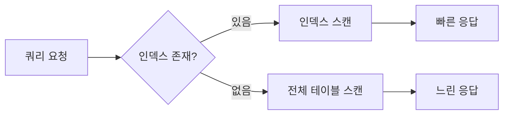

# 인덱스 & 성능

> 테이블 인덱스를 생성하고 관리하여 조회 성능을 향상시키는 방법을 안내합니다.

## 개요

인덱스는 데이터 조회 속도를 향상시키는 데이터 구조입니다. 자주 검색하거나 정렬하는 필드에 인덱스를 추가하면 쿼리 성능이 크게 개선됩니다.

---

## 인덱스 기본 개념



| 항목 | 인덱스 없음 | 인덱스 있음 |
|------|-----------|-----------|
| 검색 방식 | 전체 스캔 | 인덱스 스캔 |
| 데이터 1만 건 | 느림 | 빠름 |
| 쓰기 성능 | 빠름 | 약간 느림 (인덱스 업데이트) |

---

## 콘솔에서 인덱스 관리하기

1. **Database** 메뉴에서 테이블을 선택하세요.
2. **Indexes** 탭으로 이동하세요.
3. 현재 인덱스 목록을 확인할 수 있습니다.
4. **인덱스 추가** 버튼으로 새 인덱스를 생성하세요.

### 인덱스 목록 컬럼

| 컬럼 | 설명 |
|------|------|
| **이름** | 인덱스 이름 |
| **필드** | 인덱스 대상 필드와 정렬 방향 |
| **유니크** | 유니크 인덱스 여부 |
| **스파스** | 스파스 인덱스 여부 |

---

## MCP 도구로 인덱스 관리하기

AI 도구에서 자연어로 인덱스를 관리할 수 있습니다:

```
"users 테이블에 email 필드에 유니크 인덱스를 추가해줘"
```

```
"products 테이블에 category + price 복합 인덱스를 추가해줘"
```

---

## REST API로 인덱스 관리하기

### 인덱스 추가

```bash
curl -X POST "https://api.bkend.ai/v1/projects/{project_id}/environments/{environment}/tables/{tableName}/indexes/manage" \
  -H "Authorization: Bearer {your_token}" \
  -H "Content-Type: application/json" \
  -d '{
    "indexesToAddOrUpdate": [
      {
        "name": "idx_email",
        "fields": { "email": 1 },
        "unique": true
      }
    ]
  }'
```

### 복합 인덱스 추가

```bash
curl -X POST "https://api.bkend.ai/v1/projects/{project_id}/environments/{environment}/tables/{tableName}/indexes/manage" \
  -H "Authorization: Bearer {your_token}" \
  -H "Content-Type: application/json" \
  -d '{
    "indexesToAddOrUpdate": [
      {
        "name": "idx_category_price",
        "fields": { "category": 1, "price": -1 }
      }
    ]
  }'
```

### 인덱스 삭제

```bash
curl -X POST "https://api.bkend.ai/v1/projects/{project_id}/environments/{environment}/tables/{tableName}/indexes/manage" \
  -H "Authorization: Bearer {your_token}" \
  -H "Content-Type: application/json" \
  -d '{
    "indexesToRemove": ["idx_category_price"]
  }'
```

### 응답

```json
{
  "_id": "tbl_abc123",
  "projectId": "{project_id}",
  "environment": "dev",
  "tableName": "users",
  "indexVersion": 3,
  "previousIndexVersion": 2,
  "indexes": [
    { "name": "idx_email", "fields": { "email": 1 }, "unique": true }
  ],
  "appliedIndexes": {
    "added": ["idx_email"],
    "updated": [],
    "removed": []
  },
  "updatedAt": "2026-02-06T10:00:00Z"
}
```

---

## 인덱스 정의

| 파라미터 | 타입 | 필수 | 설명 |
|---------|------|------|------|
| `name` | string | ✅ | 인덱스 이름 |
| `fields` | object | ✅ | 인덱스 필드와 방향 (`1`: 오름차순, `-1`: 내림차순) |
| `unique` | boolean | - | 유니크 인덱스 (기본값: `false`) |
| `sparse` | boolean | - | 스파스 인덱스 (기본값: `false`) |

---

## 인덱스 유형

### 단일 필드 인덱스

하나의 필드에 대한 인덱스입니다.

```json
{
  "name": "idx_email",
  "fields": { "email": 1 },
  "unique": true
}
```

### 복합 인덱스

여러 필드를 조합한 인덱스입니다. 필드 순서가 중요합니다.

```json
{
  "name": "idx_category_price",
  "fields": { "category": 1, "price": -1 }
}
```

> 💡 **Tip** - 복합 인덱스는 왼쪽 필드부터 순서대로 사용됩니다. `{ "category": 1, "price": -1 }` 인덱스는 `category`만으로 검색할 때도 사용되지만, `price`만으로 검색할 때는 사용되지 않습니다.

### 유니크 인덱스

중복 값을 허용하지 않는 인덱스입니다.

```json
{
  "name": "idx_email_unique",
  "fields": { "email": 1 },
  "unique": true
}
```

### 스파스 인덱스

해당 필드가 존재하는 문서만 인덱스에 포함합니다. 선택적 필드에 유용합니다.

```json
{
  "name": "idx_phone_sparse",
  "fields": { "phone": 1 },
  "sparse": true
}
```

---

## 필드 정렬 방향

| 값 | 방향 | 설명 |
|-----|------|------|
| `1` | 오름차순 (ASC) | A→Z, 1→9 |
| `-1` | 내림차순 (DESC) | Z→A, 9→1 |

---

## 인덱스 버전 관리

인덱스 변경 시 새로운 버전이 생성됩니다. 이전 버전으로 롤백할 수 있습니다.

| 필드 | 설명 |
|------|------|
| `indexVersion` | 현재 인덱스 버전 번호 |
| `previousIndexVersion` | 변경 전 버전 번호 |

콘솔의 **Indexes** 탭에서 인덱스 버전 이력을 확인하고 이전 버전으로 롤백할 수 있습니다.

---

## 시스템 인덱스

bkend는 기본 시스템 인덱스를 자동으로 생성합니다. 시스템 인덱스는 수정하거나 삭제할 수 없습니다.

> ⚠️ **주의** - 시스템 인덱스를 수정하거나 삭제하려고 하면 에러가 발생합니다.

---

## 인덱스 설계 가이드

### 인덱스를 추가해야 하는 경우

- `andFilters`에 자주 사용하는 필드
- `sortBy`에 자주 사용하는 필드
- 외래 키 필드 (`userId`, `postId` 등)
- `unique` 제약이 필요한 필드

### 인덱스 추가를 피해야 하는 경우

- 거의 검색하지 않는 필드
- 값의 종류가 매우 적은 필드 (예: Boolean)
- 데이터가 매우 적은 테이블

---

## 에러 응답

| 에러 코드 | 설명 |
|----------|------|
| `CANNOT_MODIFY_SYSTEM_INDEX` | 시스템 인덱스를 수정하려고 함 |
| `CANNOT_REMOVE_SYSTEM_INDEX` | 시스템 인덱스를 삭제하려고 함 |
| `table/not-found` | 테이블이 존재하지 않음 |

---

## 관련 문서

- [필터링 & 검색](10-filtering.md) — 필터링 성능 향상
- [정렬 & 페이지네이션](11-sorting-pagination.md) — 정렬 성능 향상
- [콘솔에서 DB 관리](02-console-ui.md) — Indexes 탭 사용법
- [마이그레이션](15-migrations.md) — 스키마/인덱스 버전 관리
