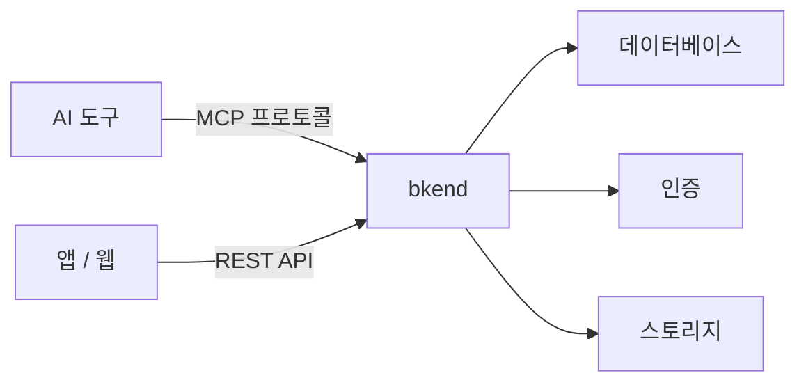
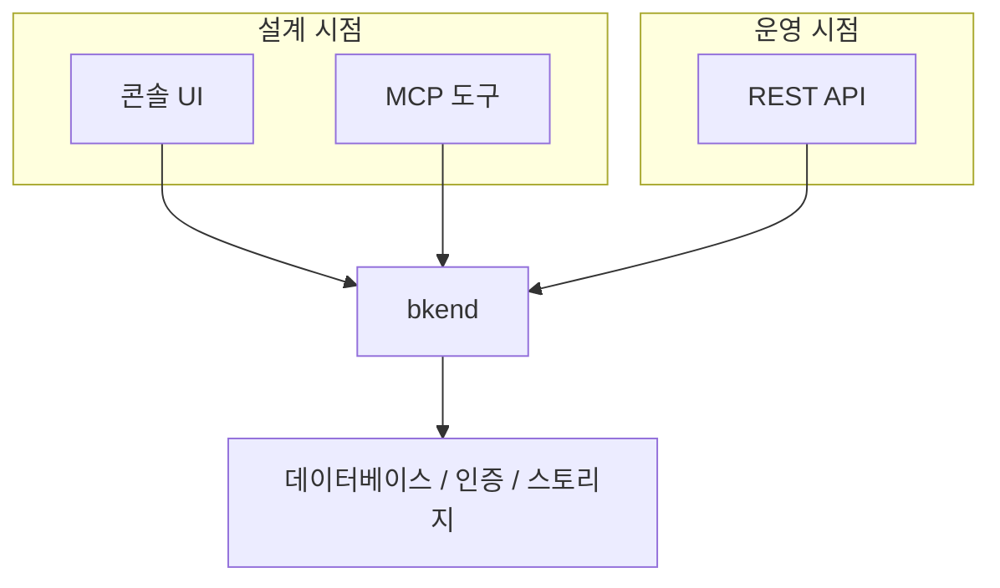

# bkend란?


💡 bkend는 AI 도구로 백엔드를 구축하고, REST API로 앱과 연동하는 서비스형 백엔드(BaaS) 플랫폼입니다.


## 개요

bkend는 서버 코드 없이 데이터베이스, 인증, 스토리지를 관리할 수 있는 백엔드 플랫폼입니다. Claude Code, Cursor 같은 AI 도구에서 자연어로 백엔드를 구축하고, REST API로 앱과 연동합니다.

***

## 왜 bkend인가?

기존 백엔드 개발은 서버 코드 작성, 데이터베이스 설정, 인증 구현, 배포 파이프라인 구성 등 많은 작업을 요구합니다. bkend는 이 모든 작업을 AI 도구의 자연어 명령이나 REST API 호출로 대체합니다.

| 기존 방식 | bkend |
|----------|-------|
| 서버 코드 작성 | AI 도구로 자연어 명령 |
| 데이터베이스 직접 설정 | 콘솔 또는 MCP 도구로 관리 |
| 인증 라이브러리 통합 | 내장 인증 시스템 |
| 파일 서버 구축 | 내장 스토리지 |
| 배포 파이프라인 구성 | 자동 프로비저닝 |

***

## 핵심 기능

### 데이터베이스

콘솔이나 MCP 도구로 동적 테이블을 생성하고, REST API(`/v1/data/{테이블명}`)로 데이터를 CRUD(Create, Read, Update, Delete)합니다. 7가지 컬럼 타입, 제약 조건, 인덱스, 관계 설정을 지원합니다.


💡 **동적 테이블**이란, 콘솔이나 MCP 도구로 스키마를 정의하면 REST API 엔드포인트(`/v1/data/{테이블명}`)가 자동 생성되는 테이블입니다. 서버 코드 없이 테이블을 만들고 바로 API로 데이터에 접근할 수 있습니다.


### 인증

이메일 회원가입, 소셜 로그인(Google, GitHub), 매직 링크, MFA(Multi-Factor Authentication)를 제공합니다. JWT(JSON Web Token) 기반 세션 관리와 토큰 자동 갱신을 처리합니다.

### 스토리지

Presigned URL 기반 파일 업로드/다운로드를 제공합니다. 대용량 파일은 멀티파트 업로드를 지원합니다.

### AI 도구 연동

[MCP(Model Context Protocol)](https://spec.modelcontextprotocol.io/2025-03-26) 표준을 지원합니다. Claude Code, Cursor 등에서 bkend의 모든 기능을 자연어로 사용할 수 있습니다.

### 콘솔

웹 기반 관리 콘솔에서 프로젝트, 환경, 팀원, 데이터를 시각적으로 관리합니다.

***

## 사용 방식

bkend는 세 가지 방식으로 사용할 수 있습니다.

| 방식 | 대상 | 설명 |
|------|------|------|
| **MCP 도구** | AI 도구 사용자 | Claude Code, Cursor에서 자연어로 백엔드 구축 |
| **REST API** | 앱 개발자 | HTTP 요청으로 데이터 조회/수정, 사용자 인증, 파일 관리 |
| **콘솔** | 모든 사용자 | 웹 UI에서 시각적으로 관리 |


💡 bkend에서 **Tenant**는 백엔드를 구축하는 개발자(콘솔/MCP 사용), **User**는 앱을 사용하는 최종 사용자(REST API 대상)를 의미합니다. 자세한 내용은 [Tenant와 User 이해](05-tenant-vs-user.md)를 참고하세요.


***


✅ bkend를 처음 사용한다면 [빠른 시작](02-quickstart.md)에서 10분 만에 첫 프로젝트를 만들어보세요. 프레임워크별 연동은 [프레임워크 QuickStart](07-quickstart-framework.md)를 참고하세요.


## 다음 단계

- [빠른 시작](02-quickstart.md) — 10분 만에 첫 프로젝트를 만들어보세요
- [앱에서 bkend 연동하기](03-app-integration.md) — REST API로 앱에 bkend를 연결하세요
- [핵심 개념](04-core-concepts.md) — Organization, Project, Environment 구조를 이해하세요
- [MCP 도구 개요](../mcp/01-overview.md) — AI 도구에서 사용할 수 있는 MCP 도구를 확인하세요
- [실전 프로젝트 쿡북](../../cookbooks/README.md) — 블로그, 소셜 네트워크 등 실전 앱 따라 만들기
