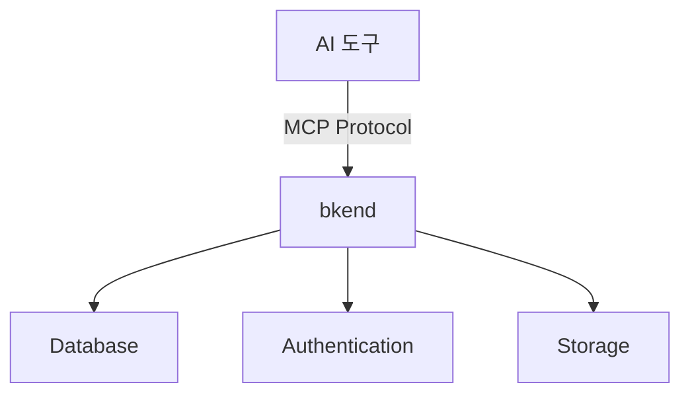
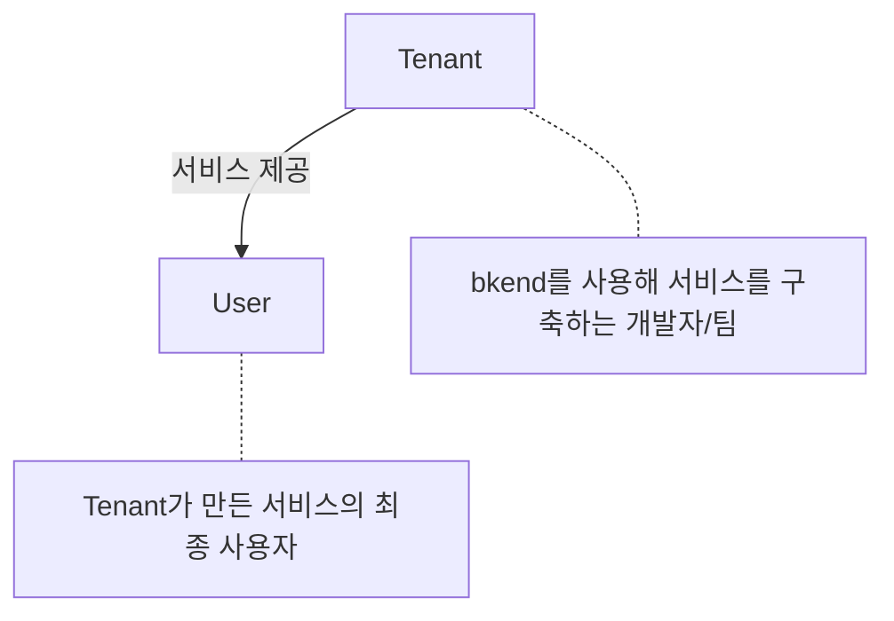
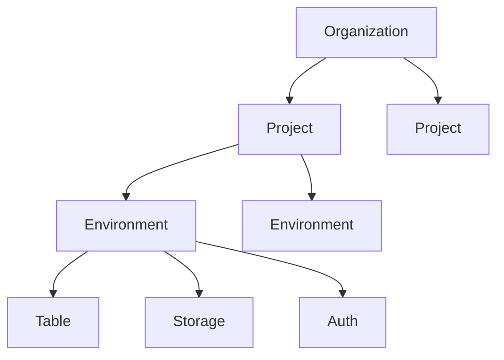

# bkend란?

> AI 도구와 자연스럽게 연동되는 백엔드 서비스 플랫폼입니다.

## 개요

bkend는 **AI 도구에서 바로 사용할 수 있는 백엔드 서비스**입니다. [MCP(Model Context Protocol)](https://spec.modelcontextprotocol.io/2025-03-26)를 통해 AI 도구와 연결되어, 별도의 서버 구축 없이 Database, Authentication, Storage 기능을 즉시 사용할 수 있습니다.



---

## 주요 특징

### MCP 기반 연동

bkend는 Anthropic이 제정한 [Model Context Protocol](https://spec.modelcontextprotocol.io/2025-03-26) 표준을 지원합니다. AI 도구에서 자연어로 명령하면, bkend가 데이터를 저장하고 조회합니다.

Claude Code, Cursor 등 MCP를 지원하는 AI 도구에서 bkend를 연결할 수 있습니다. 자세한 설정 방법은 [빠른 시작](02-quickstart.md)을 참고하세요.

### 즉시 사용 가능한 백엔드

복잡한 인프라 설정 없이 즉시 프로젝트를 시작할 수 있습니다:

- **Database** — 테이블 생성, CRUD 작업, 스키마 관리
- **Authentication** — 이메일/소셜 로그인, 세션 관리
- **Storage** — 파일 업로드, 다운로드, 접근 권한 관리

### OAuth 2.1 기반 보안

bkend는 [OAuth 2.1](https://datatracker.ietf.org/doc/html/draft-ietf-oauth-v2-1-12) + PKCE 표준을 사용하여 AI 도구와 안전하게 인증합니다. 별도의 API Key 설정 없이 브라우저에서 로그인하면 연동이 완료됩니다.

---

## Tenant와 User

bkend에는 두 가지 유형의 사용자가 있습니다:



| 사용자 | 설명 | 접근 방식 |
|--------|------|----------|
| **Tenant** | bkend를 사용해 서비스를 구축하는 개발자/팀 | bkend 콘솔, AI 도구 (MCP) |
| **User** | Tenant가 만든 서비스의 최종 사용자 | Tenant가 만든 앱/웹 |

> 💡 **Tip** - Tenant와 User의 차이를 더 자세히 알고 싶다면 [Tenant vs User](05-tenant-vs-user.md)를 참고하세요.

---

## 리소스 계층 구조

bkend의 리소스는 다음과 같은 계층 구조를 가집니다:



| 리소스 | 설명 | 예시 |
|--------|------|------|
| **Organization** | 팀 또는 회사 단위의 최상위 리소스 | "My Startup" |
| **Project** | Organization 하위의 서비스 단위 | "My First App" |
| **Environment** | 프로젝트 내 배포 환경 (데이터 완전 격리) | dev, staging, prod |

> 💡 **Tip** - Organization과 Project에 대해 더 알고 싶다면 [Organization & Project](06-org-and-project.md)를 참고하세요.

---

## bkend를 사용하면 좋은 점

### 기존 방식의 문제점

전통적인 백엔드 개발은 많은 초기 설정이 필요합니다:

- 서버 인프라 구축 및 관리
- 데이터베이스 설치 및 설정
- 인증 시스템 구현
- API 설계 및 개발

### bkend의 해결책

| 기존 방식 | bkend |
|----------|-------|
| 서버 구축 필요 | 서버리스 (관리형) |
| DB 설치/설정 | 콘솔에서 테이블 생성 |
| 인증 구현 | 내장 인증 시스템 |
| API 개발 | MCP로 자동 연동 |

---

## 지원 기능

### Database

- 동적 테이블 생성 및 스키마 관리
- 자동 CRUD API 생성
- 환경별(dev/staging/prod) 데이터 격리
- 인덱스 및 성능 최적화

### Authentication

- 이메일/소셜 로그인 (Google, GitHub)
- [JWT](https://datatracker.ietf.org/doc/html/rfc7519) 기반 세션 관리
- 비밀번호 재설정, 이메일 인증
- 역할 기반 접근 제어 (RBAC)

### Storage

- 파일 업로드/다운로드
- 버킷 기반 파일 관리
- 접근 권한 관리

---

## 사용 예시

### AI 도구에서 데이터 저장하기

AI 도구에서 자연어로 데이터를 저장할 수 있습니다:

```
"users 테이블에 새 사용자를 추가해줘: 이름은 김철수, 이메일은 kim@example.com"
```

bkend MCP가 자동으로 다음을 수행합니다:

1. `users` 테이블 존재 여부 확인
2. 데이터 유효성 검사
3. 레코드 삽입
4. 결과 반환

### REST API 예제

```bash
# 데이터 조회
curl -X POST "https://api.bkend.ai/v1/data/{project_id}/{environment}/users/find" \
  -H "Authorization: Bearer {your_token}" \
  -H "Content-Type: application/json" \
  -d '{"filter": {"author_id": "user_123"}, "sort": {"created_at": -1}}'
```

---

## 다음 단계

- [빠른 시작](02-quickstart.md) — 5분 안에 첫 프로젝트를 시작하세요
- [콘솔 화면 구성](03-console-overview.md) — 콘솔 UI 사용법을 익히세요
- [핵심 개념](04-core-concepts.md) — bkend의 핵심 개념을 이해하세요
