# 빠른 시작

> 5분 안에 bkend를 설정하고 첫 번째 데이터를 저장해보세요.

## 사전 준비

* 이메일 또는 소셜 계정 (Google, GitHub)
* MCP를 지원하는 AI 도구 (Claude Code, Cursor 등)

***

## 전체 흐름

```mermaid
flowchart LR
    A[회원가입] --> B[Organization 생성]
    B --> C[Project 생성]
    C --> D[AI 도구 연결]
    D --> E[테이블 생성 및 데이터 저장]
```



***

## 1단계: 회원가입하기

1. [console.bkend.ai](https://console.bkend.ai)에 접속하세요.
2. **Sign Up** 버튼을 클릭하세요.
3. 이메일 또는 소셜 로그인(Google, GitHub)으로 계정을 생성하세요.
4. 이메일 인증을 완료하세요.

***

## 2단계: Organization 생성하기

회원가입 후 첫 Organization을 생성하세요.

| 필드                    | 입력 예시      | 설명                                |
| --------------------- | ---------- | --------------------------------- |
| **Organization Name** | My Startup | 조직 표시 이름 (최대 100자)                |
| **Organization Slug** | my-startup | URL에 사용되는 식별자 (3-50자, 소문자/숫자/하이픈) |

**Create Organization** 버튼을 클릭하세요.

> 💡 **Tip** - Organization은 팀 또는 회사 단위의 최상위 리소스입니다. 결제와 멤버 관리의 기본 단위가 됩니다.

***

## 3단계: Project 생성하기

Organization 생성 후 첫 프로젝트를 만드세요.

| 필드               | 입력 예시                  | 설명                 |
| ---------------- | ---------------------- | ------------------ |
| **Project Name** | My First App           | 프로젝트 이름 (최대 100자)  |
| **Project Slug** | my-first-app           | URL 식별자 (자동 생성 가능) |
| **Region**       | Seoul (ap-northeast-2) | 배포 리전              |
| **Cloud**        | AWS                    | 클라우드 제공자           |

**Create Project** 버튼을 클릭하세요.

프로젝트 생성 시 자동으로 **dev 환경**이 프로비저닝됩니다 (약 30초 소요).

```mermaid
flowchart LR
    A[프로젝트 생성] --> B[Database 프로비저닝]
    B --> C[Storage 설정]
    C --> D[Auth 시스템 초기화]
    D --> E[API 엔드포인트 생성]
    E --> F[준비 완료]
```



***

## 4단계: AI 도구 연결하기

생성된 프로젝트에 AI 도구를 연결하세요. 사용하는 도구에 따라 설정 방법이 다릅니다.

### Claude Code / Cursor

MCP 설정 파일에 다음을 추가하세요:

```json
{
  "mcpServers": {
    "mcp-bkend": {
      "type": "http",
      "url": "https://api.bkend.ai/mcp"
    }
  }
}
```

첫 연결 시 브라우저에서 [OAuth 2.1](https://datatracker.ietf.org/doc/html/draft-ietf-oauth-v2-1-12) 인증이 진행됩니다:

1. bkend 콘솔 로그인 (이미 로그인되어 있으면 생략)
2. Organization 선택
3. 권한 승인

> 💡 **Tip** - 각 AI 도구별 상세 설정은 [AI 도구 연동](../integrations/01-overview.md)을 참고하세요.

***

## 5단계: 첫 번째 테이블 생성하기

AI 도구에서 자연어로 테이블을 생성할 수 있습니다.

### AI 도구에서 명령하기

```
"users 테이블을 만들어줘.
name(문자열), email(문자열), created_at(날짜) 필드가 필요해."
```

### 콘솔에서 직접 생성하기

1. 콘솔의 **Database** 메뉴로 이동하세요.
2. **Create Table** 버튼을 클릭하세요.
3. 테이블 이름과 컬럼을 정의하세요.

***

## 6단계: 데이터 저장 및 조회하기

### AI 도구에서 데이터 저장하기

```
"users 테이블에 새 사용자를 추가해줘.
name: 홍길동, email: hong@example.com"
```

### AI 도구에서 데이터 조회하기

```
"users 테이블의 모든 데이터를 보여줘."
```

### 데이터 수정 및 삭제하기

```
"홍길동의 이메일을 hong2@example.com으로 변경해줘."

"홍길동 데이터를 삭제해줘."
```

***

## 완성된 구조

```
Organization: My Startup
└── Project: My First App
    └── Environment: dev
        └── Table: users
            ├── name (string)
            ├── email (string)
            └── created_at (datetime)
```

***

## 문제 해결

### MCP 연결이 안 될 때

1. bkend 콘솔에 로그인되어 있는지 확인하세요.
2. Organization에 프로젝트가 하나 이상 있는지 확인하세요.
3. 브라우저에서 OAuth 인증을 완료했는지 확인하세요.
4. MCP 설정을 제거 후 다시 추가해보세요.

### 테이블 생성이 안 될 때

1. 프로젝트의 dev 환경이 **Active** 상태인지 확인하세요.
2. 콘솔의 **Database** 탭에서 환경을 선택했는지 확인하세요.
3. 테이블 이름이 영문 소문자로 시작하는지 확인하세요.

### 데이터 조회가 실패할 때

1. 올바른 환경(dev)이 선택되어 있는지 확인하세요.
2. 테이블 이름이 정확한지 확인하세요.

> ⚠️ **주의** - 더 많은 문제 해결 방법은 [자주 발생하는 에러](../troubleshooting/01-common-errors.md)를 참고하세요.

***

## 다음 단계

### 콘솔 활용

* [콘솔 화면 구성](03-console-overview.md) — 콘솔 UI 사용법을 익히세요

### 기능 심화

| 기능                 | 문서                                          | 내용                |
| ------------------ | ------------------------------------------- | ----------------- |
| **Database**       | [Database 개요](../database/01-overview.md)   | 테이블 스키마 설계, 고급 쿼리 |
| **Authentication** | [Auth 개요](../authentication/01-overview.md) | 이메일/소셜 로그인, 세션 관리 |
| **Storage**        | [Storage 개요](../storage/01-overview.md)     | 파일 업로드/다운로드       |

### AI 도구 연동 심화

| 도구          | 문서                                                        |
| ----------- | --------------------------------------------------------- |
| Claude Code | [Claude Code 설정](../integrations/03-claude-code-setup.md) |
| Cursor      | [Cursor 설정](../integrations/05-cursor-setup.md)           |
| 기타 도구       | [AI 도구 연동 개요](../integrations/01-overview.md)             |

### 실전 프로젝트

| 프로젝트                                      | 난이도 | 설명           |
| ----------------------------------------- | --- | ------------ |
| [Todo 앱](../cookbook/01-todo-app.md)      | 쉬움  | 할 일 관리 앱     |
| [블로그 백엔드](../cookbook/02-blog-backend.md) | 중간  | 게시글, 댓글, 사용자 |
| [이커머스](../cookbook/05-ecommerce.md)       | 어려움 | 상품, 주문, 결제   |
