# 빠른 시작


💡 10분 만에 bkend에서 프로젝트를 생성하고, 첫 데이터를 앱에서 조회해봅니다.


## 개요

이 가이드에서는 회원가입부터 첫 REST API 호출까지 전체 과정을 안내합니다.

***

## 전체 과정



***

## 사전 준비

- 웹 브라우저
- AI 도구 설치 (Claude Code, Cursor 등 하나 이상) — MCP 없이 REST API만 사용한다면 선택사항

***

## 1단계: 회원가입하기

1. [bkend 콘솔](https://console.bkend.ai)에 접속하세요.
2. **Google** 또는 **GitHub** 계정으로 로그인하세요. 매직 링크 로그인도 지원합니다.


✅ 로그인하면 자동으로 콘솔 홈 화면으로 이동합니다.


***

## 2단계: 조직 생성하기

1. 콘솔에서 **조직 생성** 버튼을 클릭하세요.
2. 조직 이름을 입력하세요 (예: `My Startup`).
3. **생성**을 클릭하세요.

***

## 3단계: 프로젝트 생성하기

1. 조직 페이지에서 **프로젝트** 메뉴를 클릭하세요.
2. **프로젝트 생성** 버튼을 클릭하세요.
3. 다음 정보를 입력하세요.

| 필드 | 예시 | 설명 |
|------|------|------|
| **프로젝트 이름** | My Blog | 프로젝트 표시 이름 |
| **프로젝트 Slug** | my-blog | URL 식별자 (자동 생성 가능) |
| **리전** | Seoul (ap-northeast-2) | 데이터 저장 리전 |
| **클라우드** | AWS | 클라우드 제공자 |

4. **생성**을 클릭하세요.


⚠️ 프로젝트를 생성하면 `dev` 환경이 자동으로 프로비저닝됩니다. **Active** 상태가 될 때까지 약 30초를 기다리세요.


***

## 4단계: AI 도구 연결하기



`~/.claude.json` 파일에 다음을 추가하세요.

```json
{
  "mcpServers": {
    "bkend": {
      "type": "http",
      "url": "https://api.bkend.ai/mcp"
    }
  }
}
```

Claude Code를 재시작하면 OAuth 2.1 인증 흐름이 자동으로 시작됩니다.


Cursor 설정에서 MCP 서버를 추가하세요.

```json
{
  "mcpServers": {
    "bkend": {
      "type": "http",
      "url": "https://api.bkend.ai/mcp"
    }
  }
}
```



***

## 5단계: 첫 테이블 생성하기

AI 도구에서 다음과 같이 요청하세요.

```
"posts 테이블을 만들어줘.
- title: 문자열 (필수)
- content: 문자열 (필수)
- author_name: 문자열
- published: 불리언 (기본값: false)"
```

콘솔의 **데이터베이스** 메뉴에서 생성된 테이블을 확인하세요.


💡 테이블이 생성되었지만 앱에서 데이터를 넣으려면 **API Key**가 필요합니다. 6~7단계로 이어서 진행하세요.


***

## 6단계: API Key 발급하기

앱에서 REST API를 호출하려면 API Key가 필요합니다.

1. 사이드바에서 **MCP**를 클릭하세요.
2. **새 토큰 생성** 버튼을 클릭하세요.
3. 다음 정보를 입력하세요.

| 필드 | 값 |
|------|-----|
| **토큰 이름** | my-app-key |
| **토큰 타입** | BEARER_TOKEN |
| **권한 범위** | Table Data (read, create, update, delete) |

4. **생성**을 클릭하면 토큰이 표시됩니다. 이 값을 안전하게 복사해두세요.


🚨 **위험** — 토큰은 생성 시 한 번만 표시됩니다. 분실 시 재생성해야 합니다.


***

## 7단계: 첫 데이터 생성하기

발급받은 API Key로 앱에서 데이터를 생성합니다. 콘솔 **프로젝트 설정**에서 Project ID를 확인하세요.



```bash
curl -X POST https://api-client.bkend.ai/v1/data/posts \
  -H "Content-Type: application/json" \
  -H "Authorization: Bearer {accessToken}" \
  -H "X-Project-Id: {project_id}" \
  -H "X-Environment: dev" \
  -d '{
    "title": "Hello bkend!",
    "content": "첫 번째 게시글입니다.",
    "published": true
  }'
```


```javascript
const response = await fetch('https://api-client.bkend.ai/v1/data/posts', {
  method: 'POST',
  headers: {
    'Content-Type': 'application/json',
    'Authorization': 'Bearer {accessToken}',
    'X-Project-Id': '{project_id}',
    'X-Environment': 'dev',
  },
  body: JSON.stringify({
    title: 'Hello bkend!',
    content: '첫 번째 게시글입니다.',
    published: true,
  }),
});

const data = await response.json();
console.log(data.id); // 생성된 데이터 ID
```



콘솔의 **데이터베이스** → **posts** 테이블에서 생성된 데이터를 확인하세요.


✅ 첫 번째 프로젝트가 준비되었고, REST API로 데이터를 생성했습니다!


***

## 다음 단계

- [핵심 개념](03-core-concepts.md) — Organization, Project, Environment 구조
- [앱에서 bkend 연동하기](06-app-integration.md) — 앱에 bkend 연결하는 방법
- [콘솔 개요](../console/01-overview.md) — 콘솔 UI 둘러보기
- [AI 도구 연동 개요](../ai-tools/01-overview.md) — MCP 도구 상세 가이드
- [테이블 관리](../console/07-table-management.md) — 콘솔에서 테이블 설계하기
- [실전 프로젝트 쿡북](../../cookbooks/README.md) — 블로그부터 쇼핑몰까지, 실전 앱 구축 튜토리얼
