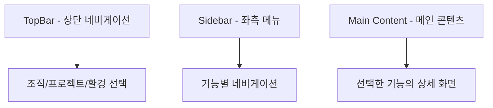

# 콘솔 화면 구성

> bkend 콘솔의 전체 레이아웃과 메뉴 구조를 살펴봅니다.

## 개요

bkend 콘솔은 [console.bkend.ai](https://console.bkend.ai)에서 접근할 수 있는 웹 기반 관리 도구입니다. Organization, Project, Environment를 관리하고, Database, Authentication, Storage 기능을 시각적으로 제어할 수 있습니다.

---

## 전체 레이아웃

콘솔은 세 가지 영역으로 구성됩니다:

| 영역 | 위치 | 역할 |
|------|------|------|
| **TopBar** | 상단 고정 | Organization, Project, Environment 선택, 사용자 메뉴 |
| **Sidebar** | 좌측 | 기능별 네비게이션 메뉴 |
| **Main Content** | 중앙 | 선택한 기능의 상세 화면 |

---

## TopBar (상단 네비게이션)

TopBar에서는 다음 기능을 사용할 수 있습니다:

| 요소 | 설명 |
|------|------|
| **Organization 선택기** | 소속된 Organization 간 전환 |
| **Project 선택기** | Organization 내 프로젝트 간 전환 |
| **Environment 선택기** | 프로젝트 내 환경 (dev, staging, prod) 전환 |
| **알림** | 시스템 알림 확인 |
| **사용자 메뉴** | 프로필, 계정 설정, 로그아웃 |

> 💡 **Tip** - Environment를 전환하면 Database, Storage, Auth 데이터가 해당 환경의 데이터로 변경됩니다. 환경 간 데이터는 완전히 격리되어 있습니다.

---

## Sidebar (좌측 메뉴)

Sidebar는 현재 선택된 컨텍스트에 따라 메뉴가 변경됩니다.

### Organization 레벨 메뉴

프로젝트를 선택하지 않았을 때 표시됩니다:

| 메뉴 | 설명 |
|------|------|
| **Home** | Organization 대시보드, 최근 프로젝트, 통계 |
| **Projects** | 프로젝트 목록 및 생성 |
| **Team** | 팀 멤버 초대 및 역할 관리 |
| **MCP** | MCP 연결 설정 |
| **Settings** | Organization 설정 |

### Project 레벨 메뉴

프로젝트를 선택했을 때 표시됩니다:

| 메뉴 | 설명 |
|------|------|
| **Overview** | 프로젝트 대시보드, 통계, 빠른 액션 |
| **Environments** | 환경 목록 및 관리 (dev/staging/prod) |
| **Auth** | 인증 관리, User 목록 |
| **Database** | 테이블 관리, 데이터 뷰어 |
| **Storage** | 파일 스토리지 관리 |
| **Activities** | 활동 로그 조회 |
| **Settings** | 프로젝트 설정 |

### Sidebar 모드

Sidebar는 세 가지 모드를 지원합니다:

| 모드 | 너비 | 설명 |
|------|------|------|
| **Expanded** | 282px | 전체 메뉴 텍스트 표시 |
| **Collapsed** | 64px | 아이콘만 표시 |
| **Hover** | 호버 시 확장 | 아이콘 상태에서 마우스 오버 시 확장 |

> 💡 **Tip** - 모바일에서는 Sidebar가 드로어(서랍) 형태로 표시됩니다.

---

## Organization 대시보드

Organization Home에서는 다음 정보를 확인할 수 있습니다:

### 빠른 통계

| 항목 | 설명 |
|------|------|
| 프로젝트 수 | Organization 내 전체 프로젝트 수 |
| 팀 멤버 수 | Organization에 속한 멤버 수 |
| 스토리지 사용량 | 전체 스토리지 사용량 |
| 테이블 수 | 전체 테이블 수 |

### 빠른 액션

- **새 프로젝트 생성** — 새 프로젝트를 만듭니다
- **팀 멤버 초대** — 새로운 멤버를 초대합니다
- **프로젝트 목록 보기** — 전체 프로젝트를 확인합니다
- **Organization 설정** — 설정 페이지로 이동합니다

### 최근 프로젝트

최대 6개의 최근 프로젝트가 카드 형태로 표시됩니다. 각 카드에는 프로젝트명, 설명, 리전, 클라우드 정보가 포함됩니다.

### 최근 활동

Organization 내 최근 활동 로그가 시간순으로 표시됩니다.

---

## Project 대시보드

Project Overview에서는 다음 정보를 확인할 수 있습니다:

### 빠른 통계

| 항목 | 설명 |
|------|------|
| 테이블 수 | 프로젝트 내 테이블 수 |
| 스토리지 사용량 | 프로젝트의 스토리지 사용량 |
| 인증된 User 수 | 등록된 User 수 |

### 프로젝트 정보

- 기본 정보: 리전, 클라우드, 생성일, 환경 수
- API 엔드포인트 🚧 확인 필요
- 데이터베이스 연결 정보 🚧 확인 필요

### 빠른 액션

- **Database 관리** — Database 페이지로 이동합니다
- **Authentication 관리** — Auth 페이지로 이동합니다
- **File Storage 관리** — Storage 페이지로 이동합니다
- **Environments 관리** — Environments 페이지로 이동합니다

### MCP 연결 배너

프로젝트 페이지 상단에 MCP 연결 상태 배너가 표시됩니다. MCP가 연결되지 않은 경우 설정 안내를 제공합니다.

---

## 사용자 설정

콘솔 우측 상단의 사용자 메뉴에서 개인 설정을 관리할 수 있습니다:

| 메뉴 | 설명 |
|------|------|
| **Profile** | 이름, 아바타 등 프로필 정보 관리 |
| **Account** | 이메일, 비밀번호 등 계정 설정 |
| **Preferences** | 언어, 테마 등 사용자 선호도 |
| **Notifications** | 알림 설정 관리 |

---

## 관련 문서

- [빠른 시작](02-quickstart.md) — 첫 프로젝트 생성 가이드
- [대시보드 사용법](09-dashboard-usage.md) — 대시보드 위젯 상세 설명
- [Organization & Project](06-org-and-project.md) — 리소스 계층 구조 이해
- [환경 전환](../platform/02-env-switching.md) — 환경 관리 상세 가이드
