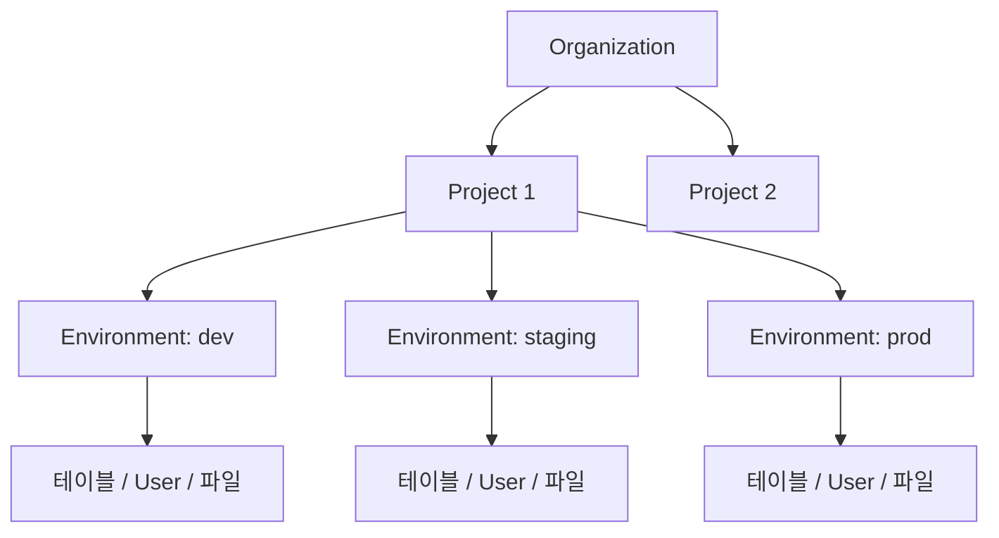

# 핵심 개념


💡 bkend의 리소스 계층 구조와 핵심 용어를 설명합니다.


## 개요

bkend는 Organization → Project → Environment 3단계 계층 구조로 리소스를 관리합니다. 이 구조를 이해하면 콘솔과 API를 효과적으로 사용할 수 있습니다.

***

## 리소스 계층 구조

***

## Organization

Organization은 bkend의 최상위 리소스입니다. 팀과 프로젝트를 하나의 단위로 관리합니다.

| 항목 | 설명 |
|------|------|
| 프로젝트 | Organization 내에 여러 프로젝트를 생성합니다 |
| 팀 멤버 | Owner, Admin, Member, Billing 역할을 부여합니다 |
| 결제 | Organization 단위로 플랜을 관리합니다 |

***

## Project

Project는 하나의 서비스 또는 앱에 대응합니다. 프로젝트를 생성할 때 리전과 클라우드를 선택합니다.

| 항목 | 설명 |
|------|------|
| 리전 | 데이터 저장 위치 (예: Seoul, US East) |
| 클라우드 | 클라우드 제공자 (예: AWS) |
| 환경 | 프로젝트 내에 여러 환경을 생성합니다 |

***

## Environment

Environment는 데이터가 격리되는 단위입니다. `dev`, `staging`, `prod` 같은 환경을 생성하여 개발과 운영을 분리합니다.

| 데이터 | 환경 간 공유 | 설명 |
|--------|:---------:|------|
| 테이블 스키마 | ❌ | 환경별 독립 스키마 |
| 테이블 데이터 | ❌ | 환경별 독립 데이터 |
| User | ❌ | 환경별 독립 User 풀 |
| API Key | ❌ | 환경별 독립 Key |
| 파일 | ❌ | 환경별 독립 저장소 |
| 프로젝트 설정 | ✅ | 모든 환경에서 공유 |
| 팀 멤버 | ✅ | Organization 단위로 공유 |


⚠️ `dev` 환경과 `prod` 환경의 데이터는 완전히 격리되어 있습니다. 환경을 전환하면 다른 데이터가 표시됩니다.


***

## API Key

API Key는 REST API를 호출할 때 인증에 사용합니다. 환경별로 독립적인 Key를 발급합니다.

| 타입 | 용도 | 권한 |
|------|------|------|
| **Public Key** | 클라이언트(브라우저, 앱)에서 사용 | 제한된 읽기/쓰기 |
| **Secret Key** | 서버에서 사용 | 전체 읽기/쓰기 |


🚨 **위험** — Secret Key는 절대 클라이언트 코드에 포함하지 마세요.


***

## MCP (Model Context Protocol)

MCP는 AI 도구와 서비스 간 통신을 위한 표준 프로토콜입니다. bkend는 MCP 서버를 제공하여 Claude Code, Cursor 같은 AI 도구에서 자연어로 백엔드를 관리할 수 있습니다.

| 항목 | 설명 |
|------|------|
| 인증 | OAuth 2.1 + PKCE (자동) |
| 전송 | Streamable HTTP |
| 엔드포인트 | `https://api.bkend.ai/mcp` |

***

## 다음 단계

- [Tenant vs User](04-tenant-vs-user.md) — 두 가지 사용자 유형의 차이
- [콘솔 개요](../console/01-overview.md) — 콘솔에서 리소스 관리하기
- [API Key 관리](../security/02-api-keys.md) — API Key 생성과 사용

> **MCP Specification 2025-03-26**
> "The Model Context Protocol (MCP) is an open protocol that standardizes how applications provide context to LLMs."
> — [Model Context Protocol](https://spec.modelcontextprotocol.io/2025-03-26)
