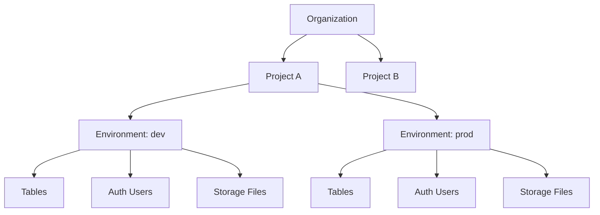
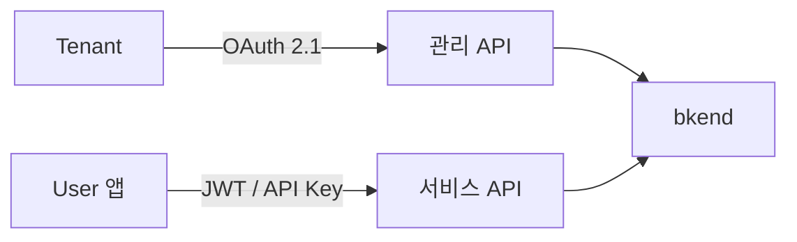
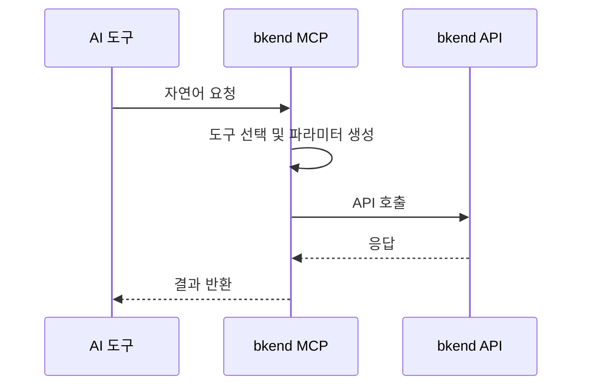

# 핵심 개념 이해하기

> bkend의 핵심 개념과 아키텍처를 이해합니다.

## 개요

bkend를 효과적으로 사용하려면 몇 가지 핵심 개념을 이해해야 합니다. 이 문서에서는 bkend의 리소스 계층, 사용자 모델, API 구조, 그리고 MCP 연동 방식을 설명합니다.

---

## 리소스 계층 구조

bkend의 모든 리소스는 명확한 계층 구조를 따릅니다:

| 계층 | 설명 | 주요 역할 |
|------|------|----------|
| **Organization** | 최상위 단위 | 결제, 멤버 관리, 프로젝트 그룹 |
| **Project** | 서비스 단위 | 하나의 앱 또는 서비스에 해당 |
| **Environment** | 배포 환경 | 데이터 완전 격리 (dev, staging, prod) |

> ⚠️ **주의** - Environment 간 데이터는 완전히 격리됩니다. dev 환경의 데이터는 prod 환경에서 접근할 수 없습니다.

---

## 사용자 모델

bkend에는 두 가지 사용자 유형이 있습니다:

### Tenant

bkend를 사용해 서비스를 구축하는 개발자 또는 팀입니다.

- bkend 콘솔에 로그인하여 프로젝트를 관리합니다
- AI 도구(MCP)를 통해 데이터를 조작합니다
- Organization 내에서 역할(Owner, Admin, Billing, Member)을 가집니다

### User

Tenant가 구축한 서비스의 최종 사용자입니다.

- Tenant가 만든 앱이나 웹사이트를 사용합니다
- 서비스 API를 통해 데이터에 접근합니다
- bkend 콘솔에 직접 접근하지 않습니다

> 💡 **Tip** - 자세한 비교는 [Tenant vs User](05-tenant-vs-user.md)를 참고하세요.

---

## API 구조

bkend는 두 가지 API를 제공합니다:

| API | 인증 방식 | 용도 | 사용자 |
|-----|----------|------|--------|
| **관리 API** | [OAuth 2.1](https://datatracker.ietf.org/doc/html/draft-ietf-oauth-v2-1-12) + PKCE | 프로젝트 설정, 테이블 관리, 스키마 변경 | Tenant |
| **서비스 API** | [JWT](https://datatracker.ietf.org/doc/html/rfc7519) (API Key) | User 앱의 데이터 CRUD, 인증, 파일 관리 | User의 앱 |

### 관리 API

Tenant가 프로젝트 구조를 설정하고 관리하는 데 사용합니다:

- Organization, Project, Environment 관리
- 테이블 생성 및 스키마 정의
- 인증 설정 및 User 관리
- MCP를 통한 AI 도구 연동

### 서비스 API

User가 사용하는 앱에서 데이터를 조작하는 데 사용합니다:

- 데이터 CRUD (Create, Read, Update, Delete)
- 회원가입, 로그인, 세션 관리
- 파일 업로드, 다운로드

---

## MCP (Model Context Protocol)

[MCP](https://spec.modelcontextprotocol.io/2025-03-26)는 AI 도구와 외부 서비스를 연결하는 표준 프로토콜입니다.

### 연동 방식

bkend는 Streamable HTTP 방식으로 MCP를 지원합니다:

### MCP 도구 유형

| 유형 | 설명 | 예시 |
|------|------|------|
| **문서 도구** | bkend 사용법 안내 | `0_get_context`, `1_concepts`, `2_tutorial` |
| **API 도구** | 실제 API 호출 수행 | `backend_table_list`, `backend_org_list` |

### MCP 인증

MCP 연결 시 [OAuth 2.1](https://datatracker.ietf.org/doc/html/draft-ietf-oauth-v2-1-12) + PKCE 인증을 사용합니다:

1. AI 도구에서 bkend MCP 서버에 연결을 요청합니다
2. 브라우저가 열리고 bkend 콘솔에서 로그인합니다
3. Organization을 선택하고 권한을 승인합니다
4. 인증 토큰이 발급되어 AI 도구에 저장됩니다

> 💡 **Tip** - MCP에 대해 더 자세히 알고 싶다면 [MCP란?](07-what-is-mcp.md)을 참고하세요.

---

## Environment (환경)

Environment는 프로젝트 내 배포 환경을 의미합니다:

| 환경 | 용도 | 데이터 |
|------|------|--------|
| **dev** | 개발 및 테스트 | 테스트 데이터 |
| **staging** | 배포 전 검증 | 검증용 데이터 |
| **prod** | 실제 서비스 운영 | 실제 데이터 |

각 환경은 독립된 데이터베이스, 스토리지, 인증 시스템을 가집니다. 환경 간 데이터는 완전히 격리되어 서로 영향을 주지 않습니다.

> 💡 **Tip** - 프로젝트 생성 시 dev 환경이 자동으로 생성됩니다. staging, prod 환경은 필요에 따라 추가로 생성할 수 있습니다.

---

## Organization 역할

Organization 멤버는 다음 역할 중 하나를 가집니다:

| 역할 | 권한 | 설명 |
|------|------|------|
| **Owner** | 전체 권한 | Organization 삭제, 멤버 역할 변경 가능 |
| **Admin** | 관리 권한 | 프로젝트 생성/수정, 멤버 초대 가능 |
| **Billing** | 결제 권한 | 결제 정보 관리 가능 |
| **Member** | 기본 권한 | 프로젝트 조회 및 데이터 작업 가능 |

---

## 관련 문서

- [Tenant vs User](05-tenant-vs-user.md) — 사용자 유형 상세 비교
- [Organization & Project](06-org-and-project.md) — 리소스 계층 구조 상세
- [MCP란?](07-what-is-mcp.md) — MCP 프로토콜 상세 설명
- [환경 개요](../platform/01-environments.md) — 환경 관리 가이드
