# 핵심 개념


💡 bkend의 리소스 계층 구조와 핵심 용어를 설명합니다.


## 개요

bkend는 Organization → Project → Environment 3단계 계층 구조로 리소스를 관리합니다. 이 구조를 이해하면 콘솔과 API를 효과적으로 사용할 수 있습니다.

***

## 리소스 계층 구조

```mermaid
flowchart TD
    A[Organization] --> B[Project 1]
    A --> C[Project 2]
    B --> D[Environment: dev]
    B --> E[Environment: staging]
    B --> F[Environment: prod]
    D --> G[테이블 / User / 파일]
    E --> H[테이블 / User / 파일]
    F --> I[테이블 / User / 파일]
```



***

## Organization

Organization은 bkend의 최상위 리소스입니다. 팀과 프로젝트를 하나의 단위로 관리합니다.

| 항목 | 설명 |
|------|------|
| 프로젝트 | Organization 내에 여러 프로젝트를 생성합니다 |
| 팀 멤버 | Owner, Admin, Member, Billing 역할을 부여합니다 |
| 결제 | Organization 단위로 플랜을 관리합니다 |

***

## Project

Project는 하나의 서비스 또는 앱에 대응합니다. 프로젝트를 생성할 때 리전과 클라우드를 선택합니다.

| 항목 | 설명 |
|------|------|
| 리전 | 데이터 저장 위치 (예: Seoul, US East) |
| 클라우드 | 클라우드 제공자 (예: AWS) |
| 환경 | 프로젝트 내에 여러 환경을 생성합니다 |

***

## Environment

Environment는 데이터가 격리되는 단위입니다. `dev`, `staging`, `prod` 같은 환경을 생성하여 개발과 운영을 분리합니다.

| 데이터 | 환경 간 공유 | 설명 |
|--------|:---------:|------|
| 테이블 스키마 | ❌ | 환경별 독립 스키마 |
| 테이블 데이터 | ❌ | 환경별 독립 데이터 |
| User | ❌ | 환경별 독립 User 풀 |
| API Key | ❌ | 환경별 독립 Key |
| 파일 | ❌ | 환경별 독립 저장소 |
| 프로젝트 설정 | ✅ | 모든 환경에서 공유 |
| 팀 멤버 | ✅ | Organization 단위로 공유 |


⚠️ `dev` 환경과 `prod` 환경의 데이터는 완전히 격리되어 있습니다. 환경을 전환하면 다른 데이터가 표시됩니다.


***

## API Key

API Key는 REST API를 호출할 때 인증에 사용합니다. 환경별로 독립적인 Key를 발급합니다.

| 타입 | 용도 | 권한 |
|------|------|------|
| **Publishable Key** | 클라이언트(브라우저, 앱)에서 사용 | 제한된 읽기/쓰기 |
| **Secret Key** | 서버에서 사용 | 전체 읽기/쓰기 |


🚨 **위험** — Secret Key는 절대 클라이언트 코드에 포함하지 마세요.


***

## 설계 도구 vs 운영 도구

bkend에서의 작업은 **설계 시점**과 **운영 시점**으로 나뉩니다. 각 시점에서 사용하는 도구가 다릅니다.

```mermaid
flowchart LR
    subgraph 설계["설계 시점 — Tenant"]
        A[콘솔 UI] --> D[테이블 생성]
        B[MCP 도구] --> D
        A --> E[권한 설정]
        A --> F[API Key 발급]
    end
    subgraph 운영["운영 시점 — 앱"]
        G[REST API] --> H[데이터 CRUD]
        G --> I[사용자 인증]
        G --> J[파일 업로드]
    end
    설계 -->|설정 완료| 운영
```

| 시점 | 도구 | 하는 일 | 누가 |
|------|------|---------|------|
| **설계** | 콘솔 UI, MCP 도구 | 테이블 생성, 스키마 편집, 권한 설정, API Key 발급 | Tenant (개발자) |
| **운영** | REST API | 데이터 CRUD, 사용자 인증, 파일 관리 | 앱 (User) |


💡 콘솔과 MCP 도구로 **구조를 설계**하고, REST API로 **앱을 운영**합니다. 테이블을 만들었다면 다음은 REST API로 데이터를 넣을 차례입니다.


***

## MCP (Model Context Protocol)

MCP는 AI 도구와 서비스 간 통신을 위한 표준 프로토콜입니다. bkend는 MCP 서버를 제공하여 Claude Code, Cursor 같은 AI 도구에서 자연어로 백엔드를 관리할 수 있습니다.

| 항목 | 설명 |
|------|------|
| 인증 | OAuth 2.1 + PKCE(Proof Key for Code Exchange) (자동) |
| 전송 | Streamable HTTP |
| 엔드포인트 | `https://api.bkend.ai/mcp` |

***

## 다음 단계

- [Tenant와 User 이해](05-tenant-vs-user.md) — 두 가지 사용자 유형의 차이
- [앱에서 bkend 연동하기](03-app-integration.md) — REST API로 앱에 bkend 연결
- [콘솔 개요](../console/01-overview.md) — 콘솔에서 리소스 관리하기
- [API 키 이해](../security/02-api-keys.md) — API Key 생성과 사용
- [MCP 도구 개요](../mcp/01-overview.md) — AI 도구에서 사용할 수 있는 MCP 도구

> **MCP Specification 2025-03-26**
> "The Model Context Protocol (MCP) is an open protocol that standardizes how applications provide context to LLMs."
> — [Model Context Protocol](https://spec.modelcontextprotocol.io/2025-03-26)
