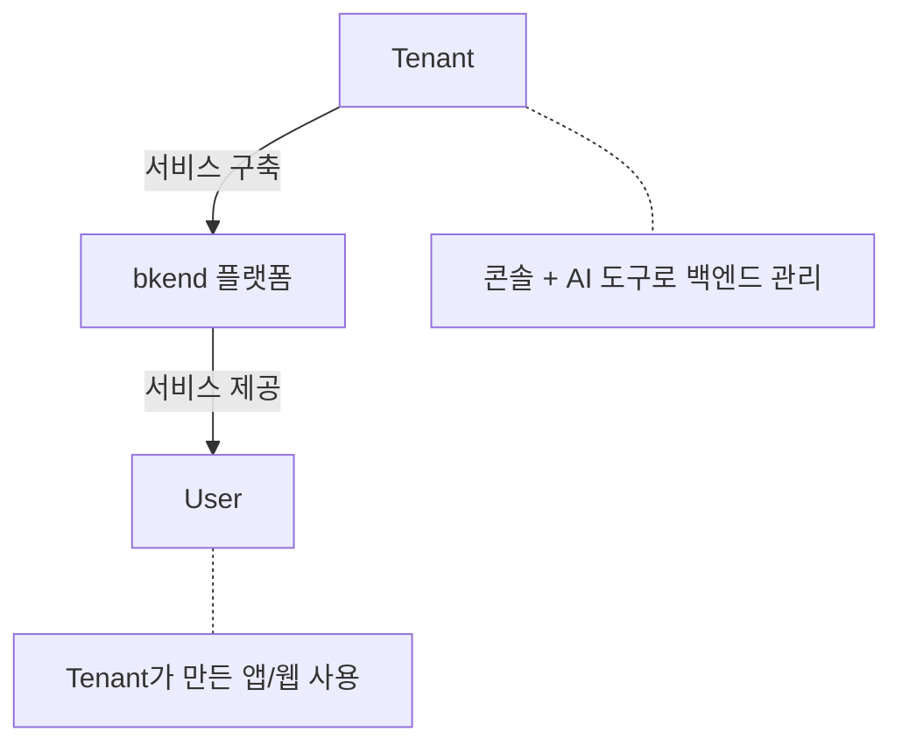
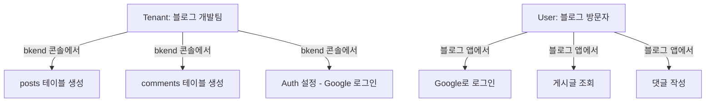

# Tenant vs User

> bkend의 두 가지 사용자 유형인 Tenant와 User의 차이를 이해합니다.

## 개요

bkend에는 **Tenant**와 **User**, 두 가지 사용자 유형이 존재합니다. 이 구분을 이해하면 bkend의 인증 시스템, 권한 모델, API 구조를 더 쉽게 활용할 수 있습니다.

---

## 비교 요약

| 항목 | Tenant | User |
|------|--------|------|
| **역할** | 서비스를 구축하는 개발자/팀 | Tenant가 만든 서비스의 최종 사용자 |
| **접근 방식** | bkend 콘솔, AI 도구 (MCP) | Tenant가 만든 앱/웹 |
| **인증** | [OAuth 2.1](https://datatracker.ietf.org/doc/html/draft-ietf-oauth-v2-1-12) + PKCE | [JWT](https://datatracker.ietf.org/doc/html/rfc7519) / API Key |
| **API** | 관리 API | 서비스 API |
| **데이터 접근** | 모든 테이블/환경 관리 가능 | 허용된 데이터만 접근 |
| **계정 관리** | bkend 콘솔에서 직접 관리 | Tenant가 Auth 기능으로 관리 |

---

## Tenant 상세

### Tenant란?

bkend를 사용하여 백엔드 서비스를 구축하는 개발자 또는 팀입니다. bkend 콘솔에 가입하고 Organization을 생성한 모든 사용자가 Tenant에 해당합니다.

### Tenant가 할 수 있는 일

- Organization, Project, Environment를 생성하고 관리합니다
- 테이블을 설계하고 스키마를 정의합니다
- 인증 설정을 구성합니다 (소셜 로그인, 이메일 인증 등)
- 파일 스토리지를 관리합니다
- AI 도구(MCP)를 연결하여 자연어로 백엔드를 조작합니다
- 팀 멤버를 초대하고 역할을 부여합니다

### Organization 역할

Tenant는 Organization 내에서 다음 역할을 가질 수 있습니다:

| 역할 | 프로젝트 관리 | 멤버 관리 | 결제 관리 | Organization 삭제 |
|------|:----------:|:--------:|:--------:|:---------------:|
| **Owner** | ✅ | ✅ | ✅ | ✅ |
| **Admin** | ✅ | ✅ | - | - |
| **Billing** | - | - | ✅ | - |
| **Member** | 조회만 | - | - | - |

---

## User 상세

### User란?

Tenant가 bkend로 구축한 서비스를 사용하는 최종 사용자입니다. 예를 들어, Tenant가 bkend로 Todo 앱을 만들었다면, 그 앱에 가입하여 할 일을 관리하는 사람이 User입니다.

### User가 할 수 있는 일

- Tenant가 만든 앱에서 회원가입, 로그인합니다
- 허용된 범위 내에서 데이터를 조회하고 수정합니다
- 파일을 업로드하고 다운로드합니다
- 자신의 프로필을 관리합니다

### User의 접근 제어

Tenant는 테이블별로 User의 접근 권한을 설정할 수 있습니다:

| 권한 그룹 | 설명 | 기본 CRUD 권한 |
|----------|------|--------------|
| **admin** | 관리자 User | 전체 권한 |
| **user** | 인증된 일반 User | 전체 권한 |
| **self** | 자신의 데이터만 | 읽기, 수정, 삭제 |
| **guest** | 비인증 User | 권한 없음 |

---

## 실제 사용 예시

### 시나리오: 블로그 서비스

| 행위자 | 작업 | 사용하는 API |
|--------|------|------------|
| Tenant | `posts` 테이블 생성 | 관리 API |
| Tenant | Google 소셜 로그인 설정 | 관리 API |
| User | 블로그 앱에서 Google 로그인 | 서비스 API |
| User | 게시글 목록 조회 | 서비스 API |
| User | 댓글 작성 | 서비스 API |

---

## 자주 묻는 질문

### Tenant와 User의 계정은 분리되어 있나요?

네, 완전히 분리되어 있습니다. Tenant의 bkend 콘솔 계정과 User의 서비스 계정은 서로 다른 인증 시스템에서 관리됩니다.

### 한 사람이 Tenant이자 User일 수 있나요?

네, 가능합니다. 개발자가 bkend로 서비스를 구축(Tenant)하면서 동시에 그 서비스를 사용(User)할 수 있습니다. 하지만 두 역할에서 사용하는 인증과 API는 다릅니다.

### User 수에 제한이 있나요?

Organization의 플랜에 따라 다릅니다. 자세한 내용은 [결제 & 플랜](../platform/08-billing.md)을 참고하세요.

---

## 관련 문서

- [핵심 개념](04-core-concepts.md) — bkend 전체 개념 이해
- [Organization & Project](06-org-and-project.md) — 리소스 계층 구조
- [Auth 개요](../authentication/01-overview.md) — User 인증 시스템 상세
- [팀 멤버 관리](../platform/07-team-management.md) — Tenant 팀 관리
