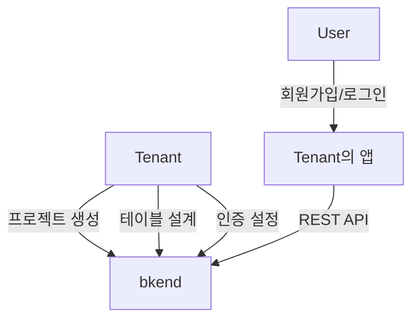
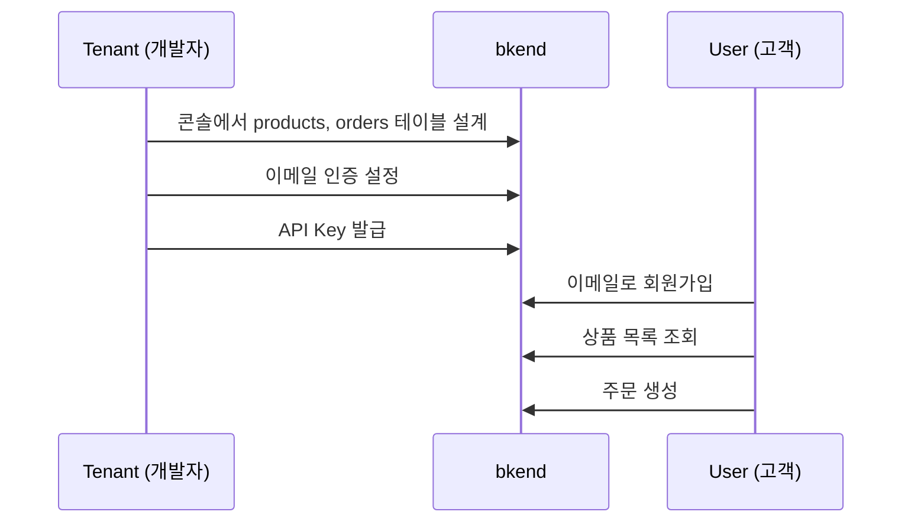

# Tenant와 User 이해


💡 bkend에는 Tenant와 User, 두 가지 사용자 유형이 있습니다.


## 개요

bkend를 사용하는 사용자는 두 가지 유형으로 나뉩니다. 이 두 유형의 차이를 이해하면 인증과 권한 설정을 올바르게 구성할 수 있습니다.

***

## Tenant

Tenant는 bkend에서 프로젝트를 생성하고 관리하는 **서비스 제공자**입니다. bkend 콘솔에 로그인하여 데이터베이스를 설계하고, 인증을 설정하고, API Key를 관리합니다.

| 항목 | 설명 |
|------|------|
| 로그인 | bkend 콘솔 (`https://console.bkend.ai`) |
| 인증 | 매직 링크, Google, GitHub |
| 역할 | Owner, Admin, Member, Billing |
| 활동 | 프로젝트 설정, 테이블 설계, 환경 관리, 팀 관리 |

***

## User

User는 Tenant가 만든 서비스의 **최종 사용자**입니다. Tenant가 설정한 인증 방식으로 로그인하며, Tenant가 설계한 데이터에 접근합니다.

| 항목 | 설명 |
|------|------|
| 로그인 | Tenant가 만든 앱/서비스 |
| 인증 | Tenant가 설정한 방식 (이메일, 소셜 등) |
| 활동 | 데이터 조회/생성/수정, 파일 업로드, 프로필 관리 |

***

## 비교

| 구분 | Tenant | User |
|------|--------|------|
| **누구인가** | 서비스 제공자 (개발자) | 서비스 사용자 (최종 고객) |
| **접근 도구** | 콘솔, MCP 도구 | Tenant가 만든 앱 |
| **인증 방식** | OAuth 2.1 (콘솔/MCP) | JWT (이메일/소셜 로그인) |
| **API 사용** | MCP 도구로 프로젝트 설정 | REST API로 데이터 조작 |
| **데이터 범위** | 전체 프로젝트 관리 | 환경 내 허용된 데이터 |


⚠️ Tenant의 인증 정보(콘솔 로그인, MCP 토큰)와 User의 인증 정보(JWT)는 완전히 분리되어 있습니다.


***

## 실제 예시

온라인 쇼핑몰을 만든다고 가정합니다.

- **Tenant**: 쇼핑몰 개발자. bkend에서 `products`, `orders` 테이블을 설계하고, 이메일 인증을 설정합니다.
- **User**: 쇼핑몰 고객. 이메일로 회원가입하고, 상품을 검색하고, 주문을 생성합니다.

***

## 자주 묻는 질문

| 질문 | 답변 |
|------|------|
| Tenant와 User의 계정은 같은 시스템인가요? | 아닙니다. 완전히 별도의 인증 시스템입니다. |
| User가 콘솔에 접근할 수 있나요? | 아닙니다. User는 Tenant가 만든 앱만 사용합니다. |
| Tenant가 여러 프로젝트를 가질 수 있나요? | 예. Organization 내에 여러 프로젝트를 생성할 수 있습니다. |
| User 데이터는 환경별로 분리되나요? | 예. `dev`와 `prod`의 User 풀은 완전히 독립적입니다. |

***

## 다음 단계

- [다음 단계](06-next-steps.md) — 주요 기능별 가이드 안내
- [인증 개요](../authentication/01-overview.md) — User 인증 설정하기
- [콘솔 개요](../console/01-overview.md) — Tenant 콘솔 사용하기
