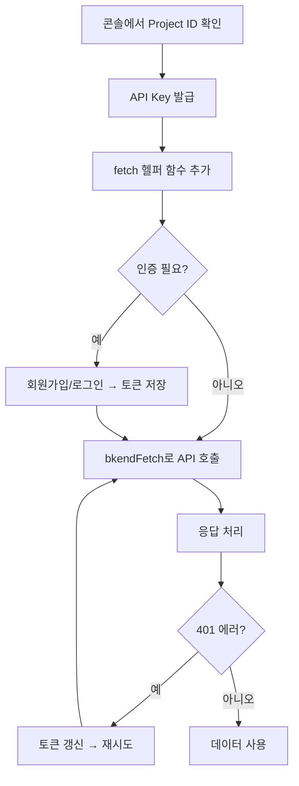

# 앱에서 bkend 연동하기


💡 REST API를 사용하여 앱에 bkend 백엔드를 연결하세요. 이 문서에서 정의하는 fetch 헬퍼 패턴을 다른 앱 통합 가이드에서 참조합니다.


## 개요

이 문서에서 다루는 내용:

- 앱에서 bkend API를 호출하기 위한 필수 설정
- 모든 요청에 공통으로 사용하는 fetch 헬퍼 함수
- 인증된 요청과 비인증 요청 구분

***

## 사전 준비

| 항목 | 확인 위치 | 설명 |
|------|----------|------|
| Project ID | 콘솔 → **프로젝트 설정** | 프로젝트 고유 식별자 |
| API Key | 콘솔 → **MCP** → **새 토큰 생성** | REST API 접근 토큰 |
| Environment | 콘솔 → **환경** 탭 | `dev` / `staging` / `prod` |


⚠️ API Key가 없으면 [API 키 관리](../console/11-api-keys.md) 문서를 참고하여 먼저 발급하세요.


***

## 필수 헤더

모든 REST API 요청에는 다음 헤더가 필요합니다.

| 헤더 | 값 | 필수 | 설명 |
|------|-----|:----:|------|
| `Content-Type` | `application/json` | ✅ | 요청 본문 형식 |
| `X-Project-Id` | `{project_id}` | ✅ | 콘솔에서 확인한 Project ID |
| `X-Environment` | `dev` | ✅ | 대상 환경 |
| `Authorization` | `Bearer {accessToken}` | 조건부 | 인증이 필요한 API에만 |

***

## API Base URL

```
https://api-client.bkend.ai
```

모든 엔드포인트는 이 URL을 기준으로 합니다.

***

## fetch 헬퍼 함수

앱 전체에서 bkend API를 호출할 때 사용하는 헬퍼 함수입니다. 모든 요청에 필수 헤더를 자동으로 포함합니다.

```javascript
// bkend.js — 프로젝트에 이 파일을 추가하세요

const API_BASE = 'https://api-client.bkend.ai';
const PROJECT_ID = '{project_id}';  // 콘솔에서 확인
const ENVIRONMENT = 'dev';

/**
 * bkend API 호출 헬퍼
 * @param {string} path - API 경로 (예: '/v1/data/posts')
 * @param {object} options - fetch 옵션 (method, body, headers 등)
 * @returns {Promise<any>} 응답 데이터
 */
export async function bkendFetch(path, options = {}) {
  const accessToken = localStorage.getItem('accessToken');

  const response = await fetch(`${API_BASE}${path}`, {
    ...options,
    headers: {
      'Content-Type': 'application/json',
      'X-Project-Id': PROJECT_ID,
      'X-Environment': ENVIRONMENT,
      ...(accessToken && { 'Authorization': `Bearer ${accessToken}` }),
      ...options.headers,
    },
    ...(options.body && typeof options.body === 'object' && !options.rawBody
      ? { body: JSON.stringify(options.body) }
      : {}),
  });

  if (response.status === 401) {
    // 토큰 만료 시 갱신 시도
    const refreshed = await refreshAccessToken();
    if (refreshed) {
      return bkendFetch(path, options); // 재시도
    }
    throw new Error('인증이 만료되었습니다. 다시 로그인하세요.');
  }

  if (!response.ok) {
    const error = await response.json().catch(() => ({}));
    throw new Error(error.message || `요청 실패 (${response.status})`);
  }

  // 204 No Content
  if (response.status === 204) return null;

  return response.json();
}

/**
 * Access Token 갱신
 */
async function refreshAccessToken() {
  const refreshToken = localStorage.getItem('refreshToken');
  if (!refreshToken) return false;

  try {
    const response = await fetch(`${API_BASE}/v1/auth/refresh`, {
      method: 'POST',
      headers: {
        'Content-Type': 'application/json',
        'X-Project-Id': PROJECT_ID,
        'X-Environment': ENVIRONMENT,
      },
      body: JSON.stringify({ refreshToken }),
    });

    if (!response.ok) return false;

    const data = await response.json();
    localStorage.setItem('accessToken', data.accessToken);
    localStorage.setItem('refreshToken', data.refreshToken);
    return true;
  } catch {
    return false;
  }
}
```

***

## 사용 예제

### 비인증 요청 (회원가입)

```javascript
import { bkendFetch } from './bkend.js';

// 회원가입 — Authorization 헤더 불필요
const result = await bkendFetch('/v1/auth/email/signup', {
  method: 'POST',
  body: {
    method: 'password',
    email: 'user@example.com',
    password: 'MyP@ssw0rd!',
    name: '홍길동',
  },
});

// 토큰 저장
localStorage.setItem('accessToken', result.accessToken);
localStorage.setItem('refreshToken', result.refreshToken);
```

### 인증된 요청 (데이터 생성)

```javascript
import { bkendFetch } from './bkend.js';

// 데이터 생성 — accessToken이 localStorage에 있으면 자동으로 포함
const post = await bkendFetch('/v1/data/posts', {
  method: 'POST',
  body: {
    title: '첫 번째 게시글',
    content: '안녕하세요!',
    published: true,
  },
});

console.log(post.id); // 생성된 데이터 ID
```

### 데이터 목록 조회

```javascript
import { bkendFetch } from './bkend.js';

// 목록 조회 — GET 요청
const result = await bkendFetch('/v1/data/posts?page=1&pageSize=10');
console.log(result.data);  // 게시글 배열
console.log(result.total); // 전체 개수
```

***

## curl로 테스트하기

앱에 연동하기 전에 curl로 API가 정상 동작하는지 확인하세요.

```bash
# 데이터 생성 테스트
curl -X POST https://api-client.bkend.ai/v1/data/posts \
  -H "Content-Type: application/json" \
  -H "Authorization: Bearer {accessToken}" \
  -H "X-Project-Id: {project_id}" \
  -H "X-Environment: dev" \
  -d '{
    "title": "테스트 게시글",
    "content": "curl로 생성한 데이터입니다."
  }'
```

***

## CORS

bkend API는 브라우저에서의 직접 호출을 지원합니다. 별도의 CORS 설정 없이 클라이언트 앱에서 `fetch`를 사용하여 API를 호출할 수 있습니다.

***

## 연동 흐름 요약



***

## 다음 단계

- [토큰 저장 및 갱신](../authentication/20-token-management.md) — 토큰 관리 상세 전략
- [인증 폼 구현 패턴](../authentication/21-auth-form-patterns.md) — 회원가입/로그인 폼
- [데이터 CRUD 앱 패턴](../database/12-crud-app-patterns.md) — 앱에서 데이터 관리
- [파일 업로드 앱 패턴](../storage/10-upload-app-patterns.md) — 파일 업로드 구현
- [에러 처리 가이드](../guides/11-error-handling.md) — 에러 응답 처리 전략
- [실전 프로젝트 쿡북](../../cookbooks/README.md) — 연동 패턴을 실전 앱에서 바로 적용하기
- 예제 프로젝트 — Mock 모드를 지원하여 바로 실행할 수 있는 전체 코드
  - [blog-web (Next.js)](../../examples/blog-web/) · [social-network-app (Flutter)](../../examples/social-network-app/) · [recipe-web (Next.js)](../../examples/recipe-web/) · [recipe-app (Flutter)](../../examples/recipe-app/) · [shopping-mall-web (Next.js)](../../examples/shopping-mall-web/)
