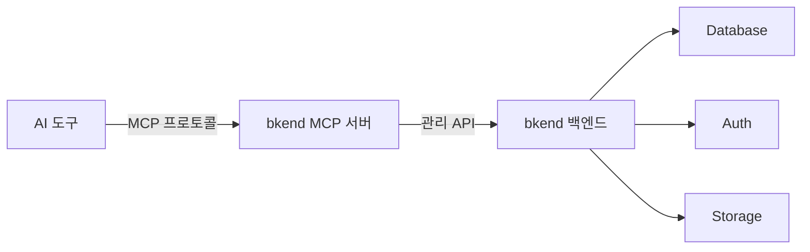
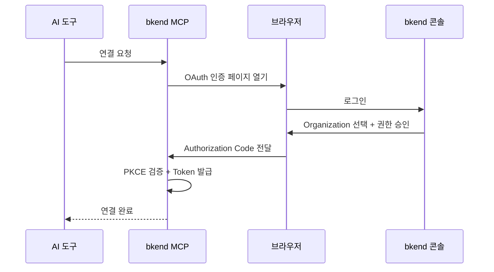

# MCP란?

> AI 도구와 bkend를 연결하는 표준 프로토콜인 MCP를 이해합니다.

## 개요

[MCP(Model Context Protocol)](https://spec.modelcontextprotocol.io/2025-03-26)는 Anthropic이 제정한 표준 프로토콜로, AI 도구와 외부 서비스를 연결합니다. bkend는 MCP를 통해 Claude Code, Cursor 등 AI 도구에서 자연어로 백엔드를 조작할 수 있게 합니다.

---

## MCP가 필요한 이유

### 기존 방식

AI 도구에서 백엔드를 사용하려면 다음과 같은 과정이 필요합니다:

1. API 문서를 읽고 이해합니다
2. 올바른 엔드포인트와 파라미터를 파악합니다
3. HTTP 요청을 직접 작성합니다
4. 인증 토큰을 수동으로 관리합니다

### MCP 방식

MCP를 사용하면 이 과정이 크게 간소화됩니다:

1. AI 도구에 자연어로 요청합니다: *"users 테이블을 만들어줘"*
2. AI 도구가 MCP를 통해 적절한 API를 자동 호출합니다
3. 결과가 자연어로 반환됩니다

---

## MCP의 핵심 구성 요소

### 도구 (Tools)

MCP 도구는 AI 도구가 호출할 수 있는 기능 단위입니다. bkend는 두 가지 유형의 도구를 제공합니다:

| 유형 | 설명 | 예시 |
|------|------|------|
| **문서 도구** | bkend 사용법을 안내하는 정적 도구 | `0_get_context`, `1_concepts`, `2_tutorial` |
| **API 도구** | 실제 API를 호출하는 동적 도구 | `backend_table_list`, `backend_env_create` |

### 문서 도구 목록

| 도구명 | 설명 |
|--------|------|
| `0_get_context` | 세션 정보를 가져옵니다 (매 세션 시작 시 자동 호출) |
| `1_concepts` | BSON 스키마, 인덱스, 역할 개념을 설명합니다 |
| `2_tutorial` | 단계별 프로젝트 설정 가이드를 제공합니다 |
| `3_howto_implement_auth` | 인증 구현 API 레퍼런스를 제공합니다 |
| `4_howto_implement_data_crud` | CRUD 구현 패턴과 예시를 제공합니다 |
| `5_get_operation_schema` | 특정 작업의 입출력 스키마를 조회합니다 |
| `6_code_examples_auth` | 인증 관련 코드 예시를 제공합니다 |
| `7_code_examples_data` | CRUD 관련 코드 예시를 제공합니다 |

### API 도구 네이밍 규칙

API 도구는 `backend_{리소스}_{액션}` 형식으로 자동 생성됩니다:

| 도구명 | 설명 |
|--------|------|
| `backend_org_list` | Organization 목록 조회 |
| `backend_project_create` | Project 생성 |
| `backend_env_create` | Environment 생성 |
| `backend_table_list` | 테이블 목록 조회 |
| `backend_table_create` | 테이블 생성 |
| `backend_field_manage` | 테이블 필드 관리 |

---

## 연결 방식: Streamable HTTP

bkend의 MCP 서버는 [MCP 2025-03-26 스펙](https://spec.modelcontextprotocol.io/2025-03-26)의 **Streamable HTTP** 방식을 사용합니다.

| 특성 | 설명 |
|------|------|
| **전송 방식** | 단순 HTTP POST 요청/응답 |
| **연결 유지** | 요청 시에만 연결 (상시 연결 불필요) |
| **세션 관리** | `mcp-session-id` 헤더로 세션 추적 |
| **프로토콜** | JSON-RPC 2.0 |

---

## 인증 흐름

bkend MCP는 [OAuth 2.1](https://datatracker.ietf.org/doc/html/draft-ietf-oauth-v2-1-12) + PKCE 인증을 사용합니다:

1. AI 도구에서 bkend MCP 서버에 연결을 요청합니다
2. 브라우저가 열리고 bkend 콘솔에서 로그인합니다
3. Organization을 선택하고 권한을 승인합니다
4. 인증 토큰이 발급되어 AI 도구에 저장됩니다

> 💡 **Tip** - 한 번 인증하면 토큰이 만료될 때까지 재인증 없이 사용할 수 있습니다. Access Token은 1시간, Refresh Token은 30일간 유효합니다.

---

## 스코프 (권한)

MCP 연결 시 부여되는 스코프에 따라 사용 가능한 도구가 결정됩니다:

| 스코프 | 설명 |
|--------|------|
| `organization:read` | Organization 정보 조회 |
| `project:read` / `project:create` / `project:update` / `project:delete` | Project 관리 |
| `environment:read` / `environment:create` / `environment:delete` | Environment 관리 |
| `table:read` / `table:create` / `table:update` / `table:delete` | 테이블 스키마 관리 |
| `table:data:read` / `table:data:create` / `table:data:update` / `table:data:delete` | 테이블 데이터 CRUD |

---

## 지원하는 AI 도구

| 도구 | 지원 상태 | 설정 문서 |
|------|----------|----------|
| Claude Code | ✅ | [Claude Code 설정](../integrations/03-claude-code-setup.md) |
| Claude Desktop | ✅ | [Claude Code 설정](../integrations/03-claude-code-setup.md) |
| Cursor | ✅ | [Cursor 설정](../integrations/05-cursor-setup.md) |
| Antigravity | ✅ | [Antigravity 연동](../integrations/08-antigravity.md) |

---

## 관련 문서

- [AI 도구 연동 개요](../integrations/01-overview.md) — 모든 AI 도구 연동 가이드
- [MCP 설정 기본](../integrations/02-mcp-basics.md) — MCP 설정 상세
- [MCP 프로토콜 설명](../api-reference/02-mcp-protocol.md) — MCP 프로토콜 기술 레퍼런스

## 참조 표준

- [MCP Specification 2025-03-26](https://spec.modelcontextprotocol.io/2025-03-26)
- [OAuth 2.1](https://datatracker.ietf.org/doc/html/draft-ietf-oauth-v2-1-12)
- [JSON-RPC 2.0](https://www.jsonrpc.org/specification)
