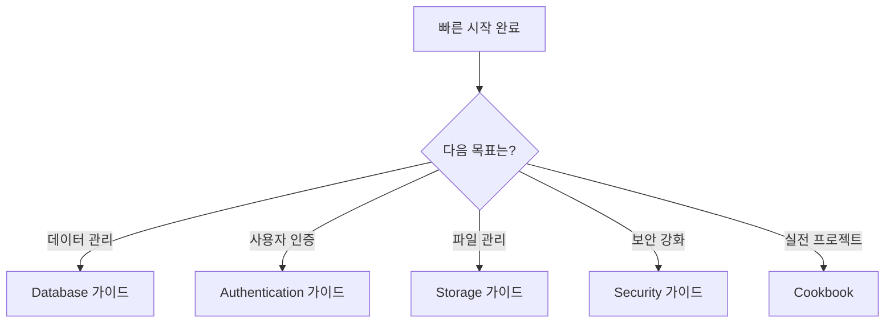

# 다음 단계 안내

> bkend를 더 깊이 활용하기 위한 학습 경로를 안내합니다.

## 개요

빠른 시작을 완료했다면 이제 bkend의 다양한 기능을 활용할 차례입니다. 이 문서에서는 목표에 따른 학습 경로를 안내합니다.

---

## 학습 경로

---

## Database 심화

데이터를 효율적으로 관리하고 싶다면 다음 순서로 학습하세요:

| 순서 | 문서 | 내용 |
|------|------|------|
| 1 | [Database 개요](../database/01-overview.md) | Database 기능 전체 소개 |
| 2 | [테이블 생성](../database/03-create-table.md) | 테이블 설계 및 생성 |
| 3 | [컬럼 타입](../database/04-column-types.md) | 지원하는 데이터 타입 |
| 4 | [데이터 삽입](../database/06-insert.md) | 데이터 추가 |
| 5 | [데이터 조회](../database/07-select.md) | 데이터 읽기 및 검색 |
| 6 | [필터링 & 검색](../database/10-filtering.md) | 고급 필터링 |
| 7 | [관계 설정](../database/12-relations.md) | 테이블 간 관계 |

---

## Authentication 심화

User 인증 시스템을 구축하고 싶다면:

| 순서 | 문서 | 내용 |
|------|------|------|
| 1 | [Auth 개요](../authentication/01-overview.md) | 인증 시스템 전체 소개 |
| 2 | [이메일 회원가입](../authentication/03-signup-email.md) | 이메일 기반 가입 |
| 3 | [이메일 로그인](../authentication/04-login-email.md) | 이메일 기반 로그인 |
| 4 | [소셜 로그인 개요](../authentication/07-social-overview.md) | Google, GitHub 로그인 |
| 5 | [세션 관리](../authentication/11-session-management.md) | 세션 및 토큰 관리 |
| 6 | [JWT 토큰](../authentication/12-jwt-tokens.md) | JWT 이해 및 활용 |

---

## Storage 심화

파일 업로드/다운로드 기능이 필요하다면:

| 순서 | 문서 | 내용 |
|------|------|------|
| 1 | [Storage 개요](../storage/01-overview.md) | Storage 기능 전체 소개 |
| 2 | [버킷 생성](../storage/03-buckets.md) | 버킷 관리 |
| 3 | [파일 업로드](../storage/04-upload-single.md) | 단일 파일 업로드 |
| 4 | [파일 다운로드](../storage/07-download.md) | 파일 다운로드 |
| 5 | [파일 접근 권한](../storage/10-permissions.md) | 접근 권한 설정 |

---

## Security 심화

보안을 강화하고 싶다면:

| 순서 | 문서 | 내용 |
|------|------|------|
| 1 | [보안 개요](../security/01-overview.md) | 보안 기능 전체 소개 |
| 2 | [API Key 관리](../security/02-api-keys.md) | API Key 발급 및 관리 |
| 3 | [Public vs Secret Key](../security/04-public-vs-secret.md) | Key 유형 이해 |
| 4 | [RLS 개요](../security/05-rls-overview.md) | Row Level Security |
| 5 | [보안 모범 사례](../security/09-best-practices.md) | 보안 체크리스트 |

---

## AI 도구 연동 심화

AI 도구를 더 효과적으로 사용하고 싶다면:

| 순서 | 문서 | 내용 |
|------|------|------|
| 1 | [MCP 설정 기본](../integrations/02-mcp-basics.md) | MCP 프로토콜 이해 |
| 2 | [Claude Code 사용법](../integrations/04-claude-code-usage.md) | Claude Code 고급 활용 |
| 3 | [Cursor 사용법](../integrations/06-cursor-usage.md) | Cursor 고급 활용 |
| 4 | [직접 MCP 연결](../integrations/10-direct-mcp.md) | MCP 직접 구현 |

---

## 실전 프로젝트 (Cookbook)

실제 프로젝트를 만들어보고 싶다면:

| 프로젝트 | 난이도 | 학습 내용 |
|----------|--------|----------|
| [Todo 앱](../cookbook/01-todo-app.md) | 쉬움 | CRUD 기본, 테이블 설계 |
| [블로그 백엔드](../cookbook/02-blog-backend.md) | 중간 | 관계, 필터링, 페이지네이션 |
| [유저 인증 플로우](../cookbook/03-user-auth-flow.md) | 중간 | 회원가입, 로그인, 세션 |
| [파일 갤러리](../cookbook/04-file-gallery.md) | 중간 | Storage, 이미지 관리 |
| [이커머스 백엔드](../cookbook/05-ecommerce.md) | 어려움 | 상품, 주문, 결제 |

---

## 플랫폼 관리

서비스 운영에 필요한 기능을 알고 싶다면:

| 문서 | 내용 |
|------|------|
| [환경 개요](../platform/01-environments.md) | dev/staging/prod 환경 관리 |
| [팀 멤버 관리](../platform/07-team-management.md) | 팀 협업 설정 |
| [모니터링](../platform/05-monitoring.md) | 서비스 모니터링 |
| [결제 & 플랜](../platform/08-billing.md) | 요금제 및 결제 |

---

## API Reference

API를 직접 호출하고 싶다면:

| 문서 | 내용 |
|------|------|
| [API 개요](../api-reference/01-overview.md) | API 전체 구조 |
| [Database MCP 도구](../api-reference/03-db-tools.md) | Database 관련 MCP 도구 |
| [Auth MCP 도구](../api-reference/04-auth-tools.md) | Auth 관련 MCP 도구 |
| [에러 코드 레퍼런스](../api-reference/10-error-codes.md) | 에러 코드 및 해결 방법 |

---

## 도움이 필요할 때

| 리소스 | 설명 |
|--------|------|
| [자주 발생하는 에러](../troubleshooting/01-common-errors.md) | 일반적인 에러 해결 |
| [연결 문제](../troubleshooting/02-connection-issues.md) | MCP/API 연결 문제 |
| [FAQ](../troubleshooting/05-faq.md) | 자주 묻는 질문 |
