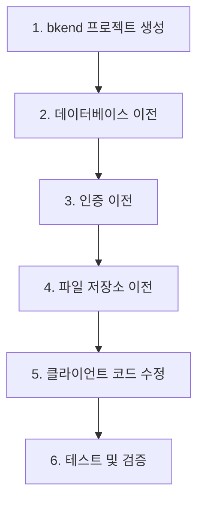

# Firebase에서 이전하기

> Firebase 프로젝트를 bkend로 이전하는 방법을 안내합니다.

## 개요

Firebase에서 bkend로 이전하려면 데이터베이스, 인증, 파일 저장소를 순서대로 마이그레이션합니다. 이 가이드는 각 단계별 전환 방법을 설명합니다.

---

## 마이그레이션 순서



---

## 1단계: bkend 프로젝트 준비하기

1. bkend 콘솔에서 Organization을 생성하세요.
2. 새 프로젝트를 생성하세요.
3. dev 환경이 `active` 상태가 될 때까지 기다리세요.

---

## 2단계: 데이터베이스 이전하기

### 개념 매핑

| Firebase | bkend | 설명 |
|----------|-------|------|
| Collection | 테이블 | 데이터 그룹 |
| Document | 레코드 (Row) | 개별 데이터 항목 |
| Field | 컬럼 | 데이터 필드 |
| Sub-collection | 관계 (Relation) | 중첩 데이터 |

### 타입 매핑

| Firebase | bkend | 비고 |
|----------|-------|------|
| string | String | |
| number | Number | 정수/실수 포함 |
| boolean | Boolean | |
| timestamp | Date | ISO 8601 형식 |
| array | Array | |
| map | Object | 중첩 객체 |
| reference | String (ID) | 관계 설정으로 대체 |
| geopoint | Object | `{ lat, lng }` 형태 |

### 이전 절차

1. **Firestore 데이터 내보내기** — Firebase Console에서 데이터를 JSON으로 내보내세요.

2. **bkend 테이블 생성** — Firebase Collection에 대응하는 테이블을 bkend에 생성하세요.

3. **데이터 변환 및 삽입** — 내보낸 JSON 데이터를 bkend 형식으로 변환하여 삽입하세요.

```typescript
// Firebase 데이터 형식
const firebaseDoc = {
  title: "게시글",
  createdAt: { seconds: 1704067200, nanoseconds: 0 },
  author: { name: "홍길동", email: "hong@example.com" }
};

// bkend 데이터 형식으로 변환
const bkendRecord = {
  title: firebaseDoc.title,
  createdAt: new Date(firebaseDoc.createdAt.seconds * 1000).toISOString(),
  authorName: firebaseDoc.author.name,
  authorEmail: firebaseDoc.author.email
};
```

> 💡 **Tip** - Firebase의 Sub-collection은 bkend의 관계(Relation) 설정으로 대체하세요. 별도 테이블로 분리하고 관계를 설정하는 것을 권장합니다.

---

## 3단계: 인증 이전하기

### 지원 인증 방식 비교

| 인증 방식 | Firebase | bkend |
|----------|----------|-------|
| 이메일/비밀번호 | ✅ | ✅ |
| Google | ✅ | ✅ |
| GitHub | ✅ | ✅ |
| 매직 링크 | ❌ | ✅ |

### 이전 절차

1. **Firebase 사용자 목록 내보내기** — Firebase Admin SDK로 사용자 목록을 추출하세요.

2. **bkend에 사용자 등록** — 이메일 회원가입 API로 사용자를 등록하세요.

3. **비밀번호 재설정 안내** — Firebase의 비밀번호 해시는 직접 이전할 수 없으므로, User에게 비밀번호 재설정을 안내하세요.

> ⚠️ **주의** - Firebase의 비밀번호 해시(scrypt)와 bkend의 해시(bcrypt)는 호환되지 않습니다. User에게 비밀번호 재설정 링크를 발송하세요.

---

## 4단계: 파일 저장소 이전하기

### 개념 매핑

| Firebase | bkend | 설명 |
|----------|-------|------|
| Storage Bucket | 버킷 카테고리 | 파일 저장 위치 |
| Storage Reference | 파일 경로 | 파일 식별 |
| Download URL | CDN/Presigned URL | 파일 접근 URL |

### 이전 절차

1. Firebase Storage에서 파일을 다운로드하세요.
2. bkend의 Presigned URL 업로드 API로 파일을 업로드하세요.
3. 기존 Firebase Download URL을 bkend URL로 교체하세요.

---

## 5단계: 클라이언트 코드 수정하기

### API 호출 방식 변경

Firebase SDK 호출을 bkend REST API 또는 MCP 도구 호출로 교체하세요.

```typescript
// Firebase (Before)
import { collection, getDocs } from 'firebase/firestore';
const snapshot = await getDocs(collection(db, 'posts'));
const posts = snapshot.docs.map(doc => doc.data());

// bkend (After)
const response = await fetch('https://api.bkend.io/data/posts', {
  headers: { 'X-API-Key': '{your_api_key}' }
});
const { items } = await response.json();
```

### 인증 방식 변경

```typescript
// Firebase (Before)
import { signInWithEmailAndPassword } from 'firebase/auth';
const credential = await signInWithEmailAndPassword(auth, email, password);

// bkend (After)
const response = await fetch('https://api.bkend.io/auth/email/signin', {
  method: 'POST',
  headers: { 'Content-Type': 'application/json' },
  body: JSON.stringify({ email, password })
});
const { accessToken, refreshToken } = await response.json();
```

---

## 6단계: 테스트 및 검증하기

마이그레이션 후 다음 항목을 검증하세요.

- [ ] 모든 데이터가 정상적으로 이전되었는지 확인
- [ ] User 로그인이 정상 동작하는지 확인
- [ ] 파일 업로드/다운로드가 정상 동작하는지 확인
- [ ] 권한 설정이 올바르게 적용되었는지 확인
- [ ] API 응답 형식이 클라이언트와 호환되는지 확인

---

## 관련 문서

- [타 서비스 비교](01-comparison.md) — Firebase, Supabase 비교
- [빠른 시작](../getting-started/02-quickstart.md) — bkend 시작하기
- [Database 개요](../database/01-overview.md) — 테이블과 스키마
- [Auth 개요](../authentication/01-overview.md) — 인증 시스템
