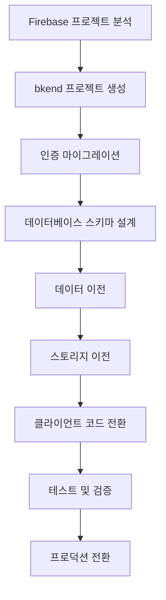
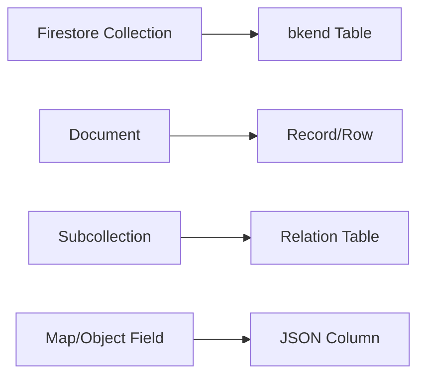
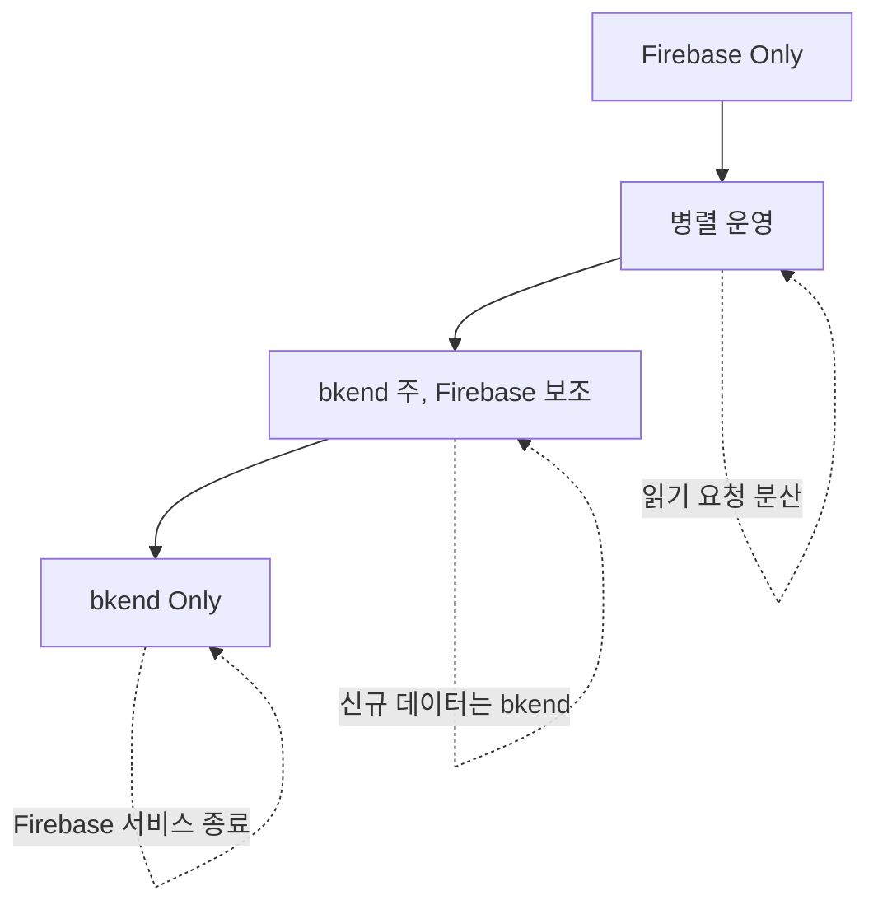

# Firebase에서 이전하기


💡 Firebase 프로젝트를 bkend로 이전하는 단계별 가이드입니다. 인증, 데이터베이스, 스토리지를 체계적으로 마이그레이션하세요.


## 개요

Firebase에서 bkend로 마이그레이션하면 다음과 같은 이점을 얻을 수 있습니다.

- **구조화된 데이터베이스** — Firestore의 NoSQL이 아닌 관계형 데이터베이스 활용
- **통합 백엔드 관리** — 인증, 데이터, 스토리지를 하나의 플랫폼에서 관리
- **강력한 권한 제어** — Row-Level Security로 세밀한 접근 제어
- **AI 도구 연동** — MCP 프로토콜로 Claude, GPT 등과 직접 연동

이 가이드는 Firebase의 핵심 기능(인증, Firestore, Storage)을 bkend로 이전하는 방법을 안내합니다.

***

## 마이그레이션 로드맵



***

## 1단계: Firebase 프로젝트 분석

### 1.1 현재 구조 문서화

마이그레이션 전에 Firebase 프로젝트의 현재 구조를 문서화하세요.

| 항목 | 확인 사항 |
|------|----------|
| **인증** | 활성화된 Provider (이메일, Google, Apple 등) |
| **Firestore** | 컬렉션 구조, 문서 수, 데이터 크기 |
| **Storage** | 버킷 구조, 파일 수, 총 용량 |
| **Functions** | Cloud Functions 목록 및 역할 |
| **Rules** | Security Rules 내용 |

### 1.2 데이터 Export

Firebase CLI로 데이터를 백업하세요.

```bash
# Firebase CLI 설치 (미설치 시)
npm install -g firebase-tools

# 로그인
firebase login

# Firestore 데이터 Export
firebase firestore:export gs://{bucket-name}/exports

# Storage 파일 다운로드 (gsutil 사용)
gsutil -m cp -r gs://{bucket-name}/files ./firebase-backup
```


⚠️ Export한 데이터는 안전한 위치에 백업하세요. 마이그레이션 중 데이터 손실 시 복구용으로 사용됩니다.


***

## 2단계: bkend 프로젝트 설정

### 2.1 조직 및 프로젝트 생성

1. bkend 콘솔에 로그인합니다.
2. **조직 생성** — Firebase 프로젝트 이름과 동일하게 설정합니다.
3. **프로젝트 생성** — "Production" 프로젝트를 생성합니다.
4. **환경 추가** — `dev`, `staging`, `prod` 환경을 생성합니다.

### 2.2 API Key 발급

**설정** → **API Keys**에서 환경별 API Key를 생성하세요.

```bash
# 환경별 키를 .env 파일에 저장
BKEND_API_KEY_DEV={dev-key}
BKEND_API_KEY_STAGING={staging-key}
BKEND_API_KEY_PROD={prod-key}
```

***

## 3단계: 인증 마이그레이션

### 3.1 Provider 매핑

Firebase Auth와 bkend Auth의 Provider 매핑표입니다.

| Firebase Provider | bkend 설정 | 비고 |
|------------------|-----------|------|
| Email/Password | 기본 활성화 | 추가 설정 불필요 |
| Google OAuth | Google Provider 활성화 | Client ID/Secret 재설정 |
| Apple Sign In | (미지원) | 로드맵 예정 |
| Phone Auth | (미지원) | 로드맵 예정 |

### 3.2 Google OAuth 설정

Firebase에서 사용하던 Google OAuth 앱을 bkend에 연결하세요.

1. **콘솔** → **인증** → **Providers** → **Google** 활성화
2. Google Cloud Console에서 Redirect URI 추가:
   ```
   https://api-client.bkend.ai/v1/auth/google/callback
   ```
3. bkend 콘솔에 Client ID/Secret 입력

### 3.3 사용자 데이터 이전

Firebase에서 Export한 사용자 데이터를 bkend로 이전합니다.

#### Firebase 사용자 Export

```bash
# Firebase Admin SDK로 사용자 목록 가져오기
const admin = require('firebase-admin');
const fs = require('fs');

admin.initializeApp();

async function exportUsers() {
  const listUsersResult = await admin.auth().listUsers(1000);
  const users = listUsersResult.users.map(user => ({
    uid: user.uid,
    email: user.email,
    emailVerified: user.emailVerified,
    displayName: user.displayName,
    photoURL: user.photoURL,
    createdAt: user.metadata.creationTime
  }));

  fs.writeFileSync('firebase-users.json', JSON.stringify(users, null, 2));
}

exportUsers();
```

#### bkend로 사용자 생성

```javascript
const users = require('./firebase-users.json');

async function migrateUsers() {
  for (const user of users) {
    // bkend 회원가입 API 호출
    const response = await fetch('https://api-client.bkend.ai/v1/auth/register', {
      method: 'POST',
      headers: {
        'Content-Type': 'application/json',
        'X-API-Key': process.env.BKEND_API_KEY_PROD,
        'X-Project-Id': '{project-id}',
        'X-Environment': 'prod'
      },
      body: JSON.stringify({
        email: user.email,
        password: Math.random().toString(36), // 임시 비밀번호
        displayName: user.displayName,
        photoURL: user.photoURL
      })
    });

    const data = await response.json();
    console.log(`Migrated: ${user.email} → ${data.user.id}`);
  }
}

migrateUsers();
```


⚠️ 비밀번호는 해시를 이전할 수 없으므로, 임시 비밀번호로 생성 후 사용자에게 비밀번호 재설정 이메일을 발송하세요.


***

## 4단계: 데이터베이스 마이그레이션

### 4.1 Firestore → bkend 스키마 변환

Firestore의 컬렉션을 bkend 테이블로 변환합니다.



#### 예시: 블로그 앱 스키마

**Firebase Firestore**
```
posts (collection)
  ├─ post-1 (document)
  │   ├─ title: "Hello"
  │   ├─ content: "..."
  │   ├─ author: {uid: "user-1", name: "Kim"}
  │   └─ comments (subcollection)
  │       └─ comment-1 {text: "Nice", userId: "user-2"}
```

**bkend Database**

| 테이블 | 컬럼 | 타입 |
|--------|------|------|
| **posts** | id | TEXT (Primary Key) |
| | title | TEXT |
| | content | TEXT |
| | author_id | TEXT (Foreign Key → users.id) |
| | created_at | TIMESTAMP |
| **comments** | id | TEXT (Primary Key) |
| | post_id | TEXT (Foreign Key → posts.id) |
| | user_id | TEXT (Foreign Key → users.id) |
| | text | TEXT |
| | created_at | TIMESTAMP |

### 4.2 테이블 생성

콘솔 또는 MCP 도구로 테이블을 생성하세요.



1. **데이터베이스** → **테이블** → **새 테이블**
2. 테이블명: `posts`
3. 컬럼 추가:
   - `id` (TEXT, Primary Key)
   - `title` (TEXT, Required)
   - `content` (TEXT)
   - `author_id` (TEXT, Foreign Key → users.id)
   - `created_at` (TIMESTAMP, Default: now())
4. **권한** → **INSERT 허용**: `user.id = author_id`



```
Claude, posts 테이블을 생성해줘.
컬럼: id(TEXT, PK), title(TEXT, Required), content(TEXT), author_id(TEXT, FK → users.id), created_at(TIMESTAMP)
```



### 4.3 데이터 이전

Firestore Export 데이터를 변환하여 bkend로 Import합니다.

```javascript
const admin = require('firebase-admin');
admin.initializeApp();

const db = admin.firestore();

async function exportFirestoreData() {
  const snapshot = await db.collection('posts').get();
  const posts = [];

  snapshot.forEach(doc => {
    const data = doc.data();
    posts.push({
      id: doc.id,
      title: data.title,
      content: data.content,
      author_id: data.author.uid, // nested object → FK
      created_at: data.createdAt.toDate().toISOString()
    });
  });

  return posts;
}

async function importToBkend(posts) {
  for (const post of posts) {
    const response = await fetch('https://api-client.bkend.ai/v1/data/posts', {
      method: 'POST',
      headers: {
        'Content-Type': 'application/json',
        'X-API-Key': process.env.BKEND_API_KEY_PROD,
        'X-Project-Id': '{project-id}',
        'X-Environment': 'prod'
      },
      body: JSON.stringify(post)
    });

    if (!response.ok) {
      console.error(`Failed to import post ${post.id}`);
    }
  }
}

// 실행
exportFirestoreData().then(importToBkend);
```

***

## 5단계: 스토리지 마이그레이션

### 5.1 Firebase Storage → bkend Storage 매핑

| Firebase | bkend | 비고 |
|----------|-------|------|
| `gs://{bucket}/users/{uid}/avatar.jpg` | `users/{uid}/avatar.jpg` | 경로 구조 유지 가능 |
| 다운로드 URL | Signed URL | 만료 시간 설정 가능 |

### 5.2 파일 이전 스크립트

```javascript
const admin = require('firebase-admin');
const fetch = require('node-fetch');
const FormData = require('form-data');
const fs = require('fs');

admin.initializeApp();
const bucket = admin.storage().bucket();

async function migrateFile(filePath) {
  // Firebase에서 파일 다운로드
  const tempFile = `/tmp/${filePath.replace(/\//g, '_')}`;
  await bucket.file(filePath).download({ destination: tempFile });

  // bkend로 업로드
  const form = new FormData();
  form.append('file', fs.createReadStream(tempFile));
  form.append('path', filePath); // 동일 경로 유지

  const response = await fetch('https://api-client.bkend.ai/v1/files/upload', {
    method: 'POST',
    headers: {
      'X-API-Key': process.env.BKEND_API_KEY_PROD,
      'X-Project-Id': '{project-id}',
      'X-Environment': 'prod',
      'Authorization': `Bearer {admin-jwt}`
    },
    body: form
  });

  const data = await response.json();
  console.log(`Migrated: ${filePath} → ${data.file.id}`);

  // 임시 파일 삭제
  fs.unlinkSync(tempFile);
}

async function migrateAllFiles() {
  const [files] = await bucket.getFiles();
  for (const file of files) {
    await migrateFile(file.name);
  }
}

migrateAllFiles();
```

***

## 6단계: 클라이언트 코드 전환

### 6.1 Firebase SDK → bkend REST API

Firebase SDK 호출을 bkend REST API로 변환합니다.

#### 인증

**Before (Firebase)**
```javascript
import { getAuth, signInWithEmailAndPassword } from 'firebase/auth';

const auth = getAuth();
const userCredential = await signInWithEmailAndPassword(auth, email, password);
const user = userCredential.user;
```

**After (bkend)**
```javascript
const response = await fetch('https://api-client.bkend.ai/v1/auth/login', {
  method: 'POST',
  headers: {
    'Content-Type': 'application/json',
    'X-API-Key': process.env.BKEND_API_KEY,
    'X-Project-Id': '{project-id}',
    'X-Environment': 'dev'
  },
  body: JSON.stringify({ email, password })
});

const { access_token, user } = await response.json();
// JWT 토큰을 localStorage에 저장
localStorage.setItem('auth_token', access_token);
```

#### 데이터 읽기

**Before (Firebase)**
```javascript
import { collection, getDocs, query, where } from 'firebase/firestore';

const q = query(collection(db, 'posts'), where('author.uid', '==', userId));
const snapshot = await getDocs(q);
const posts = snapshot.docs.map(doc => ({ id: doc.id, ...doc.data() }));
```

**After (bkend)**
```javascript
const response = await fetch('https://api-client.bkend.ai/v1/data/posts?author_id=eq.{userId}', {
  headers: {
    'X-API-Key': process.env.BKEND_API_KEY,
    'X-Project-Id': '{project-id}',
    'X-Environment': 'dev',
    'Authorization': `Bearer ${localStorage.getItem('auth_token')}`
  }
});

const posts = await response.json();
```

#### 데이터 쓰기

**Before (Firebase)**
```javascript
import { collection, addDoc } from 'firebase/firestore';

const docRef = await addDoc(collection(db, 'posts'), {
  title: 'New Post',
  content: '...',
  author: { uid: user.uid, name: user.displayName },
  createdAt: new Date()
});
```

**After (bkend)**
```javascript
const response = await fetch('https://api-client.bkend.ai/v1/data/posts', {
  method: 'POST',
  headers: {
    'Content-Type': 'application/json',
    'X-API-Key': process.env.BKEND_API_KEY,
    'X-Project-Id': '{project-id}',
    'X-Environment': 'dev',
    'Authorization': `Bearer ${localStorage.getItem('auth_token')}`
  },
  body: JSON.stringify({
    title: 'New Post',
    content: '...',
    author_id: user.id
  })
});

const post = await response.json();
```

#### 파일 업로드

**Before (Firebase)**
```javascript
import { ref, uploadBytes, getDownloadURL } from 'firebase/storage';

const storageRef = ref(storage, `users/${user.uid}/avatar.jpg`);
await uploadBytes(storageRef, file);
const url = await getDownloadURL(storageRef);
```

**After (bkend)**
```javascript
const formData = new FormData();
formData.append('file', file);
formData.append('path', `users/${user.id}/avatar.jpg`);

const response = await fetch('https://api-client.bkend.ai/v1/files/upload', {
  method: 'POST',
  headers: {
    'X-API-Key': process.env.BKEND_API_KEY,
    'X-Project-Id': '{project-id}',
    'X-Environment': 'dev',
    'Authorization': `Bearer ${localStorage.getItem('auth_token')}`
  },
  body: formData
});

const { file: uploadedFile } = await response.json();
const url = uploadedFile.url; // Signed URL
```

### 6.2 환경별 설정 분리

Firebase Config를 bkend Config로 교체하세요.

**Before (Firebase)**
```javascript
const firebaseConfig = {
  apiKey: "AIzaSy...",
  authDomain: "my-app.firebaseapp.com",
  projectId: "my-app",
  storageBucket: "my-app.appspot.com"
};
```

**After (bkend)**
```javascript
const bkendConfig = {
  apiKey: process.env.BKEND_API_KEY,
  projectId: process.env.BKEND_PROJECT_ID,
  environment: process.env.BKEND_ENV || 'dev',
  baseURL: 'https://api-client.bkend.ai'
};
```

***

## 7단계: 권한 규칙 변환

### 7.1 Firebase Security Rules → bkend Permissions

Firebase Security Rules를 bkend의 Row-Level Security로 변환합니다.

**Before (Firebase Rules)**
```javascript
rules_version = '2';
service cloud.firestore {
  match /databases/{database}/documents {
    match /posts/{postId} {
      allow read: if true;
      allow create: if request.auth != null;
      allow update, delete: if request.auth.uid == resource.data.author.uid;
    }
  }
}
```

**After (bkend Permissions)**

| 작업 | 조건 |
|------|------|
| **SELECT** | `true` (모두 읽기 가능) |
| **INSERT** | `auth.role = 'authenticated'` |
| **UPDATE** | `user.id = author_id` |
| **DELETE** | `user.id = author_id` |

콘솔에서 설정:
1. **데이터베이스** → **테이블** → **posts** → **권한**
2. **SELECT** → `true`
3. **INSERT** → `auth.role = 'authenticated'`
4. **UPDATE** → `user.id = author_id`
5. **DELETE** → `user.id = author_id`

***

## 8단계: 테스트 및 검증

### 8.1 기능 테스트 체크리스트

| 기능 | Firebase | bkend | 상태 |
|------|---------|-------|------|
| 이메일 로그인 | ✅ | ⬜ | 테스트 필요 |
| Google 로그인 | ✅ | ⬜ | 테스트 필요 |
| 데이터 읽기 | ✅ | ⬜ | 테스트 필요 |
| 데이터 쓰기 | ✅ | ⬜ | 테스트 필요 |
| 파일 업로드 | ✅ | ⬜ | 테스트 필요 |
| 권한 제어 | ✅ | ⬜ | 테스트 필요 |

### 8.2 성능 비교

마이그레이션 전후 성능을 비교하세요.

```javascript
// 응답 시간 측정
async function measureLatency(url, options) {
  const start = Date.now();
  await fetch(url, options);
  return Date.now() - start;
}

// Firebase vs bkend 비교
const firebaseLatency = await measureLatency('https://firestore.googleapis.com/...');
const bkendLatency = await measureLatency('https://api-client.bkend.ai/v1/data/posts');

console.log(`Firebase: ${firebaseLatency}ms, bkend: ${bkendLatency}ms`);
```

***

## 9단계: 프로덕션 전환

### 9.1 단계적 전환 전략



1. **병렬 운영** (1-2주) — 신규 사용자는 bkend, 기존 사용자는 Firebase
2. **점진적 전환** (2-4주) — 기존 사용자도 bkend로 이동
3. **모니터링** — 에러율, 응답 시간 추적
4. **Firebase 종료** — 데이터 백업 후 Firebase 프로젝트 삭제

### 9.2 롤백 계획

마이그레이션 실패 시 Firebase로 복귀할 수 있도록 준비하세요.

- Firebase 프로젝트 즉시 삭제 금지 (1개월 유예)
- bkend → Firebase 역방향 데이터 동기화 스크립트 준비
- DNS 레벨에서 즉시 전환 가능하도록 설정

***

## 마이그레이션 체크리스트

- [ ] Firebase 프로젝트 분석 완료
- [ ] Firestore 데이터 Export 완료
- [ ] Storage 파일 백업 완료
- [ ] bkend 조직/프로젝트 생성
- [ ] 환경(dev/staging/prod) 설정
- [ ] API Key 발급
- [ ] Google OAuth Provider 설정
- [ ] 사용자 데이터 이전 (임시 비밀번호 발급)
- [ ] 비밀번호 재설정 이메일 발송
- [ ] 테이블 스키마 생성
- [ ] Firestore 데이터 Import
- [ ] Storage 파일 이전
- [ ] 클라이언트 코드 전환 (인증, CRUD, 파일)
- [ ] 권한 규칙 설정
- [ ] 기능 테스트 통과
- [ ] 성능 테스트 통과
- [ ] 병렬 운영 시작
- [ ] 기존 사용자 마이그레이션
- [ ] 프로덕션 전환
- [ ] Firebase 프로젝트 종료


✅ 모든 단계를 완료하면 Firebase에서 bkend로의 마이그레이션이 완료됩니다.


***

## 관련 문서

- [Supabase에서 이전하기](03-migration-supabase.md) — Supabase 마이그레이션 가이드
- [인증 개요](../authentication/01-overview.md) — bkend 인증 시스템
- [데이터베이스 CRUD](../database/03-crud.md) — Portal API 사용법
- [스토리지 업로드](../storage/03-upload.md) — 파일 업로드 API
- [테스트 전략](06-testing.md) — 마이그레이션 검증 테스트
