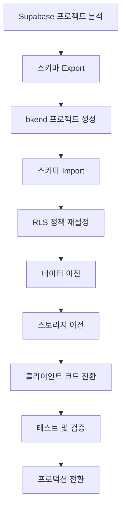
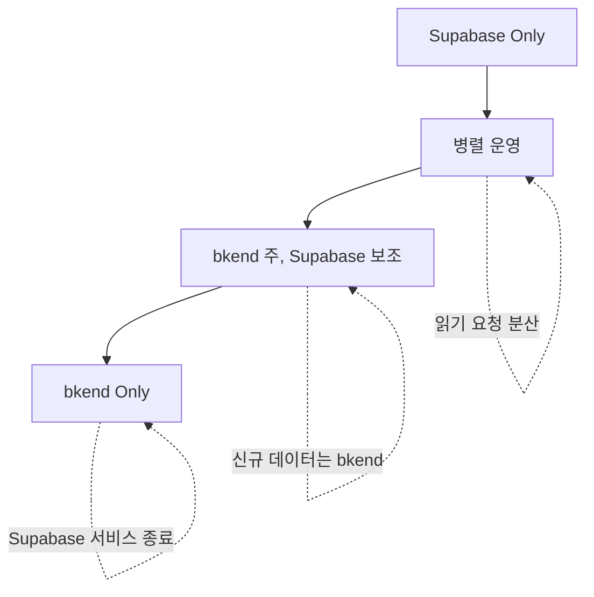

# Supabase에서 이전하기


💡 Supabase 프로젝트를 bkend로 이전하는 단계별 가이드입니다. PostgreSQL 스키마, RLS, Storage를 체계적으로 마이그레이션하세요.


## 개요

Supabase와 bkend는 모두 PostgreSQL 기반 BaaS 플랫폼이므로, Firebase보다 마이그레이션이 수월합니다.

### 마이그레이션 이점

- **스키마 호환성** — PostgreSQL → PostgreSQL 직접 이전 가능
- **RLS 재사용** — Row-Level Security 정책 거의 그대로 적용
- **AI 도구 연동** — MCP 프로토콜로 Claude, GPT와 자동 연동
- **환경 분리** — dev/staging/prod 환경을 프로젝트 단위로 관리

### Supabase vs bkend 비교

| 기능 | Supabase | bkend |
|------|----------|-------|
| **데이터베이스** | PostgreSQL | PostgreSQL |
| **인증** | GoTrue | JWT 기반 인증 |
| **스토리지** | S3 호환 | S3 기반 스토리지 |
| **실시간** | Realtime Subscriptions | (미지원) |
| **Edge Functions** | Deno 런타임 | (미지원) |
| **AI 연동** | (미지원) | MCP 프로토콜 기본 지원 |

***

## 마이그레이션 로드맵



***

## 1단계: Supabase 프로젝트 분석

### 1.1 현재 구조 문서화

Supabase 프로젝트의 구조를 문서화하세요.

| 항목 | 확인 사항 |
|------|----------|
| **데이터베이스** | 테이블 수, 컬럼 타입, 제약조건, 인덱스 |
| **RLS** | 활성화된 정책, SELECT/INSERT/UPDATE/DELETE 규칙 |
| **인증** | 활성화된 Provider (이메일, Google, GitHub 등) |
| **스토리지** | 버킷 구조, 파일 수, 총 용량 |
| **Edge Functions** | Functions 목록 및 역할 |

### 1.2 스키마 Export

Supabase CLI 또는 `pg_dump`로 스키마를 Export하세요.

```bash
# Supabase CLI 설치 (미설치 시)
npm install -g supabase

# 로그인
supabase login

# 프로젝트 연결
supabase link --project-ref {project-id}

# 스키마 Export (테이블 정의만)
supabase db dump --schema public > supabase-schema.sql

# 데이터 포함 Export
supabase db dump --data-only --schema public > supabase-data.sql
```

또는 PostgreSQL `pg_dump` 직접 사용:

```bash
pg_dump -h db.{project-id}.supabase.co \
  -U postgres \
  -d postgres \
  --schema=public \
  --schema-only \
  -f supabase-schema.sql
```


⚠️ Supabase 시스템 스키마(`auth`, `storage`, `realtime`)는 Export하지 마세요. `public` 스키마만 필요합니다.


***

## 2단계: bkend 프로젝트 설정

### 2.1 조직 및 프로젝트 생성

1. bkend 콘솔에 로그인합니다.
2. **조직 생성** — Supabase 프로젝트 이름과 동일하게 설정합니다.
3. **프로젝트 생성** — "Production" 프로젝트를 생성합니다.
4. **환경 추가** — `dev`, `staging`, `prod` 환경을 생성합니다.

### 2.2 API Key 발급

**설정** → **API Keys**에서 환경별 API Key를 생성하세요.

```bash
# 환경별 키를 .env 파일에 저장
BKEND_API_KEY_DEV={dev-key}
BKEND_API_KEY_STAGING={staging-key}
BKEND_API_KEY_PROD={prod-key}
```

***

## 3단계: 스키마 마이그레이션

### 3.1 스키마 변환

Supabase Export 파일(`supabase-schema.sql`)을 bkend에 맞게 수정하세요.

#### 제거할 내용

- `auth.users` 참조 → bkend의 `users` 테이블 사용
- `storage.objects` 참조 → bkend의 파일 API 사용
- `SECURITY DEFINER` 함수 → 필요 시 재작성
- Supabase 전용 확장 (`pgsodium`, `supabase_vault` 등)

#### 예시: 변환 전후

**Before (Supabase)**
```sql
CREATE TABLE posts (
  id UUID PRIMARY KEY DEFAULT uuid_generate_v4(),
  user_id UUID REFERENCES auth.users(id),
  title TEXT NOT NULL,
  content TEXT,
  created_at TIMESTAMPTZ DEFAULT now()
);

ALTER TABLE posts ENABLE ROW LEVEL SECURITY;
```

**After (bkend)**
```sql
CREATE TABLE posts (
  id TEXT PRIMARY KEY DEFAULT gen_random_uuid()::TEXT,
  user_id TEXT NOT NULL, -- bkend의 users.id는 TEXT
  title TEXT NOT NULL,
  content TEXT,
  created_at TIMESTAMP DEFAULT now()
);

-- RLS는 콘솔에서 설정하거나 별도 SQL로 작성
```


💡 bkend의 `users.id`는 TEXT 타입입니다. Supabase의 UUID → TEXT로 변환하거나, bkend에서도 UUID 타입을 사용할 수 있습니다.


### 3.2 테이블 생성

변환한 스키마를 bkend에 적용합니다.



1. **데이터베이스** → **SQL 편집기**
2. 변환한 SQL 파일 내용을 붙여넣기
3. **실행** 버튼 클릭
4. 결과 확인



```
Claude, supabase-schema.sql 파일을 읽고 bkend에 테이블을 생성해줘.
- auth.users → users.id (TEXT)
- UUID → TEXT 변환
- RLS는 콘솔에서 별도 설정
```



***

## 4단계: RLS 정책 마이그레이션

### 4.1 Supabase RLS → bkend Permissions

Supabase의 RLS 정책을 bkend Permissions로 변환합니다.

**Supabase RLS 예시**
```sql
CREATE POLICY "Users can read all posts"
  ON posts FOR SELECT
  USING (true);

CREATE POLICY "Users can insert their own posts"
  ON posts FOR INSERT
  WITH CHECK (auth.uid() = user_id);

CREATE POLICY "Users can update their own posts"
  ON posts FOR UPDATE
  USING (auth.uid() = user_id);
```

**bkend Permissions 설정**

| 작업 | 조건 |
|------|------|
| **SELECT** | `true` |
| **INSERT** | `user.id = user_id` |
| **UPDATE** | `user.id = user_id` |
| **DELETE** | `user.id = user_id` |

콘솔에서 설정:
1. **데이터베이스** → **테이블** → **posts** → **권한**
2. 각 작업별 조건 입력
3. **저장**

### 4.2 복잡한 RLS 정책 변환

**Supabase (복잡한 정책)**
```sql
CREATE POLICY "Admins can delete any post"
  ON posts FOR DELETE
  USING (
    auth.uid() = user_id OR
    EXISTS (
      SELECT 1 FROM user_roles
      WHERE user_id = auth.uid() AND role = 'admin'
    )
  );
```

**bkend (동일 로직)**

콘솔에서 **DELETE** 조건:
```
user.id = user_id OR (
  SELECT COUNT(*) FROM user_roles
  WHERE user_id = user.id AND role = 'admin'
) > 0
```

***

## 5단계: 데이터 이전

### 5.1 PostgreSQL → bkend 직접 이전

`supabase-data.sql` 파일을 bkend에 Import합니다.

#### 방법 1: SQL 편집기 (소규모 데이터)

1. **데이터베이스** → **SQL 편집기**
2. `supabase-data.sql` 내용 붙여넣기
3. **실행**

#### 방법 2: REST API (대규모 데이터)

```javascript
const fs = require('fs');
const rows = JSON.parse(fs.readFileSync('posts-data.json'));

async function importData() {
  for (const row of rows) {
    const response = await fetch('https://api-client.bkend.ai/v1/data/posts', {
      method: 'POST',
      headers: {
        'Content-Type': 'application/json',
        'X-API-Key': process.env.BKEND_API_KEY_PROD,
        'X-Project-Id': '{project-id}',
        'X-Environment': 'prod'
      },
      body: JSON.stringify(row)
    });

    if (!response.ok) {
      console.error(`Failed to import row ${row.id}`);
    }
  }
}

importData();
```

### 5.2 사용자 데이터 이전

Supabase의 `auth.users` 데이터를 bkend로 이전합니다.

```javascript
const { createClient } = require('@supabase/supabase-js');

const supabase = createClient(
  'https://{project-id}.supabase.co',
  '{service-role-key}' // Admin 권한 필요
);

async function migrateUsers() {
  // Supabase auth.users 조회 (Admin API)
  const { data: users, error } = await supabase.auth.admin.listUsers();

  for (const user of users.users) {
    // bkend 회원가입 API 호출
    const response = await fetch('https://api-client.bkend.ai/v1/auth/register', {
      method: 'POST',
      headers: {
        'Content-Type': 'application/json',
        'X-API-Key': process.env.BKEND_API_KEY_PROD,
        'X-Project-Id': '{project-id}',
        'X-Environment': 'prod'
      },
      body: JSON.stringify({
        email: user.email,
        password: Math.random().toString(36), // 임시 비밀번호
        displayName: user.user_metadata?.full_name,
        photoURL: user.user_metadata?.avatar_url
      })
    });

    const data = await response.json();
    console.log(`Migrated: ${user.email} → ${data.user.id}`);
  }
}

migrateUsers();
```


⚠️ 비밀번호는 해시를 이전할 수 없으므로, 임시 비밀번호로 생성 후 사용자에게 비밀번호 재설정 이메일을 발송하세요.


***

## 6단계: 스토리지 마이그레이션

### 6.1 버킷 구조 매핑

Supabase Storage 버킷을 bkend 경로로 매핑합니다.

| Supabase | bkend | 비고 |
|----------|-------|------|
| `avatars/{userId}/profile.jpg` | `avatars/{userId}/profile.jpg` | 경로 구조 유지 |
| `public/images/logo.png` | `public/images/logo.png` | 동일 경로 |

### 6.2 파일 이전 스크립트

```javascript
const { createClient } = require('@supabase/supabase-js');
const fetch = require('node-fetch');
const FormData = require('form-data');

const supabase = createClient(
  'https://{project-id}.supabase.co',
  '{service-role-key}'
);

async function migrateFile(bucket, filePath) {
  // Supabase에서 파일 다운로드
  const { data, error } = await supabase.storage.from(bucket).download(filePath);
  if (error) throw error;

  // bkend로 업로드
  const form = new FormData();
  form.append('file', Buffer.from(await data.arrayBuffer()), { filename: filePath });
  form.append('path', `${bucket}/${filePath}`);

  const response = await fetch('https://api-client.bkend.ai/v1/files/upload', {
    method: 'POST',
    headers: {
      'X-API-Key': process.env.BKEND_API_KEY_PROD,
      'X-Project-Id': '{project-id}',
      'X-Environment': 'prod',
      'Authorization': `Bearer {admin-jwt}`
    },
    body: form
  });

  const result = await response.json();
  console.log(`Migrated: ${bucket}/${filePath} → ${result.file.id}`);
}

async function migrateAllFiles(bucket) {
  const { data: files, error } = await supabase.storage.from(bucket).list('', {
    limit: 1000
  });

  for (const file of files) {
    await migrateFile(bucket, file.name);
  }
}

// 실행
migrateAllFiles('avatars');
migrateAllFiles('public');
```

***

## 7단계: 클라이언트 코드 전환

### 7.1 supabase-js → bkend REST API

Supabase SDK 호출을 bkend REST API로 변환합니다.

#### 인증

**Before (Supabase)**
```javascript
import { createClient } from '@supabase/supabase-js';

const supabase = createClient('{url}', '{anon-key}');
const { data, error } = await supabase.auth.signInWithPassword({
  email,
  password
});
```

**After (bkend)**
```javascript
const response = await fetch('https://api-client.bkend.ai/v1/auth/login', {
  method: 'POST',
  headers: {
    'Content-Type': 'application/json',
    'X-API-Key': process.env.BKEND_API_KEY,
    'X-Project-Id': '{project-id}',
    'X-Environment': 'dev'
  },
  body: JSON.stringify({ email, password })
});

const { access_token, user } = await response.json();
localStorage.setItem('auth_token', access_token);
```

#### 데이터 읽기

**Before (Supabase)**
```javascript
const { data, error } = await supabase
  .from('posts')
  .select('*')
  .eq('user_id', userId)
  .order('created_at', { ascending: false })
  .limit(10);
```

**After (bkend)**
```javascript
const response = await fetch(
  'https://api-client.bkend.ai/v1/data/posts?user_id=eq.{userId}&order=created_at.desc&limit=10',
  {
    headers: {
      'X-API-Key': process.env.BKEND_API_KEY,
      'X-Project-Id': '{project-id}',
      'X-Environment': 'dev',
      'Authorization': `Bearer ${localStorage.getItem('auth_token')}`
    }
  }
);

const posts = await response.json();
```

#### 데이터 쓰기

**Before (Supabase)**
```javascript
const { data, error } = await supabase
  .from('posts')
  .insert({
    title: 'New Post',
    content: '...',
    user_id: user.id
  });
```

**After (bkend)**
```javascript
const response = await fetch('https://api-client.bkend.ai/v1/data/posts', {
  method: 'POST',
  headers: {
    'Content-Type': 'application/json',
    'X-API-Key': process.env.BKEND_API_KEY,
    'X-Project-Id': '{project-id}',
    'X-Environment': 'dev',
    'Authorization': `Bearer ${localStorage.getItem('auth_token')}`
  },
  body: JSON.stringify({
    title: 'New Post',
    content: '...',
    user_id: user.id
  })
});

const post = await response.json();
```

#### 데이터 업데이트

**Before (Supabase)**
```javascript
const { data, error } = await supabase
  .from('posts')
  .update({ title: 'Updated Title' })
  .eq('id', postId);
```

**After (bkend)**
```javascript
const response = await fetch(`https://api-client.bkend.ai/v1/data/posts/${postId}`, {
  method: 'PATCH',
  headers: {
    'Content-Type': 'application/json',
    'X-API-Key': process.env.BKEND_API_KEY,
    'X-Project-Id': '{project-id}',
    'X-Environment': 'dev',
    'Authorization': `Bearer ${localStorage.getItem('auth_token')}`
  },
  body: JSON.stringify({ title: 'Updated Title' })
});
```

#### 파일 업로드

**Before (Supabase)**
```javascript
const { data, error } = await supabase.storage
  .from('avatars')
  .upload(`${user.id}/profile.jpg`, file, { upsert: true });

const { data: urlData } = supabase.storage
  .from('avatars')
  .getPublicUrl(`${user.id}/profile.jpg`);
```

**After (bkend)**
```javascript
const formData = new FormData();
formData.append('file', file);
formData.append('path', `avatars/${user.id}/profile.jpg`);

const response = await fetch('https://api-client.bkend.ai/v1/files/upload', {
  method: 'POST',
  headers: {
    'X-API-Key': process.env.BKEND_API_KEY,
    'X-Project-Id': '{project-id}',
    'X-Environment': 'dev',
    'Authorization': `Bearer ${localStorage.getItem('auth_token')}`
  },
  body: formData
});

const { file: uploadedFile } = await response.json();
const url = uploadedFile.url; // Signed URL
```

### 7.2 쿼리 필터 변환

Supabase 필터를 bkend 쿼리 파라미터로 변환합니다.

| Supabase | bkend | 예시 |
|----------|-------|------|
| `.eq('id', 1)` | `?id=eq.1` | 정확히 일치 |
| `.neq('status', 'deleted')` | `?status=neq.deleted` | 같지 않음 |
| `.gt('price', 100)` | `?price=gt.100` | 초과 |
| `.gte('age', 18)` | `?age=gte.18` | 이상 |
| `.lt('stock', 10)` | `?stock=lt.10` | 미만 |
| `.lte('score', 50)` | `?score=lte.50` | 이하 |
| `.like('name', '%John%')` | `?name=like.*John*` | 패턴 매칭 |
| `.in('category', ['A', 'B'])` | `?category=in.(A,B)` | 배열 포함 |
| `.order('created_at', { ascending: false })` | `?order=created_at.desc` | 정렬 |
| `.limit(10)` | `?limit=10` | 개수 제한 |
| `.range(0, 9)` | `?offset=0&limit=10` | 페이지네이션 |

***

## 8단계: 테스트 및 검증

### 8.1 기능 테스트 체크리스트

| 기능 | Supabase | bkend | 상태 |
|------|---------|-------|------|
| 이메일 로그인 | ✅ | ⬜ | 테스트 필요 |
| Google 로그인 | ✅ | ⬜ | 테스트 필요 |
| 데이터 읽기 (SELECT) | ✅ | ⬜ | 테스트 필요 |
| 데이터 쓰기 (INSERT) | ✅ | ⬜ | 테스트 필요 |
| 데이터 수정 (UPDATE) | ✅ | ⬜ | 테스트 필요 |
| 데이터 삭제 (DELETE) | ✅ | ⬜ | 테스트 필요 |
| 파일 업로드 | ✅ | ⬜ | 테스트 필요 |
| RLS 권한 제어 | ✅ | ⬜ | 테스트 필요 |

### 8.2 RLS 정책 검증

각 테이블의 RLS 정책이 올바르게 동작하는지 테스트하세요.

```javascript
// 본인 데이터만 수정 가능한지 테스트
async function testRLS() {
  // User A 로그인
  const loginA = await fetch('https://api-client.bkend.ai/v1/auth/login', {
    method: 'POST',
    headers: {
      'Content-Type': 'application/json',
      'X-API-Key': process.env.BKEND_API_KEY,
      'X-Project-Id': '{project-id}',
      'X-Environment': 'dev'
    },
    body: JSON.stringify({ email: 'userA@example.com', password: 'password' })
  });
  const { access_token: tokenA } = await loginA.json();

  // User B 로그인
  const loginB = await fetch('https://api-client.bkend.ai/v1/auth/login', {
    method: 'POST',
    headers: {
      'Content-Type': 'application/json',
      'X-API-Key': process.env.BKEND_API_KEY,
      'X-Project-Id': '{project-id}',
      'X-Environment': 'dev'
    },
    body: JSON.stringify({ email: 'userB@example.com', password: 'password' })
  });
  const { access_token: tokenB } = await loginB.json();

  // User A가 본인 게시글 생성
  const createPost = await fetch('https://api-client.bkend.ai/v1/data/posts', {
    method: 'POST',
    headers: {
      'Content-Type': 'application/json',
      'X-API-Key': process.env.BKEND_API_KEY,
      'X-Project-Id': '{project-id}',
      'X-Environment': 'dev',
      'Authorization': `Bearer ${tokenA}`
    },
    body: JSON.stringify({ title: 'Test Post', content: 'Content' })
  });
  const post = await createPost.json();

  // User B가 User A 게시글 수정 시도 (실패해야 함)
  const updatePost = await fetch(`https://api-client.bkend.ai/v1/data/posts/${post.id}`, {
    method: 'PATCH',
    headers: {
      'Content-Type': 'application/json',
      'X-API-Key': process.env.BKEND_API_KEY,
      'X-Project-Id': '{project-id}',
      'X-Environment': 'dev',
      'Authorization': `Bearer ${tokenB}`
    },
    body: JSON.stringify({ title: 'Hacked' })
  });

  if (updatePost.status === 403) {
    console.log('✅ RLS 정책 정상 동작 (User B는 User A 게시글 수정 불가)');
  } else {
    console.error('❌ RLS 정책 오류 (User B가 User A 게시글 수정 가능)');
  }
}

testRLS();
```

***

## 9단계: 프로덕션 전환

### 9.1 단계적 전환 전략



1. **병렬 운영** (1-2주) — 신규 사용자는 bkend, 기존 사용자는 Supabase
2. **점진적 전환** (2-4주) — 기존 사용자도 bkend로 이동
3. **모니터링** — 에러율, 응답 시간 추적
4. **Supabase 종료** — 데이터 백업 후 Supabase 프로젝트 일시 정지

### 9.2 롤백 계획

마이그레이션 실패 시 Supabase로 복귀할 수 있도록 준비하세요.

- Supabase 프로젝트 즉시 삭제 금지 (1개월 유예)
- bkend → Supabase 역방향 데이터 동기화 스크립트 준비
- 환경 변수로 즉시 전환 가능하도록 설정

```javascript
// 환경 변수로 Supabase/bkend 선택
const USE_BKEND = process.env.USE_BKEND === 'true';

const apiURL = USE_BKEND
  ? 'https://api-client.bkend.ai'
  : 'https://{project-id}.supabase.co';
```

***

## 마이그레이션 체크리스트

- [ ] Supabase 프로젝트 분석 완료
- [ ] 스키마 Export (public 스키마만)
- [ ] 데이터 Export (SQL 또는 JSON)
- [ ] Storage 파일 백업
- [ ] bkend 조직/프로젝트 생성
- [ ] 환경(dev/staging/prod) 설정
- [ ] API Key 발급
- [ ] 스키마 변환 (auth.users → users.id TEXT)
- [ ] 테이블 생성 (SQL 편집기)
- [ ] RLS 정책 재설정
- [ ] 사용자 데이터 이전 (임시 비밀번호 발급)
- [ ] 비밀번호 재설정 이메일 발송
- [ ] 테이블 데이터 Import
- [ ] Storage 파일 이전
- [ ] 클라이언트 코드 전환 (supabase-js → fetch)
- [ ] 쿼리 필터 변환
- [ ] 기능 테스트 통과
- [ ] RLS 정책 검증
- [ ] 병렬 운영 시작
- [ ] 기존 사용자 마이그레이션
- [ ] 프로덕션 전환
- [ ] Supabase 프로젝트 일시 정지


✅ 모든 단계를 완료하면 Supabase에서 bkend로의 마이그레이션이 완료됩니다.


***

## 관련 문서

- [Firebase에서 이전하기](02-migration-firebase.md) — Firebase 마이그레이션 가이드
- [인증 개요](../authentication/01-overview.md) — bkend 인증 시스템
- [데이터베이스 CRUD](../database/03-crud.md) — Portal API 사용법
- [권한 설정](../database/04-permissions.md) — RLS 정책 설정
- [스토리지 업로드](../storage/03-upload.md) — 파일 업로드 API
- [테스트 전략](06-testing.md) — 마이그레이션 검증 테스트
