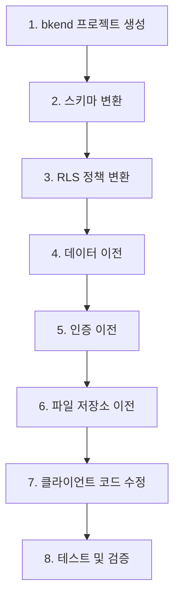

# Supabase에서 이전하기


💡 Supabase 프로젝트를 bkend로 이전하는 방법을 안내합니다.


## 개요

Supabase에서 bkend로 이전하려면 PostgreSQL 스키마를 MongoDB 스키마로 변환하고, SQL 기반 RLS 정책을 bkend의 JSON 기반 RBAC 설정으로 재작성해야 합니다.

***

## 마이그레이션 순서



***

## 1단계: 스키마 변환하기

### 타입 매핑

| PostgreSQL | bkend | 비고 |
|-----------|-------|------|
| `text`, `varchar` | String | |
| `integer`, `bigint` | Number | |
| `numeric`, `decimal` | Number | 실수 포함 |
| `boolean` | Boolean | |
| `timestamp`, `timestamptz` | Date | ISO 8601 형식 |
| `json`, `jsonb` | Object | |
| `text[]`, `integer[]` | Array | |
| `uuid` | String | 문자열로 저장 |

### 변환 예시

```sql
-- Supabase (PostgreSQL)
CREATE TABLE posts (
  id uuid DEFAULT uuid_generate_v4() PRIMARY KEY,
  title text NOT NULL,
  content text,
  author_id uuid REFERENCES auth.users(id),
  tags text[] DEFAULT '{}',
  metadata jsonb DEFAULT '{}',
  created_at timestamptz DEFAULT now()
);
```

bkend에서는 다음과 같이 테이블을 생성합니다.

```json
{
  "name": "posts",
  "columns": [
    { "name": "title", "type": "String", "required": true },
    { "name": "content", "type": "String" },
    { "name": "authorId", "type": "String" },
    { "name": "tags", "type": "Array" },
    { "name": "metadata", "type": "Object" }
  ]
}
```


💡 bkend는 `_id`, `createdAt`, `updatedAt`, `createdBy` 필드를 자동 생성합니다. Supabase의 `id`, `created_at` 컬럼은 별도로 생성할 필요가 없습니다.


***

## 2단계: RLS 정책 변환하기

### Supabase RLS → bkend RBAC

```sql
-- Supabase RLS 정책
CREATE POLICY "Users can view all posts"
ON posts FOR SELECT USING (true);

CREATE POLICY "Users can insert own posts"
ON posts FOR INSERT WITH CHECK (auth.uid() = author_id);

CREATE POLICY "Users can update own posts"
ON posts FOR UPDATE USING (auth.uid() = author_id);
```

bkend에서는 다음과 같이 권한을 설정합니다.

```json
{
  "permissions": {
    "user": { "create": true, "read": true, "list": true },
    "self": { "update": true, "delete": true },
    "guest": { "read": true, "list": true }
  }
}
```

### 주요 차이점

| Supabase RLS | bkend RLS |
|-------------|----------|
| SQL 기반 커스텀 정책 | JSON 기반 선언적 설정 |
| 복잡한 조건식 가능 | admin/user/self/guest 4그룹 |
| `auth.uid()` 비교 | `createdBy` 자동 필터 |
| Row 단위 세밀한 제어 | 그룹 단위 CRUD 제어 |


⚠️ Supabase의 복잡한 커스텀 RLS 정책(여러 조건을 조합한 정책)은 bkend의 기본 RLS로 완전히 대체되지 않을 수 있습니다. 비즈니스 로직에서 추가 검증이 필요할 수 있습니다.


***

## 3단계: 데이터 이전하기

1. **Supabase에서 데이터 내보내기** — SQL 쿼리 또는 Dashboard에서 CSV/JSON으로 내보내세요
2. **데이터 변환** — PostgreSQL 타입을 bkend 타입으로 변환하세요
3. **bkend에 데이터 삽입** — REST API의 Insert 엔드포인트로 삽입하세요

```typescript
// Supabase 데이터
const supabaseRow = {
  id: "550e8400-e29b-41d4-a716-446655440000",
  title: "게시글",
  created_at: "2025-01-01T00:00:00+09:00",
  tags: ["javascript", "tutorial"],
};

// bkend 형식으로 변환
const bkendRecord = {
  title: supabaseRow.title,
  tags: supabaseRow.tags,
  // _id, createdAt은 자동 생성됨
};
```

***

## 4단계: 인증 이전하기

| Supabase | bkend | 이전 방법 |
|----------|-------|---------|
| 이메일/비밀번호 | 이메일/비밀번호 | 비밀번호 재설정 필요 |
| Google OAuth | Google OAuth | OAuth 설정 재구성 |
| GitHub OAuth | GitHub OAuth | OAuth 설정 재구성 |
| 매직 링크 | 매직 링크 | API 교체 |


⚠️ Supabase의 비밀번호 해시는 직접 이전할 수 없습니다. 사용자에게 비밀번호 재설정을 안내하세요.


***

## 5단계: 파일 저장소 이전하기

| Supabase Storage | bkend Storage | 설명 |
|-----------------|---------------|------|
| Bucket | 파일 카테고리 | 파일 저장 위치 |
| Public / Private | public / private visibility | 접근 권한 |
| URL | CDN / Presigned URL | 파일 접근 |

1. Supabase Storage에서 파일을 다운로드하세요
2. bkend의 Presigned URL 업로드 API로 파일을 업로드하세요
3. 기존 Supabase Storage URL을 bkend URL로 교체하세요

***

## 6단계: 클라이언트 코드 수정하기

```typescript
// Supabase (Before)
import { createClient } from '@supabase/supabase-js';
const supabase = createClient(url, key);
const { data } = await supabase.from('posts').select('*').eq('status', 'published');

// bkend (After)
const response = await fetch(
  'https://api-client.bkend.ai/v1/data/posts?andFilters[status]=published',
  {
    headers: {
      'Authorization': `Bearer ${apiKey}`,
      'X-Project-Id': '{project_id}',
      'X-Environment': 'prod',
    },
  }
);
const { data } = await response.json();
```

***

## 테스트 체크리스트

- [ ] 모든 테이블이 올바른 스키마로 생성되었는지 확인
- [ ] 데이터가 정확히 이전되었는지 확인 (타입 변환 포함)
- [ ] RLS 정책이 올바르게 변환되었는지 확인
- [ ] 사용자 인증이 정상 동작하는지 확인
- [ ] 파일 접근 URL이 올바르게 교체되었는지 확인

***

## 다음 단계

- [타 서비스 비교](01-comparison.md) — Firebase, Supabase 상세 비교
- [데이터베이스 개요](../database/01-overview.md) — bkend 데이터베이스
- [RLS 개요](../security/04-rls-overview.md) — bkend 접근 제어
