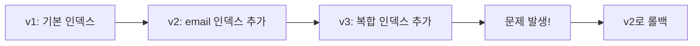

# 성능 최적화

> bkend 프로젝트의 성능을 최적화하는 방법을 안내합니다.

## 개요

bkend는 인덱스 관리, 쿼리 최적화, 파일 저장소 최적화 등 다양한 성능 개선 방법을 제공합니다.

---

## 인덱스 관리

### 기본 인덱스

bkend는 테이블 생성 시 다음 인덱스를 자동으로 생성합니다.

| 인덱스 이름 | 필드 | 정렬 | 설명 |
|-----------|------|------|------|
| `_id_` | `_id` | 오름차순 | 기본 키 인덱스 (시스템) |
| `idx_createdAt_desc` | `createdAt` | 내림차순 | 생성일 정렬 |
| `idx_updatedAt_desc` | `updatedAt` | 내림차순 | 수정일 정렬 |
| `idx_createdBy` | `createdBy` | 오름차순 | 작성자 필터링 |

> ⚠️ **주의** - 기본 인덱스와 시스템 인덱스(`_id_`)는 수정하거나 삭제할 수 없습니다.

### 커스텀 인덱스 추가하기

자주 조회하는 필드에 인덱스를 추가하면 쿼리 성능이 향상됩니다.

```json
{
  "name": "idx_status_createdAt",
  "fields": {
    "status": 1,
    "createdAt": -1
  }
}
```

### 인덱스 유형

| 유형 | 설명 | 사용 예시 |
|------|------|----------|
| **단일 필드** | 하나의 필드에 대한 인덱스 | `{ "email": 1 }` |
| **복합 인덱스** | 여러 필드를 조합한 인덱스 | `{ "status": 1, "createdAt": -1 }` |
| **Unique** | 중복 값 방지 | 이메일, 슬러그 등 |
| **Sparse** | null 값을 제외한 인덱스 | 선택적 필드 |

### 인덱스 버전 관리

bkend는 인덱스 변경 이력을 버전으로 관리합니다. 문제가 발생하면 이전 버전으로 롤백할 수 있습니다.



---

## 쿼리 최적화

### 필터링 최적화

인덱스가 있는 필드를 우선적으로 필터 조건에 사용하세요.

```typescript
// 좋은 예 — 인덱스된 필드로 필터링
const response = await fetch('/data/posts?status=published&sort=-createdAt&limit=20', {
  headers: { 'X-API-Key': '{your_api_key}' }
});

// 나쁜 예 — 인덱스 없는 필드로 필터링
const response = await fetch('/data/posts?content[$contains]=keyword', {
  headers: { 'X-API-Key': '{your_api_key}' }
});
```

### 페이지네이션 활용

대량 데이터를 조회할 때는 반드시 `limit`과 `offset`을 사용하세요.

| 파라미터 | 설명 | 권장값 |
|---------|------|-------|
| `limit` | 한 번에 조회할 레코드 수 | 10~50 |
| `offset` | 건너뛸 레코드 수 | 페이지 × limit |

```typescript
// 페이지네이션 예시
const page = 1;
const limit = 20;
const offset = (page - 1) * limit;

const response = await fetch(`/data/posts?limit=${limit}&offset=${offset}`, {
  headers: { 'X-API-Key': '{your_api_key}' }
});
```

### 필드 선택

필요한 필드만 선택하여 응답 크기를 줄이세요.

```typescript
// 필요한 필드만 조회
const response = await fetch('/data/posts?fields=title,status,createdAt', {
  headers: { 'X-API-Key': '{your_api_key}' }
});
```

---

## 파일 저장소 최적화

### 파일 크기 최적화

| 파일 유형 | 권장사항 |
|----------|---------|
| **이미지** | 업로드 전 압축, WebP 형식 사용 |
| **문서** | 필요한 형식만 저장, PDF 압축 |
| **대용량 파일** | 멀티파트 업로드 활용 |

### CDN 활용

public 파일은 CDN을 통해 제공되어 응답 시간이 빠릅니다.

| 접근 방식 | 응답 시간 | 만료 |
|----------|---------|------|
| **CDN** (public) | 빠름 | 만료 없음 |
| **Presigned URL** (private) | 보통 | 1시간 |

> 💡 **Tip** - 자주 접근하는 파일은 `public`으로 설정하여 CDN의 이점을 활용하세요. 민감하지 않은 이미지, CSS, JavaScript 파일에 적합합니다.

---

## API 호출 최적화

### 배치 처리

여러 레코드를 한 번에 처리하면 API 호출 횟수를 줄일 수 있습니다.

```typescript
// 나쁜 예 — 개별 삽입 (N번 호출)
for (const item of items) {
  await fetch('/data/posts', {
    method: 'POST',
    body: JSON.stringify(item)
  });
}

// 좋은 예 — 배치 삽입 (1번 호출)
await fetch('/data/posts', {
  method: 'POST',
  body: JSON.stringify(items) // 배열로 전달
});
```

### 클라이언트 캐싱

자주 변경되지 않는 데이터는 클라이언트에서 캐싱하세요.

```typescript
// 간단한 메모리 캐시 예시
const cache = new Map<string, { data: unknown; expiry: number }>();

async function fetchWithCache(url: string, ttl = 60000) {
  const cached = cache.get(url);
  if (cached && cached.expiry > Date.now()) {
    return cached.data;
  }

  const response = await fetch(url, {
    headers: { 'X-API-Key': '{your_api_key}' }
  });
  const data = await response.json();
  cache.set(url, { data, expiry: Date.now() + ttl });
  return data;
}
```

---

## 성능 체크리스트

- [ ] 자주 필터링하는 필드에 인덱스를 추가했는지 확인
- [ ] 페이지네이션을 적용했는지 확인
- [ ] 불필요한 필드를 제외하고 조회하는지 확인
- [ ] public 파일에 CDN을 활용하는지 확인
- [ ] 배치 처리로 API 호출을 최소화했는지 확인
- [ ] 클라이언트 캐싱을 적용했는지 확인

---

## 관련 문서

- [인덱스 & 성능](../database/14-indexes.md) — 인덱스 관리 상세
- [필터링 & 검색](../database/10-filtering.md) — 효율적인 쿼리 작성
- [정렬 & 페이지네이션](../database/11-sorting-pagination.md) — 페이지네이션 활용
- [사용량 분석](../platform/06-usage-analytics.md) — API 사용량 모니터링
