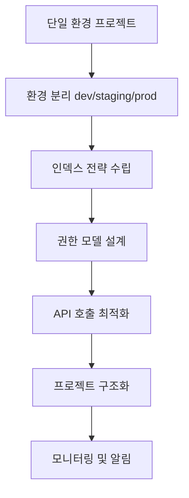
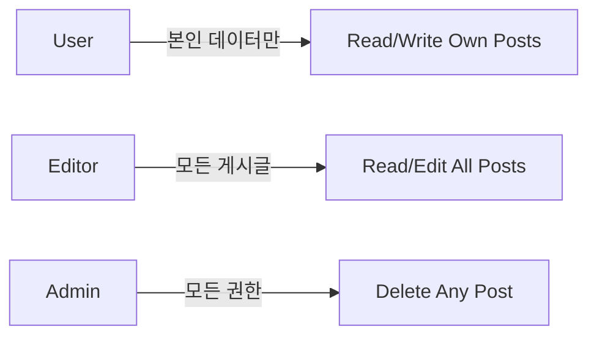

# 확장 가이드


💡 bkend 프로젝트를 확장하기 위한 전략과 모범 사례를 안내합니다. 환경 분리, 인덱스 최적화, 권한 설계 등을 다룹니다.


## 개요

프로젝트가 성장하면서 다음과 같은 확장 과제를 만나게 됩니다.

- **환경 분리** — 개발/스테이징/프로덕션 환경을 안전하게 격리
- **데이터 증가** — 수백만 레코드에서도 빠른 쿼리 성능 유지
- **사용자 증가** — 동시 접속자가 많아져도 안정적인 응답 시간
- **복잡한 권한** — 팀, 역할, 조직별 세밀한 접근 제어
- **API 호출 최적화** — 불필요한 요청 줄이고 캐싱 활용

이 가이드는 bkend 프로젝트를 확장 가능하게 설계하는 방법을 단계별로 안내합니다.

***

## 확장 로드맵



***

## 1단계: 환경별 구성 전략

### 1.1 환경 분리 패턴

bkend의 환경 분리 기능을 활용하여 개발/테스트/프로덕션 데이터를 격리하세요.

| 환경 | 용도 | API Key | 데이터베이스 |
|------|------|---------|-------------|
| **dev** | 개발 및 실험 | 개발자 개인별 발급 | 테스트 데이터 |
| **staging** | QA 및 통합 테스트 | 팀 공유 | 프로덕션 복제본 |
| **prod** | 실제 서비스 | 엄격한 권한 관리 | 실제 사용자 데이터 |

#### 환경별 .env 파일 관리

```bash
# .env.development
BKEND_API_KEY={pk_dev_publishable_key}

# .env.staging
BKEND_API_KEY={pk_staging_publishable_key}

# .env.production
BKEND_API_KEY={pk_prod_publishable_key}
```

#### 클라이언트 코드에서 환경별 설정

```javascript
const config = {
  apiKey: process.env.BKEND_API_KEY,
  baseURL: 'https://api-client.bkend.ai'
};

// API 호출 헬퍼
async function apiRequest(endpoint, options = {}) {
  const response = await fetch(`${config.baseURL}${endpoint}`, {
    ...options,
    headers: {
      ...options.headers,
      'X-API-Key': config.apiKey,
      'Authorization': `Bearer ${config.apiKey}`,
    }
  });

  return response.json();
}

// 사용 예시
const posts = await apiRequest('/v1/data/posts');
```

### 1.2 환경별 데이터 동기화

staging 환경에 프로덕션 데이터 복제본을 주기적으로 동기화하세요.

```javascript
// 프로덕션 → 스테이징 데이터 복사 스크립트
async function syncProdToStaging(tableName) {
  // 1. 프로덕션 데이터 조회
  const prodData = await fetch(`https://api-client.bkend.ai/v1/data/${tableName}`, {
    headers: {
      'X-API-Key': process.env.BKEND_SOURCE_API_KEY,
      'Authorization': `Bearer ${process.env.BKEND_SOURCE_API_KEY}`,
    }
  }).then(r => r.json());

  // 2. 스테이징 기존 데이터 삭제
  await fetch(`https://api-client.bkend.ai/v1/data/${tableName}`, {
    method: 'DELETE',
    headers: {
      'X-API-Key': process.env.BKEND_TARGET_API_KEY,
      'Authorization': `Bearer ${process.env.BKEND_TARGET_API_KEY}`,
    }
  });

  // 3. 프로덕션 데이터 복사
  for (const row of prodData) {
    await fetch(`https://api-client.bkend.ai/v1/data/${tableName}`, {
      method: 'POST',
      headers: {
        'Content-Type': 'application/json',
        'X-API-Key': process.env.BKEND_TARGET_API_KEY,
        'Authorization': `Bearer ${process.env.BKEND_TARGET_API_KEY}`,
      },
      body: JSON.stringify(row)
    });
  }

  console.log(`✅ ${tableName} synced to staging`);
}

// 매주 일요일 새벽 2시에 실행 (cron)
syncProdToStaging('users');
syncProdToStaging('posts');
```


⚠️ 개인정보가 포함된 테이블은 익명화 후 동기화하세요. 이메일, 전화번호 등을 마스킹 처리하세요.


***

## 2단계: 프로젝트 구조화

### 2.1 마이크로서비스별 프로젝트 분리

하나의 조직 내에서 서비스별로 프로젝트를 분리하면 다음과 같은 이점이 있습니다.

- **독립적인 스키마** — 각 서비스의 테이블이 섞이지 않음
- **권한 격리** — 팀별로 프로젝트 접근 권한 분리
- **환경별 설정** — 서비스마다 다른 환경 전략 사용 가능

#### 예시: 전자상거래 앱 구조

```text
조직: MyCompany
├── 프로젝트: Auth Service
│   ├── dev
│   ├── staging
│   └── prod
│       └── 테이블: users, sessions, oauth_tokens
├── 프로젝트: Product Service
│   ├── dev
│   ├── staging
│   └── prod
│       └── 테이블: products, categories, inventory
├── 프로젝트: Order Service
│   ├── dev
│   ├── staging
│   └── prod
│       └── 테이블: orders, order_items, payments
└── 프로젝트: Notification Service
    ├── dev
    ├── staging
    └── prod
        └── 테이블: notifications, templates, schedules
```

### 2.2 공유 데이터 전략

여러 서비스에서 동일한 데이터를 참조해야 할 때는 다음 전략 중 하나를 선택하세요.

| 전략 | 방법 | 장점 | 단점 |
|------|------|------|------|
| **중앙 DB** | 하나의 프로젝트에 모든 테이블 | 간단함 | 서비스 간 결합도 증가 |
| **API 호출** | 서비스 A → 서비스 B API | 독립성 유지 | 네트워크 지연 |
| **데이터 복제** | 주기적으로 동기화 | 빠른 조회 | 일관성 문제 |

#### 예시: API 호출 방식

```javascript
// Order Service에서 User Service API 호출
async function getUserInfo(userId) {
  const response = await fetch(`https://api-client.bkend.ai/v1/data/users/${userId}`, {
    headers: {
      'X-API-Key': process.env.USER_SERVICE_API_KEY,
      'Authorization': `Bearer ${process.env.USER_SERVICE_API_KEY}`,
    }
  });

  return response.json();
}
```

***

## 3단계: 인덱스 전략

### 3.1 인덱스가 필요한 경우

다음 상황에서는 반드시 인덱스를 추가하세요.

| 상황 | 인덱스 대상 | 예시 |
|------|-------------|------|
| **WHERE 절 필터** | 자주 검색하는 컬럼 | `WHERE user_id = '...'` → `user_id` 인덱스 |
| **ORDER BY 정렬** | 정렬 기준 컬럼 | `ORDER BY created_at DESC` → `created_at` 인덱스 |
| **JOIN 조건** | Foreign Key 컬럼 | `JOIN orders ON user_id` → `user_id` 인덱스 |
| **고유 제약** | 중복 방지 컬럼 | `email` 컬럼 → UNIQUE 인덱스 |

### 3.2 인덱스 생성 예시

콘솔 또는 SQL로 인덱스를 생성하세요.



1. **데이터베이스** → **테이블** → **posts** → **인덱스**
2. **새 인덱스** 클릭
3. 인덱스명: `idx_posts_user_id`
4. 컬럼: `user_id`
5. 타입: B-Tree (기본값)
6. **생성**



```sql
-- 단일 컬럼 인덱스
CREATE INDEX idx_posts_user_id ON posts(user_id);

-- 복합 인덱스 (user_id + created_at)
CREATE INDEX idx_posts_user_created ON posts(user_id, created_at DESC);

-- 부분 인덱스 (status가 'published'인 것만)
CREATE INDEX idx_posts_published ON posts(created_at)
WHERE status = 'published';

-- 고유 인덱스
CREATE UNIQUE INDEX idx_users_email ON users(email);
```



### 3.3 인덱스 성능 측정

인덱스 추가 전후 쿼리 성능을 비교하세요.

```javascript
const headers = {
  'X-API-Key': '{pk_publishable_key}',
  'Authorization': 'Bearer {accessToken}',
};

const url = 'https://api-client.bkend.ai/v1/data/posts?' + new URLSearchParams({
  andFilters: JSON.stringify({ userId: '{userId}' })
});

// 인덱스 없이 1만 건 조회
console.time('without index');
await fetch(url, { headers });
console.timeEnd('without index'); // 예: 850ms

// 인덱스 추가 후
console.time('with index');
await fetch(url, { headers });
console.timeEnd('with index'); // 예: 45ms
```


💡 인덱스는 읽기 성능은 향상시키지만, 쓰기 성능은 약간 저하됩니다. 자주 조회하지만 덜 쓰는 컬럼에 인덱스를 추가하세요.


***

## 4단계: 권한 모델 설계

### 4.1 역할 기반 접근 제어 (RBAC)

복잡한 권한 요구사항은 역할 기반으로 설계하세요.

#### 예시: 블로그 앱 역할 모델



**테이블 설계**

```sql
-- 사용자 역할 테이블
CREATE TABLE user_roles (
  id TEXT PRIMARY KEY DEFAULT gen_random_uuid()::TEXT,
  user_id TEXT NOT NULL REFERENCES users(id),
  role TEXT NOT NULL, -- 'user', 'editor', 'admin'
  created_at TIMESTAMP DEFAULT now()
);

CREATE INDEX idx_user_roles_user_id ON user_roles(user_id);
```

**권한 설정 (posts 테이블)**

| 작업 | 조건 |
|------|------|
| **SELECT** | `true` (모두 읽기) |
| **INSERT** | `auth.role = 'authenticated'` |
| **UPDATE** | `user.id = author_id OR (SELECT COUNT(*) FROM user_roles WHERE user_id = user.id AND role IN ('editor', 'admin')) > 0` |
| **DELETE** | `(SELECT COUNT(*) FROM user_roles WHERE user_id = user.id AND role = 'admin') > 0` |

### 4.2 조직별 데이터 격리

멀티 테넌트 앱에서는 조직(Organization)별로 데이터를 격리하세요.

**테이블 설계**

```sql
-- 조직 테이블
CREATE TABLE organizations (
  id TEXT PRIMARY KEY DEFAULT gen_random_uuid()::TEXT,
  name TEXT NOT NULL,
  created_at TIMESTAMP DEFAULT now()
);

-- 조직 멤버 테이블
CREATE TABLE organization_members (
  id TEXT PRIMARY KEY DEFAULT gen_random_uuid()::TEXT,
  organization_id TEXT NOT NULL REFERENCES organizations(id),
  user_id TEXT NOT NULL REFERENCES users(id),
  role TEXT NOT NULL, -- 'owner', 'admin', 'member'
  created_at TIMESTAMP DEFAULT now()
);

-- 게시글 테이블 (조직 ID 추가)
CREATE TABLE posts (
  id TEXT PRIMARY KEY DEFAULT gen_random_uuid()::TEXT,
  organization_id TEXT NOT NULL REFERENCES organizations(id),
  author_id TEXT NOT NULL REFERENCES users(id),
  title TEXT NOT NULL,
  content TEXT,
  created_at TIMESTAMP DEFAULT now()
);
```

**권한 설정 (posts 테이블)**

| 작업 | 조건 |
|------|------|
| **SELECT** | `(SELECT COUNT(*) FROM organization_members WHERE organization_id = posts.organization_id AND user_id = user.id) > 0` |
| **INSERT** | `(SELECT COUNT(*) FROM organization_members WHERE organization_id = NEW.organization_id AND user_id = user.id) > 0` |
| **UPDATE** | `user.id = author_id` |
| **DELETE** | `user.id = author_id OR (SELECT role FROM organization_members WHERE organization_id = posts.organization_id AND user_id = user.id) = 'owner'` |

***

## 5단계: API 호출 최적화

### 5.1 쿼리 파라미터 활용

필요한 데이터만 조회하여 네트워크 트래픽을 줄이세요.

```javascript
// ❌ 나쁜 예: 모든 데이터 조회 후 필터링
const allPosts = await fetch('https://api-client.bkend.ai/v1/data/posts', {
  headers: {
    'X-API-Key': '{pk_publishable_key}',
    'Authorization': 'Bearer {accessToken}',
  }
}).then(r => r.json());

const myPosts = allPosts.items.filter(p => p.authorId === userId);

// ✅ 좋은 예: 서버에서 필터링
const myPosts = await fetch(
  'https://api-client.bkend.ai/v1/data/posts?' + new URLSearchParams({
    andFilters: JSON.stringify({ authorId: userId }),
    select: 'id,title,createdAt'
  }),
  {
    headers: {
      'X-API-Key': '{pk_publishable_key}',
      'Authorization': 'Bearer {accessToken}',
    }
  }
).then(r => r.json());
```

### 5.2 페이지네이션

대량 데이터는 페이지네이션으로 나눠 조회하세요.

```javascript
async function fetchPosts(page = 1, limit = 20) {
  const posts = await fetch(
    'https://api-client.bkend.ai/v1/data/posts?' + new URLSearchParams({
      page: String(page),
      limit: String(limit),
      sortBy: 'createdAt',
      sortDirection: 'desc'
    }),
    {
      headers: {
        'X-API-Key': '{pk_publishable_key}',
        'Authorization': `Bearer {accessToken}`,
      }
    }
  ).then(r => r.json());

  // 응답: { items: [...], pagination: { page, limit, total } }
  return posts;
}

// 사용 예시
const page1 = await fetchPosts(1); // 1-20
const page2 = await fetchPosts(2); // 21-40
```

### 5.3 클라이언트 캐싱

자주 변경되지 않는 데이터는 클라이언트에서 캐싱하세요.

```javascript
// 간단한 메모리 캐시
const cache = new Map();

async function fetchWithCache(url, options, cacheKey, ttl = 60000) {
  const cached = cache.get(cacheKey);

  if (cached && Date.now() - cached.timestamp < ttl) {
    console.log('Using cached data');
    return cached.data;
  }

  const response = await fetch(url, options);
  const data = await response.json();

  cache.set(cacheKey, { data, timestamp: Date.now() });
  return data;
}

// 사용 예시 (카테고리는 1분간 캐싱)
const categories = await fetchWithCache(
  'https://api-client.bkend.ai/v1/data/categories',
  {
    headers: {
      'X-API-Key': '{pk_publishable_key}',
      'Authorization': 'Bearer {accessToken}',
    }
  },
  'categories',
  60000
);
```

### 5.4 배치 요청

여러 리소스를 한 번에 조회하세요.

```javascript
// ❌ 나쁜 예: 10번의 개별 요청
for (const postId of postIds) {
  const post = await fetch(`https://api-client.bkend.ai/v1/data/posts/${postId}`, {
    headers: {
      'X-API-Key': '{pk_publishable_key}',
      'Authorization': 'Bearer {accessToken}',
    }
  }).then(r => r.json());
}

// ✅ 좋은 예: Promise.all로 병렬 요청
const headers = {
  'X-API-Key': '{pk_publishable_key}',
  'Authorization': 'Bearer {accessToken}',
};

const posts = await Promise.all(
  postIds.map(id =>
    fetch(`https://api-client.bkend.ai/v1/data/posts/${id}`, { headers })
      .then(r => r.json())
  )
);
```

***

## 6단계: API Key 관리 전략

### 6.1 환경별 키 분리

환경별로 API Key를 분리하여 실수로 프로덕션 데이터를 변경하는 것을 방지하세요.

```bash
# .env.development
BKEND_API_KEY={pk_dev_publishable_key}

# .env.production
BKEND_API_KEY={pk_prod_publishable_key}
```

### 6.2 키 순환 정책

보안을 위해 API Key를 주기적으로 교체하세요.

1. 콘솔에서 새 API Key 생성
2. 애플리케이션에 새 키 배포
3. 기존 키 비활성화 (1주일 유예 기간)
4. 기존 키 삭제

### 6.3 키 권한 제한

프로덕션 환경에서는 최소 권한 원칙을 적용하세요.

| 환경 | 권한 | 이유 |
|------|------|------|
| **dev** | 모든 권한 | 개발 편의성 |
| **staging** | 읽기/쓰기 | QA 테스트 |
| **prod** | 읽기 전용 (프론트엔드) | 보안 강화 |
| **prod** | 읽기/쓰기 (백엔드) | 서버 측 작업 |

***

## 7단계: 모니터링 및 알림

### 7.1 에러 로깅

API 호출 실패를 로깅하여 문제를 추적하세요.

```javascript
async function apiRequestWithLogging(url, options) {
  try {
    const response = await fetch(url, options);

    if (!response.ok) {
      const error = await response.json();
      console.error('API Error:', {
        url,
        status: response.status,
        error
      });

      // 외부 로깅 서비스로 전송 (Sentry, LogRocket 등)
      sendToLoggingService({
        level: 'error',
        message: `API request failed: ${url}`,
        context: { status: response.status, error }
      });
    }

    return response.json();
  } catch (err) {
    console.error('Network Error:', err);
    sendToLoggingService({
      level: 'error',
      message: `Network error: ${url}`,
      context: { error: err.message }
    });
    throw err;
  }
}
```

### 7.2 성능 모니터링

API 응답 시간을 추적하여 성능 저하를 감지하세요.

```javascript
async function apiRequestWithMetrics(url, options) {
  const start = performance.now();

  const response = await fetch(url, options);
  const data = await response.json();

  const duration = performance.now() - start;

  // 메트릭 수집
  sendToMetricsService({
    metric: 'api.request.duration',
    value: duration,
    tags: {
      endpoint: url,
      status: response.status,
      environment: process.env.NODE_ENV
    }
  });

  return data;
}
```

***

## 확장 체크리스트

- [ ] 환경(dev/staging/prod) 분리 완료
- [ ] 환경별 .env 파일 설정
- [ ] 프로덕션 → 스테이징 동기화 스크립트 작성
- [ ] 마이크로서비스별 프로젝트 분리 검토
- [ ] 자주 조회하는 컬럼에 인덱스 추가
- [ ] 복합 인덱스 전략 수립
- [ ] 인덱스 성능 측정 완료
- [ ] 역할 기반 권한 모델 설계
- [ ] 조직별 데이터 격리 (멀티 테넌트)
- [ ] 쿼리 파라미터 활용 (select, filter, limit)
- [ ] 페이지네이션 구현
- [ ] 클라이언트 캐싱 구현
- [ ] 배치 요청으로 API 호출 최적화
- [ ] 환경별 API Key 분리
- [ ] API Key 순환 정책 수립
- [ ] 에러 로깅 시스템 구축
- [ ] 성능 모니터링 대시보드 구성


✅ 모든 단계를 완료하면 bkend 프로젝트가 확장 가능한 구조로 준비됩니다.


***

## 관련 문서

- [성능 최적화](04-performance.md) — 쿼리 및 인덱스 최적화
- [CI/CD 연동](07-ci-cd.md) — 배포 파이프라인 구성
- [테스트 전략](06-testing.md) — 환경별 테스트 전략
- [권한 설정](../security/05-rls-policies.md) — RLS 정책 설계
- [콘솔 환경 관리](../console/05-environment.md) — 환경 설정 가이드
