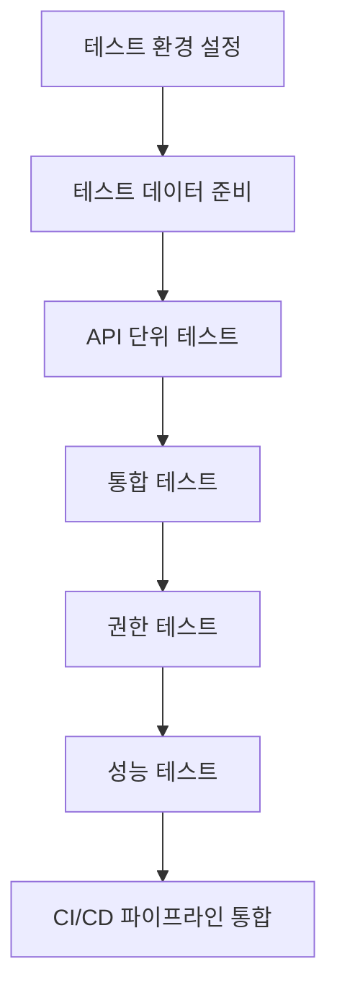

# 테스트 전략


💡 bkend 프로젝트의 테스트 환경 구성과 자동화 전략을 안내합니다. 인증, CRUD, 권한을 안전하게 테스트하세요.


## 개요

bkend의 환경 분리 기능을 활용하면 프로덕션 데이터에 영향 없이 안전하게 테스트할 수 있습니다.

### 테스트 전략 원칙

- **환경 격리** — dev 환경에서 테스트, prod는 건드리지 않음
- **자동화** — CI/CD 파이프라인에 통합하여 매 커밋마다 테스트
- **데이터 독립성** — 테스트용 데이터는 테스트 종료 후 삭제
- **권한 검증** — RLS 정책이 올바르게 동작하는지 확인

***

## 테스트 로드맵



***

## 1단계: 테스트 환경 설정

### 1.1 환경별 전략

| 환경 | 용도 | 데이터 | API Key |
|------|------|--------|---------|
| **dev** | 로컬 개발 테스트 | 개발자 개인 테스트 데이터 | 개발자 개인 키 |
| **staging** | CI/CD 자동화 테스트 | 프로덕션 복제본 (익명화) | 팀 공유 키 |
| **prod** | 실제 서비스 | 실제 사용자 데이터 | 프로덕션 전용 키 |

### 1.2 환경 변수 설정

테스트용 환경 변수를 `.env.test` 파일에 분리하세요.

```bash
# .env.test
BKEND_API_KEY={test-api-key}
BKEND_PROJECT_ID={project-id}
BKEND_ENVIRONMENT=dev
BKEND_BASE_URL=https://api-client.bkend.ai
```

### 1.3 테스트 헬퍼 함수

API 호출을 간편하게 하는 헬퍼 함수를 작성하세요.

```javascript
// test/helpers.js
require('dotenv').config({ path: '.env.test' });

const config = {
  apiKey: process.env.BKEND_API_KEY,
  projectId: process.env.BKEND_PROJECT_ID,
  environment: process.env.BKEND_ENVIRONMENT,
  baseURL: process.env.BKEND_BASE_URL
};

async function apiRequest(endpoint, options = {}) {
  const response = await fetch(`${config.baseURL}${endpoint}`, {
    ...options,
    headers: {
      ...options.headers,
      'Authorization': `Bearer ${config.apiKey}`,
      'X-Project-Id': config.projectId,
      'X-Environment': config.environment
    }
  });

  const data = await response.json();

  if (!response.ok) {
    throw new Error(`API Error: ${response.status} ${JSON.stringify(data)}`);
  }

  return data;
}

async function login(email, password) {
  const data = await apiRequest('/v1/auth/login', {
    method: 'POST',
    headers: { 'Content-Type': 'application/json' },
    body: JSON.stringify({ email, password })
  });

  return data.access_token;
}

module.exports = { apiRequest, login, config };
```

***

## 2단계: 테스트 데이터 준비

### 2.1 Fixture 데이터

테스트용 고정 데이터를 준비하세요.

```javascript
// test/fixtures.js
const testUsers = [
  {
    email: 'user1@test.com',
    password: 'password123',
    displayName: 'Test User 1'
  },
  {
    email: 'user2@test.com',
    password: 'password123',
    displayName: 'Test User 2'
  }
];

const testPosts = [
  {
    title: 'Test Post 1',
    content: 'This is a test post.'
  },
  {
    title: 'Test Post 2',
    content: 'Another test post.'
  }
];

module.exports = { testUsers, testPosts };
```

### 2.2 Setup/Teardown

테스트 전후로 데이터를 생성/삭제하세요.

```javascript
// test/setup.js
const { apiRequest } = require('./helpers');
const { testUsers, testPosts } = require('./fixtures');

let createdUserIds = [];
let createdPostIds = [];

async function setup() {
  console.log('Setting up test data...');

  // 테스트 사용자 생성
  for (const user of testUsers) {
    const data = await apiRequest('/v1/auth/register', {
      method: 'POST',
      headers: { 'Content-Type': 'application/json' },
      body: JSON.stringify(user)
    });
    createdUserIds.push(data.user.id);
  }

  console.log(`Created ${createdUserIds.length} test users`);
}

async function teardown() {
  console.log('Cleaning up test data...');

  // 생성한 게시글 삭제
  for (const postId of createdPostIds) {
    await apiRequest(`/v1/data/posts/${postId}`, { method: 'DELETE' });
  }

  console.log(`Deleted ${createdPostIds.length} test posts`);

  // 생성한 사용자는 유지 (재사용 가능)
}

module.exports = { setup, teardown, createdUserIds, createdPostIds };
```

***

## 3단계: API 테스트

### 3.1 인증 테스트

회원가입, 로그인, 토큰 갱신을 테스트하세요.

```javascript
// test/auth.test.js
const { apiRequest, login } = require('./helpers');

describe('Authentication', () => {
  test('회원가입 성공', async () => {
    const response = await apiRequest('/v1/auth/register', {
      method: 'POST',
      headers: { 'Content-Type': 'application/json' },
      body: JSON.stringify({
        email: 'newuser@test.com',
        password: 'password123',
        displayName: 'New User'
      })
    });

    expect(response.user).toBeDefined();
    expect(response.user.email).toBe('newuser@test.com');
    expect(response.access_token).toBeDefined();
  });

  test('로그인 성공', async () => {
    const token = await login('user1@test.com', 'password123');
    expect(token).toBeDefined();
  });

  test('잘못된 비밀번호로 로그인 실패', async () => {
    await expect(
      login('user1@test.com', 'wrongpassword')
    ).rejects.toThrow();
  });

  test('토큰 갱신 성공', async () => {
    const loginData = await apiRequest('/v1/auth/login', {
      method: 'POST',
      headers: { 'Content-Type': 'application/json' },
      body: JSON.stringify({
        email: 'user1@test.com',
        password: 'password123'
      })
    });

    const refreshData = await apiRequest('/v1/auth/refresh', {
      method: 'POST',
      headers: { 'Content-Type': 'application/json' },
      body: JSON.stringify({
        refresh_token: loginData.refresh_token
      })
    });

    expect(refreshData.access_token).toBeDefined();
    expect(refreshData.access_token).not.toBe(loginData.access_token);
  });
});
```

### 3.2 CRUD 테스트

데이터 생성, 조회, 수정, 삭제를 테스트하세요.

```javascript
// test/crud.test.js
const { apiRequest, login } = require('./helpers');
const { createdPostIds } = require('./setup');

describe('CRUD Operations', () => {
  let token;
  let postId;

  beforeAll(async () => {
    token = await login('user1@test.com', 'password123');
  });

  test('게시글 생성 (INSERT)', async () => {
    const response = await apiRequest('/v1/data/posts', {
      method: 'POST',
      headers: {
        'Content-Type': 'application/json',
        'Authorization': `Bearer ${token}`
      },
      body: JSON.stringify({
        title: 'Test Post',
        content: 'This is a test post.'
      })
    });

    expect(response.id).toBeDefined();
    postId = response.id;
    createdPostIds.push(postId);
  });

  test('게시글 조회 (SELECT)', async () => {
    const posts = await apiRequest(`/v1/data/posts?id=eq.${postId}`, {
      headers: { 'Authorization': `Bearer ${token}` }
    });

    expect(posts.length).toBe(1);
    expect(posts[0].title).toBe('Test Post');
  });

  test('게시글 수정 (UPDATE)', async () => {
    const response = await apiRequest(`/v1/data/posts/${postId}`, {
      method: 'PATCH',
      headers: {
        'Content-Type': 'application/json',
        'Authorization': `Bearer ${token}`
      },
      body: JSON.stringify({
        title: 'Updated Title'
      })
    });

    expect(response.title).toBe('Updated Title');
  });

  test('게시글 삭제 (DELETE)', async () => {
    await apiRequest(`/v1/data/posts/${postId}`, {
      method: 'DELETE',
      headers: { 'Authorization': `Bearer ${token}` }
    });

    const posts = await apiRequest(`/v1/data/posts?id=eq.${postId}`, {
      headers: { 'Authorization': `Bearer ${token}` }
    });

    expect(posts.length).toBe(0);

    // 삭제됨으로 표시
    const index = createdPostIds.indexOf(postId);
    if (index > -1) createdPostIds.splice(index, 1);
  });
});
```

### 3.3 쿼리 필터 테스트

다양한 쿼리 파라미터를 테스트하세요.

```javascript
// test/query.test.js
const { apiRequest, login } = require('./helpers');

describe('Query Filters', () => {
  let token;

  beforeAll(async () => {
    token = await login('user1@test.com', 'password123');
  });

  test('eq (같음) 필터', async () => {
    const posts = await apiRequest('/v1/data/posts?title=eq.Test Post', {
      headers: { 'Authorization': `Bearer ${token}` }
    });

    posts.forEach(post => {
      expect(post.title).toBe('Test Post');
    });
  });

  test('like (패턴) 필터', async () => {
    const posts = await apiRequest('/v1/data/posts?title=like.*Test*', {
      headers: { 'Authorization': `Bearer ${token}` }
    });

    posts.forEach(post => {
      expect(post.title).toContain('Test');
    });
  });

  test('order (정렬)', async () => {
    const posts = await apiRequest('/v1/data/posts?order=created_at.desc', {
      headers: { 'Authorization': `Bearer ${token}` }
    });

    for (let i = 1; i < posts.length; i++) {
      const prev = new Date(posts[i - 1].created_at);
      const curr = new Date(posts[i].created_at);
      expect(prev >= curr).toBe(true);
    }
  });

  test('limit (개수 제한)', async () => {
    const posts = await apiRequest('/v1/data/posts?limit=5', {
      headers: { 'Authorization': `Bearer ${token}` }
    });

    expect(posts.length).toBeLessThanOrEqual(5);
  });
});
```

***

## 4단계: 권한 테스트

### 4.1 RLS 정책 검증

Row-Level Security 정책이 올바르게 동작하는지 테스트하세요.

```javascript
// test/permissions.test.js
const { apiRequest, login } = require('./helpers');

describe('Permissions (RLS)', () => {
  let user1Token, user2Token;
  let user1PostId;

  beforeAll(async () => {
    user1Token = await login('user1@test.com', 'password123');
    user2Token = await login('user2@test.com', 'password123');

    // User1이 게시글 생성
    const post = await apiRequest('/v1/data/posts', {
      method: 'POST',
      headers: {
        'Content-Type': 'application/json',
        'Authorization': `Bearer ${user1Token}`
      },
      body: JSON.stringify({
        title: 'User1 Post',
        content: 'This is User1 post.'
      })
    });
    user1PostId = post.id;
  });

  test('본인 게시글 수정 허용', async () => {
    const response = await apiRequest(`/v1/data/posts/${user1PostId}`, {
      method: 'PATCH',
      headers: {
        'Content-Type': 'application/json',
        'Authorization': `Bearer ${user1Token}`
      },
      body: JSON.stringify({ title: 'Updated by User1' })
    });

    expect(response.title).toBe('Updated by User1');
  });

  test('타인 게시글 수정 차단', async () => {
    await expect(
      apiRequest(`/v1/data/posts/${user1PostId}`, {
        method: 'PATCH',
        headers: {
          'Content-Type': 'application/json',
          'Authorization': `Bearer ${user2Token}`
        },
        body: JSON.stringify({ title: 'Hacked by User2' })
      })
    ).rejects.toThrow();
  });

  test('타인 게시글 삭제 차단', async () => {
    await expect(
      apiRequest(`/v1/data/posts/${user1PostId}`, {
        method: 'DELETE',
        headers: { 'Authorization': `Bearer ${user2Token}` }
      })
    ).rejects.toThrow();
  });

  test('본인 게시글 삭제 허용', async () => {
    await apiRequest(`/v1/data/posts/${user1PostId}`, {
      method: 'DELETE',
      headers: { 'Authorization': `Bearer ${user1Token}` }
    });

    const posts = await apiRequest(`/v1/data/posts?id=eq.${user1PostId}`, {
      headers: { 'Authorization': `Bearer ${user1Token}` }
    });

    expect(posts.length).toBe(0);
  });
});
```

### 4.2 역할 기반 권한 테스트

역할(role)에 따른 권한을 테스트하세요.

```javascript
// test/roles.test.js
const { apiRequest, login } = require('./helpers');

describe('Role-Based Permissions', () => {
  let adminToken, userToken;
  let userPostId;

  beforeAll(async () => {
    adminToken = await login('admin@test.com', 'password123');
    userToken = await login('user1@test.com', 'password123');

    // User가 게시글 생성
    const post = await apiRequest('/v1/data/posts', {
      method: 'POST',
      headers: {
        'Content-Type': 'application/json',
        'Authorization': `Bearer ${userToken}`
      },
      body: JSON.stringify({ title: 'User Post', content: 'Content' })
    });
    userPostId = post.id;
  });

  test('Admin은 모든 게시글 삭제 가능', async () => {
    await apiRequest(`/v1/data/posts/${userPostId}`, {
      method: 'DELETE',
      headers: { 'Authorization': `Bearer ${adminToken}` }
    });

    const posts = await apiRequest(`/v1/data/posts?id=eq.${userPostId}`, {
      headers: { 'Authorization': `Bearer ${adminToken}` }
    });

    expect(posts.length).toBe(0);
  });
});
```

***

## 5단계: 통합 테스트

### 5.1 사용자 플로우 테스트

실제 사용자 시나리오를 테스트하세요.

```javascript
// test/integration.test.js
const { apiRequest } = require('./helpers');

describe('User Flow Integration', () => {
  test('회원가입 → 로그인 → 게시글 작성 → 조회 → 삭제', async () => {
    // 1. 회원가입
    const registerData = await apiRequest('/v1/auth/register', {
      method: 'POST',
      headers: { 'Content-Type': 'application/json' },
      body: JSON.stringify({
        email: 'flow@test.com',
        password: 'password123',
        displayName: 'Flow User'
      })
    });

    expect(registerData.user).toBeDefined();
    const token = registerData.access_token;

    // 2. 게시글 작성
    const post = await apiRequest('/v1/data/posts', {
      method: 'POST',
      headers: {
        'Content-Type': 'application/json',
        'Authorization': `Bearer ${token}`
      },
      body: JSON.stringify({
        title: 'Integration Test Post',
        content: 'This is an integration test.'
      })
    });

    expect(post.id).toBeDefined();

    // 3. 게시글 조회
    const posts = await apiRequest(`/v1/data/posts?id=eq.${post.id}`, {
      headers: { 'Authorization': `Bearer ${token}` }
    });

    expect(posts.length).toBe(1);
    expect(posts[0].title).toBe('Integration Test Post');

    // 4. 게시글 삭제
    await apiRequest(`/v1/data/posts/${post.id}`, {
      method: 'DELETE',
      headers: { 'Authorization': `Bearer ${token}` }
    });

    // 5. 삭제 확인
    const deletedPosts = await apiRequest(`/v1/data/posts?id=eq.${post.id}`, {
      headers: { 'Authorization': `Bearer ${token}` }
    });

    expect(deletedPosts.length).toBe(0);
  });
});
```

***

## 6단계: 성능 테스트

### 6.1 응답 시간 측정

API 응답 시간을 측정하세요.

```javascript
// test/performance.test.js
const { apiRequest, login } = require('./helpers');

describe('Performance', () => {
  let token;

  beforeAll(async () => {
    token = await login('user1@test.com', 'password123');
  });

  test('게시글 조회 응답 시간 < 500ms', async () => {
    const start = performance.now();

    await apiRequest('/v1/data/posts?limit=100', {
      headers: { 'Authorization': `Bearer ${token}` }
    });

    const duration = performance.now() - start;
    expect(duration).toBeLessThan(500);
  });

  test('인덱스 활용 시 응답 시간 < 100ms', async () => {
    const start = performance.now();

    // user_id에 인덱스가 있다고 가정
    await apiRequest('/v1/data/posts?user_id=eq.{user-id}&limit=100', {
      headers: { 'Authorization': `Bearer ${token}` }
    });

    const duration = performance.now() - start;
    expect(duration).toBeLessThan(100);
  });
});
```

### 6.2 부하 테스트

동시 요청을 시뮬레이션하세요.

```javascript
// test/load.test.js
const { apiRequest, login } = require('./helpers');

describe('Load Test', () => {
  test('100개 동시 요청 처리', async () => {
    const token = await login('user1@test.com', 'password123');

    const requests = Array.from({ length: 100 }, () =>
      apiRequest('/v1/data/posts?limit=10', {
        headers: { 'Authorization': `Bearer ${token}` }
      })
    );

    const start = performance.now();
    const results = await Promise.all(requests);
    const duration = performance.now() - start;

    expect(results.length).toBe(100);
    console.log(`100 requests completed in ${duration}ms`);
  });
});
```

***

## 7단계: CI/CD 파이프라인 통합

### 7.1 GitHub Actions 설정

`.github/workflows/test.yml` 파일을 생성하세요.

```yaml
name: API Tests

on:
  push:
    branches: [ main, develop ]
  pull_request:
    branches: [ main ]

jobs:
  test:
    runs-on: ubuntu-latest

    steps:
    - uses: actions/checkout@v3

    - name: Setup Node.js
      uses: actions/setup-node@v3
      with:
        node-version: '18'

    - name: Install dependencies
      run: npm install

    - name: Run tests
      env:
        BKEND_API_KEY: ${{ secrets.BKEND_API_KEY_TEST }}
        BKEND_PROJECT_ID: ${{ secrets.BKEND_PROJECT_ID }}
        BKEND_ENVIRONMENT: dev
      run: npm test

    - name: Cleanup test data
      if: always()
      run: npm run test:cleanup
```

### 7.2 npm 스크립트 설정

`package.json`에 테스트 스크립트를 추가하세요.

```json
{
  "scripts": {
    "test": "jest",
    "test:watch": "jest --watch",
    "test:coverage": "jest --coverage",
    "test:setup": "node test/setup.js",
    "test:cleanup": "node test/teardown.js"
  },
  "jest": {
    "testEnvironment": "node",
    "globalSetup": "./test/setup.js",
    "globalTeardown": "./test/teardown.js"
  }
}
```

***

## 테스트 체크리스트

- [ ] 테스트 환경(dev) 설정 완료
- [ ] .env.test 파일 생성
- [ ] 테스트 헬퍼 함수 작성
- [ ] Fixture 데이터 준비
- [ ] Setup/Teardown 스크립트 작성
- [ ] 인증 테스트 (회원가입, 로그인, 토큰 갱신)
- [ ] CRUD 테스트 (INSERT, SELECT, UPDATE, DELETE)
- [ ] 쿼리 필터 테스트 (eq, like, order, limit)
- [ ] RLS 권한 테스트 (본인/타인 데이터 접근)
- [ ] 역할 기반 권한 테스트 (admin, user)
- [ ] 통합 테스트 (사용자 플로우)
- [ ] 성능 테스트 (응답 시간, 인덱스 효과)
- [ ] 부하 테스트 (동시 요청 처리)
- [ ] CI/CD 파이프라인 통합 (GitHub Actions)
- [ ] 테스트 커버리지 > 80%


✅ 모든 테스트를 통과하면 안전하게 프로덕션 배포를 진행할 수 있습니다.


***

## 관련 문서

- [CI/CD 연동](07-ci-cd.md) — 배포 파이프라인 구성
- [확장 가이드](05-scaling.md) — 환경별 구성 전략
- [성능 최적화](04-performance.md) — 쿼리 최적화 전략
- [인증 API 레퍼런스](../authentication/19-api-reference.md) — 인증 엔드포인트
- [데이터베이스 CRUD](../database/01-overview.md) — 데이터 API 사용법
- [권한 설정](../security/05-rls-policies.md) — RLS 정책 설정
