# CI/CD 연동


💡 bkend 프로젝트를 CI/CD 파이프라인과 연동하는 방법을 안내합니다.


## 개요

bkend의 REST API와 환경 분리 기능을 활용하여 CI/CD 파이프라인을 구성할 수 있습니다. 자동화된 배포 파이프라인으로 안전하게 변경 사항을 반영하세요.

***

## 배포 파이프라인 구성

### 권장 워크플로우

```mermaid
flowchart LR
    A[코드 변경] --> B[CI: 빌드 & 테스트]
    B --> C[dev 환경 검증]
    C --> D[staging 환경 배포]
    D --> E[통합 테스트]
    E --> F[prod 환경 배포]
```



### 환경별 역할

| 단계 | 환경 | 트리거 | 목적 |
|------|------|--------|------|
| 개발 | `dev` | Push to feature branch | 기능 개발 및 단위 테스트 |
| 검증 | `staging` | PR to main | 통합 테스트, QA |
| 운영 | `prod` | 수동 승인 | 프로덕션 배포 |

***

## GitHub Actions 예시

### 환경별 API Key 설정

GitHub Repository **Settings** > **Secrets and variables** > **Actions**에서 환경별 Secret을 등록하세요.

| Secret 이름 | 환경 | 설명 |
|------------|------|------|
| `BKEND_PROJECT_ID` | 공통 | 프로젝트 ID |
| `BKEND_DEV_API_KEY` | dev | dev 환경 API Key |
| `BKEND_STAGING_API_KEY` | staging | staging 환경 API Key |
| `BKEND_PROD_API_KEY` | prod | prod 환경 API Key |

### 테스트 워크플로우

```yaml
# .github/workflows/test.yml
name: API Test

on:
  push:
    branches: [main, develop]
  pull_request:
    branches: [main]

jobs:
  test:
    runs-on: ubuntu-latest
    steps:
      - uses: actions/checkout@v4

      - name: Setup Node.js
        uses: actions/setup-node@v4
        with:
          node-version: '20'

      - name: Install dependencies
        run: npm ci

      - name: Run API tests
        env:
          BKEND_API_URL: https://api-client.bkend.ai
          BKEND_API_KEY: ${{ secrets.BKEND_DEV_API_KEY }}
          BKEND_PROJECT_ID: ${{ secrets.BKEND_PROJECT_ID }}
          BKEND_ENVIRONMENT: dev
        run: npm test
```

### 배포 워크플로우

```yaml
# .github/workflows/deploy.yml
name: Deploy

on:
  push:
    branches: [main]

jobs:
  deploy-staging:
    runs-on: ubuntu-latest
    environment: staging
    steps:
      - uses: actions/checkout@v4

      - name: Run staging tests
        env:
          BKEND_API_URL: https://api-client.bkend.ai
          BKEND_API_KEY: ${{ secrets.BKEND_STAGING_API_KEY }}
          BKEND_PROJECT_ID: ${{ secrets.BKEND_PROJECT_ID }}
          BKEND_ENVIRONMENT: staging
        run: npm test

      - name: Deploy to staging
        run: echo "Staging 배포 완료"

  deploy-prod:
    needs: deploy-staging
    runs-on: ubuntu-latest
    environment: production
    steps:
      - uses: actions/checkout@v4

      - name: Smoke test
        env:
          BKEND_API_URL: https://api-client.bkend.ai
          BKEND_API_KEY: ${{ secrets.BKEND_PROD_API_KEY }}
          BKEND_PROJECT_ID: ${{ secrets.BKEND_PROJECT_ID }}
          BKEND_ENVIRONMENT: prod
        run: npm run test:smoke

      - name: Deploy to production
        run: echo "Production 배포 완료"
```

***

## 환경 변수 관리

### `.env` 파일 구조

```bash
# .env.dev
BKEND_API_URL=https://api-client.bkend.ai
BKEND_API_KEY=ak_{your_dev_key}
BKEND_PROJECT_ID={project_id}
BKEND_ENVIRONMENT=dev

# .env.prod
BKEND_API_URL=https://api-client.bkend.ai
BKEND_API_KEY=ak_{your_prod_key}
BKEND_PROJECT_ID={project_id}
BKEND_ENVIRONMENT=prod
```


🚨 **위험** — `.env` 파일을 소스 코드에 포함하지 마세요. `.gitignore`에 추가하고, CI/CD 환경에서는 Secret으로 관리하세요.


### 환경별 설정 로드

```typescript
// config.ts
const config = {
  apiUrl: process.env.BKEND_API_URL || 'https://api-client.bkend.ai',
  apiKey: process.env.BKEND_API_KEY || '',
  projectId: process.env.BKEND_PROJECT_ID || '',
  environment: process.env.BKEND_ENVIRONMENT || 'dev',
};

export default config;
```

***

## 배포 체크리스트

### 배포 전

- [ ] 모든 테스트가 통과했는지 확인
- [ ] 환경별 API Key가 올바르게 설정되었는지 확인
- [ ] `.env` 파일이 소스에 포함되지 않았는지 확인
- [ ] 스키마 변경 사항이 있는지 확인

### 배포 후

- [ ] API 엔드포인트가 정상 응답하는지 확인
- [ ] 스모크 테스트가 통과했는지 확인
- [ ] 에러 로그에 비정상적인 이벤트가 없는지 확인

***

## 다음 단계

- [테스트 전략](06-testing.md) — 테스트 환경 구성
- [보안 모범 사례](../security/07-best-practices.md) — 환경 분리 보안
- [API 키 이해](../security/02-api-keys.md) — API Key 관리
