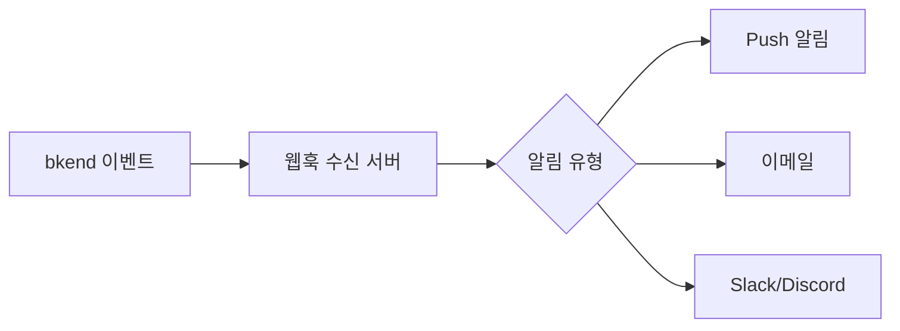

# 실시간 기능

> bkend에서 실시간 데이터 업데이트를 구현하는 방법을 안내합니다.

## 개요

bkend는 REST API 기반으로 동작하며, 실시간 데이터 업데이트는 폴링(Polling)과 웹훅(Webhook)을 조합하여 구현할 수 있습니다.

> 🚧 **확인 필요** - WebSocket/SSE 기반의 네이티브 실시간 기능은 향후 업데이트 예정입니다.

---

## 실시간 패턴 비교

| 패턴 | 실시간성 | 구현 복잡도 | 적합한 용도 |
|------|:------:|:---------:|-----------|
| **폴링** | 보통 | 낮음 | 대시보드, 목록 갱신 |
| **롱 폴링** | 높음 | 보통 | 알림, 채팅 |
| **웹훅 + Push** | 높음 | 높음 | 서버 간 연동, 이벤트 기반 |

---

## 폴링 (Polling)

일정 간격으로 API를 호출하여 데이터 변경을 감지합니다.

### 기본 폴링

```typescript
// 5초 간격으로 데이터 조회
function startPolling(tableName: string, interval = 5000) {
  const poll = async () => {
    try {
      const response = await fetch(`https://api.bkend.io/data/${tableName}?sort=-updatedAt&limit=10`, {
        headers: { 'X-API-Key': '{your_api_key}' }
      });
      const { items } = await response.json();
      updateUI(items);
    } catch (error) {
      console.error('폴링 실패:', error);
    }
  };

  // 즉시 1회 실행 후 반복
  poll();
  return setInterval(poll, interval);
}

// 폴링 시작
const pollId = startPolling('messages');

// 폴링 중지
clearInterval(pollId);
```

### 스마트 폴링

변경이 있을 때만 UI를 업데이트하는 최적화된 폴링입니다.

```typescript
function startSmartPolling(tableName: string, interval = 5000) {
  let lastUpdatedAt: string | null = null;

  const poll = async () => {
    try {
      // 마지막 업데이트 이후 데이터만 조회
      let url = `https://api.bkend.io/data/${tableName}?sort=-updatedAt&limit=10`;
      if (lastUpdatedAt) {
        url += `&updatedAt[$gt]=${lastUpdatedAt}`;
      }

      const response = await fetch(url, {
        headers: { 'X-API-Key': '{your_api_key}' }
      });
      const { items } = await response.json();

      if (items.length > 0) {
        lastUpdatedAt = items[0].updatedAt;
        updateUI(items); // 변경이 있을 때만 UI 업데이트
      }
    } catch (error) {
      console.error('폴링 실패:', error);
    }
  };

  poll();
  return setInterval(poll, interval);
}
```

### 폴링 간격 권장값

| 용도 | 간격 | 설명 |
|------|------|------|
| 실시간 채팅 | 1~2초 | 빠른 응답 필요 |
| 알림 | 5~10초 | 적당한 응답 시간 |
| 대시보드 | 30~60초 | 통계 데이터 갱신 |
| 목록 | 60~300초 | 낮은 빈도 갱신 |

> ⚠️ **주의** - 폴링 간격이 짧을수록 API 호출 횟수가 증가합니다. 플랜별 API 호출 한도를 확인하세요.

---

## 웹훅 + Push 알림

서버 사이드에서 웹훅을 수신하고, 클라이언트에 Push 알림을 전달하는 패턴입니다.



### 구현 예시

```typescript
// 웹훅 수신 → Push 알림 전송
import express from 'express';
import webpush from 'web-push';

const app = express();
app.use(express.json());

// 웹훅 수신
app.post('/webhook', async (req, res) => {
  const event = req.body;

  if (event.eventType === 'user.created') {
    // Push 알림 전송
    const payload = JSON.stringify({
      title: '새 사용자 가입',
      body: `${event.payload.email}님이 가입했습니다.`
    });

    // 구독자에게 Push 알림 전송
    for (const subscription of subscriptions) {
      await webpush.sendNotification(subscription, payload);
    }
  }

  res.status(200).json({ received: true });
});
```

---

## React에서 폴링 구현하기

### usePolling Hook

```typescript
import { useState, useEffect, useCallback } from 'react';

function usePolling<T>(
  url: string,
  apiKey: string,
  interval = 5000
) {
  const [data, setData] = useState<T[]>([]);
  const [loading, setLoading] = useState(true);
  const [error, setError] = useState<Error | null>(null);

  const fetchData = useCallback(async () => {
    try {
      const response = await fetch(url, {
        headers: { 'X-API-Key': apiKey }
      });
      const result = await response.json();
      setData(result.items);
      setError(null);
    } catch (err) {
      setError(err as Error);
    } finally {
      setLoading(false);
    }
  }, [url, apiKey]);

  useEffect(() => {
    fetchData();
    const id = setInterval(fetchData, interval);
    return () => clearInterval(id);
  }, [fetchData, interval]);

  return { data, loading, error, refetch: fetchData };
}

// 사용 예시
function MessageList() {
  const { data: messages, loading } = usePolling(
    'https://api.bkend.io/data/messages?sort=-createdAt&limit=20',
    '{your_api_key}',
    3000 // 3초 간격
  );

  if (loading) return <div>로딩 중...</div>;

  return (
    <ul>
      {messages.map((msg: { _id: string; content: string }) => (
        <li key={msg._id}>{msg.content}</li>
      ))}
    </ul>
  );
}
```

---

## 실시간 기능 최적화

### API 호출 절감 전략

| 전략 | 설명 | 절감 효과 |
|------|------|---------|
| **스마트 폴링** | 변경 시에만 UI 갱신 | 렌더링 최적화 |
| **적응형 간격** | 활동이 없으면 간격 증가 | 30~50% |
| **페이지 가시성** | 탭 비활성화 시 폴링 중지 | 50~80% |
| **웹훅 활용** | 서버에서 Push | 90%+ |

### 적응형 폴링 예시

```typescript
function adaptivePolling(tableName: string) {
  let interval = 5000; // 초기 5초
  let emptyCount = 0;

  const poll = async () => {
    const items = await fetchData(tableName);

    if (items.length === 0) {
      emptyCount++;
      // 변경이 없으면 간격을 점점 늘림 (최대 60초)
      interval = Math.min(interval * 1.5, 60000);
    } else {
      emptyCount = 0;
      interval = 5000; // 변경이 있으면 간격 초기화
      updateUI(items);
    }

    setTimeout(poll, interval);
  };

  poll();
}
```

---

## 관련 문서

- [웹훅 설정](08-webhooks.md) — 웹훅 구성과 이벤트 타입
- [데이터 조회](../database/07-select.md) — 데이터 조회 API
- [필터링 & 검색](../database/10-filtering.md) — 효율적인 필터링
- [사용량 분석](../platform/06-usage-analytics.md) — API 호출 모니터링
