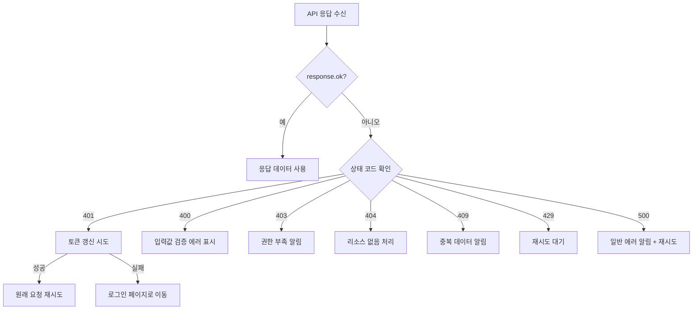

# 에러 처리 가이드


💡 앱에서 bkend API 에러를 효과적으로 처리하세요. HTTP 상태 코드별 대응 전략과 사용자 알림 패턴을 설명합니다.


## 개요

이 문서에서 다루는 내용:

- HTTP 상태 코드별 처리 전략
- 에러 응답 구조 파싱
- 사용자 알림 패턴 (toast, inline error)
- 네트워크 에러 처리

***

## 에러 응답 구조

bkend API의 에러 응답은 다음 형식을 따릅니다.

```json
{
  "statusCode": 400,
  "error": "VALIDATION_ERROR",
  "message": "필수 파라미터가 누락되었습니다"
}
```

| 필드 | 타입 | 설명 |
|------|------|------|
| `statusCode` | `number` | HTTP 상태 코드 |
| `error` | `string` | 에러 코드 (프로그래밍용) |
| `message` | `string` | 사람이 읽을 수 있는 에러 설명 |

***

## 에러 처리 흐름



***

## 에러 처리 유틸리티

모든 API 호출에서 사용하는 에러 처리 함수입니다.

```javascript
/**
 * API 에러 응답을 파싱합니다
 * @param {Response} response - fetch Response 객체
 * @returns {object} 파싱된 에러 정보
 */
async function parseApiError(response) {
  try {
    const body = await response.json();
    return {
      status: response.status,
      code: body.error || 'UNKNOWN_ERROR',
      message: body.message || '알 수 없는 에러가 발생했습니다',
    };
  } catch {
    return {
      status: response.status,
      code: 'PARSE_ERROR',
      message: '서버 응답을 처리할 수 없습니다',
    };
  }
}
```

***

## 상태 코드별 처리 전략

### 401 Unauthorized — 토큰 갱신

Access Token이 만료되면 자동으로 갱신하고 원래 요청을 재시도합니다.

```javascript
async function handleApiRequest(path, options = {}) {
  let response = await bkendFetch(path, options);

  // bkendFetch에 이미 401 처리가 포함되어 있지만,
  // 갱신 실패 시 로그인 페이지로 이동합니다
  return response;
}

// 갱신 실패 시 로그인으로 이동
function redirectToLogin() {
  localStorage.removeItem('accessToken');
  localStorage.removeItem('refreshToken');
  window.location.href = '/login';
}
```


💡 `bkendFetch` 헬퍼를 사용하면 401 → 토큰 갱신 → 재시도가 자동으로 처리됩니다. 상세 설정은 [앱에서 bkend 연동하기](../getting-started/06-app-integration.md)를 참고하세요.


***

### 400 Bad Request — 입력값 검증

사용자 입력을 검증하고, 에러 메시지를 폼 필드 옆에 표시합니다.

```javascript
async function createPost(formData) {
  try {
    const post = await bkendFetch('/v1/data/posts', {
      method: 'POST',
      body: formData,
    });
    return { success: true, data: post };
  } catch (error) {
    return {
      success: false,
      message: error.message, // "title은 필수 항목입니다" 등
    };
  }
}

// 폼 제출 핸들러
async function handleSubmit(event) {
  event.preventDefault();
  const formData = {
    title: document.getElementById('title').value,
    content: document.getElementById('content').value,
  };

  const result = await createPost(formData);
  if (!result.success) {
    // 에러 메시지를 폼 하단에 표시
    showInlineError(result.message);
  }
}
```

***

### 403 Forbidden — 권한 부족

```javascript
async function handleForbidden(error) {
  showToast({
    type: 'error',
    message: '이 작업을 수행할 권한이 없습니다',
  });
}
```


⚠️ 403 에러가 반복 발생하면 콘솔에서 테이블의 **Permissions** 설정을 확인하세요. User 역할에 필요한 CRUD 권한이 부여되어 있는지 점검합니다.


***

### 409 Conflict — 중복 데이터

```javascript
// 회원가입 시 이메일 중복
async function handleSignup(email, password, name) {
  try {
    const result = await bkendFetch('/v1/auth/email/signup', {
      method: 'POST',
      body: { method: 'password', email, password, name },
    });
    return result;
  } catch (error) {
    if (error.message.includes('already exists')) {
      showInlineError('이미 등록된 이메일입니다. 로그인을 시도하세요.');
    } else {
      showInlineError(error.message);
    }
  }
}
```

***

### 429 Too Many Requests — 속도 제한

```javascript
/**
 * 지수 백오프로 재시도합니다
 */
async function fetchWithRetry(path, options, maxRetries = 3) {
  for (let attempt = 0; attempt < maxRetries; attempt++) {
    try {
      return await bkendFetch(path, options);
    } catch (error) {
      if (error.message.includes('429') && attempt < maxRetries - 1) {
        const delay = Math.pow(2, attempt) * 1000; // 1s, 2s, 4s
        await new Promise(resolve => setTimeout(resolve, delay));
        continue;
      }
      throw error;
    }
  }
}
```

***

### 네트워크 에러

인터넷 연결이 끊기거나 서버에 도달할 수 없을 때 발생합니다.

```javascript
async function safeApiCall(path, options) {
  try {
    return await bkendFetch(path, options);
  } catch (error) {
    if (error instanceof TypeError && error.message === 'Failed to fetch') {
      showToast({
        type: 'error',
        message: '네트워크 연결을 확인해주세요',
      });
      return null;
    }
    throw error;
  }
}
```

***

## 사용자 알림 패턴

### Toast 알림

전체 화면에 잠시 표시되는 알림입니다. 네트워크 에러, 서버 에러 등 일반적인 에러에 적합합니다.

```javascript
function showToast({ type, message, duration = 3000 }) {
  const toast = document.createElement('div');
  toast.className = `toast toast-${type}`;
  toast.textContent = message;
  document.body.appendChild(toast);

  setTimeout(() => toast.remove(), duration);
}
```

### Inline 에러

폼 필드 옆에 표시하는 에러입니다. 입력값 검증 에러에 적합합니다.

```javascript
function showInlineError(message, fieldId) {
  const errorEl = document.getElementById(`${fieldId}-error`);
  if (errorEl) {
    errorEl.textContent = message;
    errorEl.style.display = 'block';
  }
}

function clearInlineError(fieldId) {
  const errorEl = document.getElementById(`${fieldId}-error`);
  if (errorEl) {
    errorEl.textContent = '';
    errorEl.style.display = 'none';
  }
}
```

***

## 에러 코드 참조

자주 발생하는 에러 코드와 권장 사용자 메시지입니다.

| 에러 코드 | HTTP | 사용자 메시지 |
|----------|:----:|-------------|
| `VALIDATION_ERROR` | 400 | 입력값을 확인해주세요 |
| `UNAUTHORIZED` | 401 | 로그인이 필요합니다 |
| `TOKEN_EXPIRED` | 401 | (자동 갱신 후 재시도) |
| `PERMISSION_DENIED` | 403 | 권한이 없습니다 |
| `TABLE_NOT_FOUND` | 404 | 요청한 데이터를 찾을 수 없습니다 |
| `RECORD_NOT_FOUND` | 404 | 요청한 데이터를 찾을 수 없습니다 |
| `EMAIL_ALREADY_EXISTS` | 409 | 이미 등록된 이메일입니다 |
| `RATE_LIMIT_EXCEEDED` | 429 | 잠시 후 다시 시도해주세요 |

전체 에러 코드 목록은 [공통 에러 코드](../troubleshooting/01-common-errors.md)를 참고하세요.

***

## 다음 단계

- [앱에서 bkend 연동하기](../getting-started/06-app-integration.md) — fetch 헬퍼 설정
- [토큰 저장 및 갱신](../authentication/20-token-management.md) — 토큰 자동 갱신 상세
- [공통 에러 코드](../troubleshooting/01-common-errors.md) — 전체 에러 코드 레퍼런스
- [인증 문제 해결](../troubleshooting/03-auth-issues.md) — 인증 에러 해결
- [실전 프로젝트 쿡북](../../cookbooks/README.md) — 에러 처리가 포함된 실전 앱 구축
- 예제 프로젝트 — [blog-web](../../examples/blog-web/) · [recipe-web](../../examples/recipe-web/) · [shopping-mall-web](../../examples/shopping-mall-web/)에서 에러 처리 구현 코드 확인
