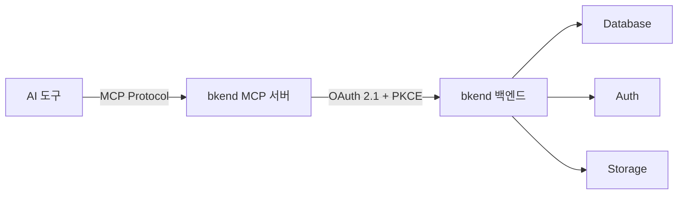
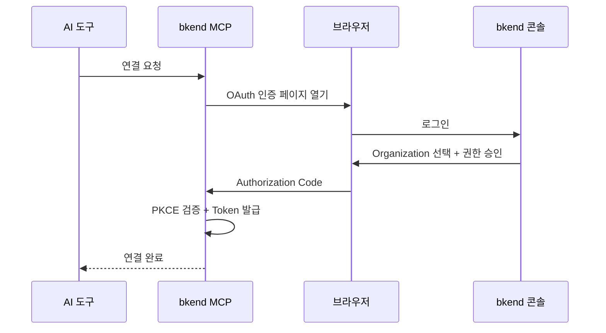

# AI 도구 연동 개요

> bkend MCP 서버를 통해 Claude Code, Cursor 등 다양한 AI 도구와 연동하여 백엔드를 자연어로 관리하세요.

## 개요

bkend는 [MCP(Model Context Protocol)](https://spec.modelcontextprotocol.io/2025-03-26)를 통해 AI 도구와 연결됩니다. MCP를 지원하는 AI 도구에서 자연어로 명령하면, bkend가 Database, Auth, Storage를 자동으로 관리합니다.



---

## 지원하는 AI 도구

| 도구 | MCP 지원 | 인증 방식 | 설정 문서 |
|------|:--------:|----------|----------|
| Claude Code | ✅ | OAuth 2.1 | [설정](03-claude-code-setup.md) / [사용법](04-claude-code-usage.md) |
| Claude Desktop | ✅ | OAuth 2.1 | [설정](03-claude-code-setup.md) |
| Cursor | ✅ | OAuth 2.1 | [설정](05-cursor-setup.md) / [사용법](06-cursor-usage.md) |
| Antigravity | ✅ | OAuth 2.1 | [연동](08-antigravity.md) |
| 기타 MCP 도구 | ✅ | OAuth 2.1 | [기타 도구](09-other-tools.md) |

---

## MCP 서버 정보

| 항목 | 값 |
|------|-----|
| Server URL | `https://api.bkend.ai/mcp` |
| Protocol Version | `2025-03-26` |
| Transport | Streamable HTTP |
| 인증 | [OAuth 2.1](https://datatracker.ietf.org/doc/html/draft-ietf-oauth-v2-1-12) + PKCE |
| Message Format | JSON-RPC 2.0 |

---

## 제공되는 도구

### 문서 도구

| 도구 | 설명 |
|------|------|
| `0_get_context` | 세션 시작 시 필수 호출 — 리소스 계층 및 주의사항 안내 |
| `1_concepts` | 핵심 개념 (스키마, 역할, 계층 구조) |
| `2_tutorial` | 단계별 프로젝트 설정 가이드 |
| `3_howto_implement_auth` | 인증 구현 API 레퍼런스 |
| `4_howto_implement_data_crud` | CRUD 구현 패턴 및 예시 |
| `5_get_operation_schema` | 특정 작업의 상세 스키마 조회 |
| `6_code_examples_auth` | 인증 코드 예시 (TypeScript/JavaScript) |
| `7_code_examples_data` | 데이터 CRUD 코드 예시 |

### API 도구

| 도구 | 설명 |
|------|------|
| `backend_org_list` | Organization 목록 조회 |
| `backend_project_list` | Project 목록 조회 |
| `backend_project_create` | Project 생성 |
| `backend_env_list` | Environment 목록 조회 |
| `backend_env_create` | Environment 생성 |
| `backend_table_list` | 테이블 목록 조회 |
| `backend_table_create` | 테이블 생성 |
| `backend_field_manage` | 필드 추가/수정/삭제 |
| `backend_index_manage` | 인덱스 관리 |

---

## 빠른 시작

### Claude Code / Cursor

```json
{
  "mcpServers": {
    "mcp-bkend": {
      "type": "http",
      "url": "https://api.bkend.ai/mcp"
    }
  }
}
```

### 기타 MCP 도구

MCP를 지원하는 도구에서 다음 URL로 연결하세요:

```
https://api.bkend.ai/mcp
```

---

## 인증 흐름

bkend MCP는 [OAuth 2.1](https://datatracker.ietf.org/doc/html/draft-ietf-oauth-v2-1-12) + PKCE 방식으로 인증합니다:



### 토큰 유효 기간

| 토큰 | 유효 기간 | 용도 |
|------|----------|------|
| Access Token | 1시간 | API 인증 |
| Refresh Token | 30일 | Access Token 갱신 |

---

## 권한 (Scopes)

MCP 연동 시 부여되는 권한:

| 리소스 | 읽기 | 생성 | 수정 | 삭제 |
|--------|:----:|:----:|:----:|:----:|
| Organization | ✅ | - | - | - |
| Project | ✅ | ✅ | ✅ | ✅ |
| Environment | ✅ | ✅ | - | ✅ |
| Table Schema | ✅ | ✅ | ✅ | ✅ |
| Table Data | ✅ | ✅ | ✅ | ✅ |

---

## 관련 문서

- [MCP 설정 기본](02-mcp-basics.md) — MCP 프로토콜 상세 이해
- [Claude Code 설정](03-claude-code-setup.md) — Claude Code 연동
- [Cursor 설정](05-cursor-setup.md) — Cursor 연동
- [직접 MCP 연결](10-direct-mcp.md) — MCP 프로토콜 직접 구현

## 참조 표준

- [MCP Specification 2025-03-26](https://spec.modelcontextprotocol.io/2025-03-26)
- [OAuth 2.1](https://datatracker.ietf.org/doc/html/draft-ietf-oauth-v2-1-12)
