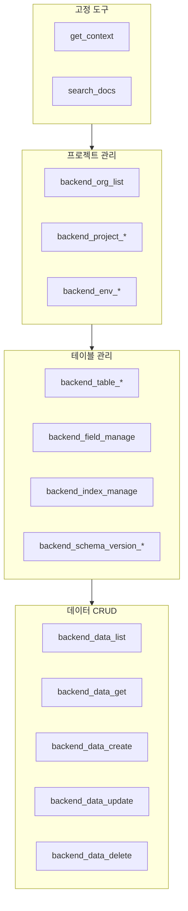

# MCP 도구 개요


💡 bkend MCP 서버가 제공하는 도구(Tools)와 리소스(Resources)의 전체 목록과 분류를 안내합니다.


## 개요

bkend MCP 서버는 AI 도구에서 백엔드를 관리할 수 있도록 **도구(Tools)**와 **리소스(Resources)**를 제공합니다. 도구는 자연어 요청을 실제 백엔드 작업으로 변환하고, 리소스는 현재 상태를 조회합니다.

***

## 도구 분류

### 고정 도구 (Fixed Tools)

MCP 서버에 연결하면 항상 사용할 수 있는 도구입니다.

| 도구 | 설명 | 상세 |
|------|------|------|
| `get_context` | 세션 컨텍스트 조회 (Organization, 프로젝트, 환경) | [컨텍스트](02-context.md) |
| `search_docs` | bkend 문서 검색 | [컨텍스트](02-context.md) |

### API 도구 (API Tools)

백엔드를 직접 관리하는 도구입니다. 모두 `backend_` 접두사를 사용합니다.

| 카테고리 | 도구 수 | 설명 | 상세 |
|----------|:-------:|------|------|
| 프로젝트 관리 | 6 | Organization, 프로젝트, 환경 관리 | [프로젝트 도구](03-project-tools.md) |
| 테이블 관리 | 9 | 테이블, 필드, 인덱스, 스키마 버전 관리 | [테이블 도구](04-table-tools.md) |
| 데이터 CRUD | 5 | 데이터 조회, 생성, 수정, 삭제 | [데이터 도구](05-data-tools.md) |

***

## 도구가 없는 기능

Auth와 Storage는 MCP 도구가 제공되지 않습니다. AI 도구에서는 **문서 검색 도구**를 통해 구현 방법을 안내받고, **REST API 코드**를 생성하는 방식으로 사용합니다.

| 기능 | MCP 도구 | 대안 |
|------|:--------:|------|
| 인증 (Auth) | ❌ | REST API 코드 생성 → [인증 도구](06-auth-tools.md) |
| 스토리지 (Storage) | ❌ | REST API 코드 생성 → [스토리지 도구](07-storage-tools.md) |


💡 AI 도구에 "로그인 기능을 구현해줘"라고 요청하면, `search_docs` 도구로 인증 문서를 검색한 뒤 REST API 호출 코드를 자동으로 생성합니다.


***

## 리소스 (Resources)

MCP 리소스는 `bkend://` URI 스키마를 통해 현재 상태를 읽기 전용으로 조회합니다.

| 리소스 | URI 패턴 | 설명 |
|--------|---------|------|
| Organization | `bkend://orgs` | Organization 목록 |
| 프로젝트 | `bkend://orgs/{orgId}/projects` | 프로젝트 목록 |
| 환경 | `bkend://orgs/{orgId}/projects/{projectId}/environments` | 환경 목록 |
| 테이블 | `bkend://orgs/{orgId}/projects/{projectId}/environments/{envId}/tables` | 테이블 목록 |

→ 상세는 [MCP 리소스](08-resources.md)를 참고하세요.

***

## 도구 전체 목록

***

## 다음 단계

- [컨텍스트](02-context.md) — `get_context`와 `search_docs` 도구 상세
- [프로젝트 도구](03-project-tools.md) — Organization, 프로젝트, 환경 관리
- [데이터 도구](05-data-tools.md) — 데이터 CRUD 작업
- [MCP 리소스](08-resources.md) — 리소스 URI와 조회 방법
