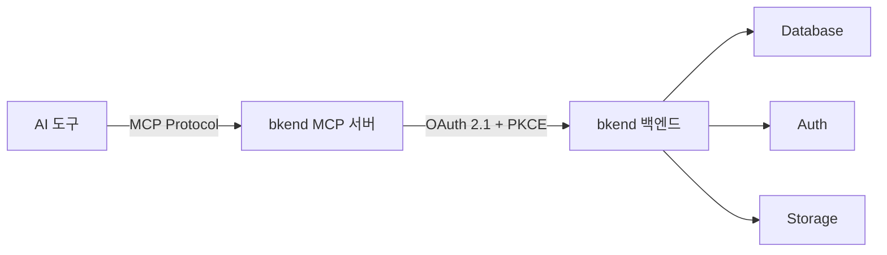
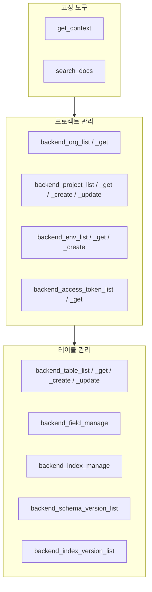

# MCP


💡 bkend MCP 서버를 통해 Claude Code, Cursor, VS Code 등 AI 도구에서 자연어로 백엔드를 관리하세요.


## 개요

bkend는 [MCP(Model Context Protocol)](https://spec.modelcontextprotocol.io/2025-03-26)를 통해 AI 도구와 연결됩니다. MCP를 지원하는 AI 도구에서 자연어로 명령하면, bkend가 Database, Auth, Storage를 자동으로 관리합니다.

```mermaid
flowchart LR
    A[AI 도구] -->|MCP Protocol| B[bkend MCP 서버]
    B -->|OAuth 2.1 + PKCE| C[bkend 백엔드]
    C --> D[Database]
    C --> E[Auth]
    C --> F[Storage]
```

***

## MCP 서버 정보

| 항목 | 값 |
|------|-----|
| Server URL | `https://api.bkend.ai/mcp` |
| Protocol Version | `2025-03-26` |
| Transport | Streamable HTTP |
| 인증 | [OAuth 2.1](https://datatracker.ietf.org/doc/html/draft-ietf-oauth-v2-1-12) + PKCE |
| Message Format | JSON-RPC 2.0 |

***

## 제공되는 도구

### 고정 도구

세션 컨텍스트와 문서 검색을 위한 도구입니다.

| 도구 | 설명 | 상세 |
|------|------|------|
| `get_context` | 세션 시작 시 필수 호출 — Organization ID, 리소스 계층 및 주의사항 안내 | [컨텍스트](06-context.md) |
| `search_docs` | bkend 문서 검색 — API 가이드, 인증 구현, CRUD 패턴, 코드 예시 | [컨텍스트](06-context.md) |

### API 도구

백엔드를 직접 관리하는 도구입니다. 모두 `backend_` 접두사를 사용합니다.

| 카테고리 | 도구 수 | 설명 | 상세 |
|----------|:-------:|------|------|
| 프로젝트 관리 | 9 | Organization, 프로젝트, 환경, 액세스 토큰 관리 | [프로젝트 도구](07-project-tools.md) |
| 테이블 관리 | 7 | 테이블, 필드, 인덱스, 스키마 버전 관리 | [테이블 도구](08-table-tools.md) |

### REST API 코드 생성

Auth, Storage, 데이터 CRUD는 전용 MCP 도구가 없습니다. 대신 `search_docs`로 구현 가이드를 검색한 뒤 **REST API 코드**를 생성하는 방식으로 사용합니다.

| 기능 | MCP 도구 | 대안 |
|------|:--------:|------|
| 인증 (Auth) | ❌ | REST API 코드 생성 — [코드 생성](09-code-generation.md#auth) |
| 스토리지 (Storage) | ❌ | REST API 코드 생성 — [코드 생성](09-code-generation.md#storage) |
| 데이터 CRUD | ❌ | REST API 코드 생성 — [코드 생성](09-code-generation.md#data-crud) |


💡 AI 도구에 "로그인 기능을 구현해줘" 또는 "테이블에 데이터를 추가해줘"라고 요청하면, `search_docs`가 관련 문서를 검색한 뒤 REST API 호출 코드를 자동으로 생성합니다.



⚠️ MCP 도구는 **관리 기능**(테이블 스키마, 프로젝트, 환경 등)을 제어합니다. 앱 사용자 데이터를 다루는 REST API와는 다릅니다. REST API 연동은 [앱에서 bkend 연동하기](../getting-started/03-app-integration.md)를 참고하세요.


***

## 도구 전체 목록

```mermaid
graph TD
    subgraph Fixed["고정 도구"]
        A[get_context]
        B[search_docs]
    end

    subgraph Project["프로젝트 관리"]
        C[backend_org_list / _get]
        D[backend_project_list / _get / _create / _update]
        E[backend_env_list / _get / _create]
        F[backend_access_token_list / _get]
    end

    subgraph Table["테이블 관리"]
        G[backend_table_list / _get / _create / _update]
        H[backend_field_manage]
        I[backend_index_manage]
        J[backend_schema_version_list]
        K[backend_index_version_list]
    end

    Fixed --> Project
    Project --> Table
```

***

## 리소스 (Resources)

MCP 리소스는 `bkend://` URI 스키마를 통해 현재 상태를 읽기 전용으로 조회합니다.

| 리소스 | URI 패턴 | 설명 |
|--------|---------|------|
| Organization | `bkend://organizations/{organizationId}` | Organization 상세 |
| Organization 목록 | `bkend://organizations` | Organization 목록 |
| 프로젝트 | `bkend://projects/{projectId}` | 프로젝트 상세 |
| 프로젝트 목록 | `bkend://projects` | 프로젝트 목록 |
| 환경 | `bkend://environments/{environmentId}` | 환경 상세 |
| 환경 목록 | `bkend://environments` | 환경 목록 |
| 테이블 | `bkend://tables/{tableId}` | 테이블 상세 |
| 테이블 목록 | `bkend://tables` | 테이블 목록 |

> 상세는 [MCP 리소스](10-resources.md)를 참고하세요.

***

## 권한 (Scopes)

MCP 연동 시 부여되는 권한입니다.

| 리소스 | 읽기 | 생성 | 수정 | 삭제 |
|--------|:----:|:----:|:----:|:----:|
| Organization | ✅ | - | - | - |
| Project | ✅ | ✅ | ✅ | ✅ |
| Environment | ✅ | ✅ | - | ✅ |
| Table Schema | ✅ | ✅ | ✅ | ✅ |
| Table Data | ✅ | ✅ | ✅ | ✅ |
| Access Token | ✅ | - | - | - |

***

## 빠른 시작

> 전체 설정 가이드는 [설정](02-setup.md)을 참고하세요.

***

## 다음 단계

- [설정](02-setup.md) — AI 도구 설치 및 인증
- [사용법](03-usage.md) — 프롬프트 예시와 모범 사례
- [MCP 프로토콜](04-protocol.md) — 프로토콜 사양 상세
- [OAuth 2.1 인증](05-oauth.md) — 인증 흐름과 토큰 관리
- [컨텍스트](06-context.md) — `get_context`와 `search_docs` 상세
- [프로젝트 도구](07-project-tools.md) — Organization, 프로젝트, 환경 관리
- [테이블 도구](08-table-tools.md) — 테이블, 필드, 인덱스 관리
- [코드 생성](09-code-generation.md) — Auth, Storage, 데이터 REST API 코드 생성
- [리소스](10-resources.md) — MCP 리소스 URI
- [API 레퍼런스](11-api-reference.md) — 도구 전체 스키마
- [실전 프로젝트 쿡북](../../cookbooks/README.md) — MCP로 실전 앱 백엔드 구축하기

## 참조 표준

- [MCP Specification 2025-03-26](https://spec.modelcontextprotocol.io/2025-03-26)
- [OAuth 2.1](https://datatracker.ietf.org/doc/html/draft-ietf-oauth-v2-1-12)
