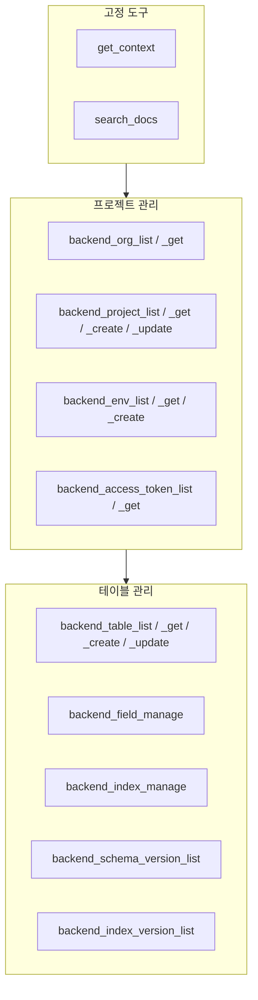

# MCP 도구 개요


💡 bkend MCP 서버가 제공하는 도구(Tools)와 리소스(Resources)의 전체 목록과 분류를 안내합니다.


## 개요

bkend MCP 서버는 AI 도구에서 백엔드를 관리할 수 있도록 **도구(Tools)**와 **리소스(Resources)**를 제공합니다. 도구는 자연어 요청을 실제 백엔드 작업으로 변환하고, 리소스는 현재 상태를 조회합니다.

***

## 도구 분류

### 고정 도구 (Fixed Tools)

MCP 서버에 연결하면 항상 사용할 수 있는 도구입니다.

| 도구 | 설명 | 상세 |
|------|------|------|
| `get_context` | 세션 컨텍스트 조회 (Organization, 프로젝트, 환경) | [컨텍스트](02-context.md) |
| `search_docs` | bkend 문서 검색 | [컨텍스트](02-context.md) |

### API 도구 (API Tools)

백엔드를 직접 관리하는 도구입니다. 모두 `backend_` 접두사를 사용합니다.

| 카테고리 | 도구 수 | 설명 | 상세 |
|----------|:-------:|------|------|
| 프로젝트 관리 | 9 | Organization, 프로젝트, 환경, 액세스 토큰 관리 | [프로젝트 도구](03-project-tools.md) |
| 테이블 관리 | 7 | 테이블, 필드, 인덱스, 스키마 버전 관리 | [테이블 도구](04-table-tools.md) |

***

## 전용 도구가 없는 기능

Auth, Storage, 데이터 CRUD는 전용 MCP 도구가 제공되지 않습니다. `search_docs`로 구현 가이드를 검색한 뒤 **REST API 코드**를 생성하는 방식으로 사용합니다.

| 기능 | MCP 도구 | 대안 |
|------|:--------:|------|
| 인증 (Auth) | ❌ | REST API 코드 생성 → [인증 도구](06-auth-tools.md) |
| 스토리지 (Storage) | ❌ | REST API 코드 생성 → [스토리지 도구](07-storage-tools.md) |
| 데이터 CRUD | ❌ | REST API 코드 생성 → [데이터 도구](05-data-tools.md) |


💡 AI 도구에 "로그인 기능을 구현해줘" 또는 "테이블에 데이터를 추가해줘"라고 요청하면, `search_docs`가 관련 문서를 검색한 뒤 REST API 호출 코드를 자동으로 생성합니다.


***

## 리소스 (Resources)

MCP 리소스는 `bkend://` URI 스키마를 통해 현재 상태를 읽기 전용으로 조회합니다. MCP가 활성화된 GET 엔드포인트에서 자동으로 생성됩니다.

| 리소스 | URI 패턴 | 설명 |
|--------|---------|------|
| Organization | `bkend://organizations/{organizationId}` | Organization 상세 |
| Organization 목록 | `bkend://organizations` | Organization 목록 |
| 프로젝트 | `bkend://projects/{projectId}` | 프로젝트 상세 |
| 프로젝트 목록 | `bkend://projects` | 프로젝트 목록 |
| 환경 | `bkend://environments/{environmentId}` | 환경 상세 |
| 환경 목록 | `bkend://environments` | 환경 목록 |
| 테이블 | `bkend://tables/{tableId}` | 테이블 상세 |
| 테이블 목록 | `bkend://tables` | 테이블 목록 |

> 상세는 [MCP 리소스](08-resources.md)를 참고하세요.

***

## 도구 전체 목록

***

## 다음 단계

- [컨텍스트](02-context.md) — `get_context`와 `search_docs` 도구 상세
- [프로젝트 도구](03-project-tools.md) — Organization, 프로젝트, 환경, 액세스 토큰 관리
- [테이블 도구](04-table-tools.md) — 테이블, 필드, 인덱스 관리
- [MCP 리소스](08-resources.md) — 리소스 URI와 조회 방법
