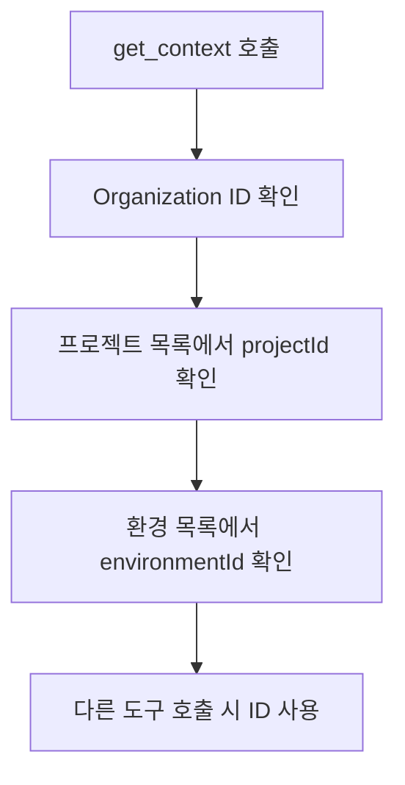

# 컨텍스트


💡 AI 도구가 bkend에 처음 연결될 때 자동으로 호출되는 `get_context`와 문서 검색 도구 `search_docs`를 안내합니다.


## get_context

AI 도구가 MCP 서버에 연결되면 **자동으로** `get_context`를 호출합니다. 이 도구는 현재 세션에서 사용할 수 있는 정보를 반환합니다.

### 파라미터

파라미터 없이 호출합니다.

### 응답 구조

```json
{
  "organization": {
    "id": "org_abc123",
    "name": "My Organization"
  },
  "projects": [
    {
      "id": "proj_xyz789",
      "name": "my-app",
      "environments": [
        {
          "id": "env_dev001",
          "name": "dev",
          "status": "active"
        }
      ]
    }
  ],
  "apiEndpoint": "https://api-client.bkend.ai",
  "warnings": []
}
```

### 반환 정보

| 항목 | 설명 |
|------|------|
| Organization | 현재 인증된 Organization의 ID와 이름 |
| 프로젝트 목록 | 접근 가능한 프로젝트와 각 환경 정보 |
| API 엔드포인트 | REST API 엔드포인트 |
| 주의사항 | 제한 사항이나 경고 메시지 |

### ID 조회 흐름

대부분의 MCP 도구는 `projectId`와 `environmentId`를 필요로 합니다. `get_context`의 응답에서 이 값을 확인할 수 있습니다.




⚠️ AI 도구가 `get_context`를 호출하지 않으면 다른 도구를 사용할 수 없습니다. 연결 후 응답이 없다면 AI 도구를 재시작하세요.


***

## search_docs

bkend 문서를 검색하는 도구입니다. Auth, Storage 등 MCP 도구가 없는 기능의 구현 방법을 찾을 때 주로 사용됩니다.

### 파라미터

| 파라미터 | 타입 | 필수 | 설명 |
|----------|------|:----:|------|
| `query` | string | ✅ | 검색 키워드 |

### 사용 예시

```json
{
  "query": "이메일 회원가입 구현 방법"
}
```

### 응답 구조

```json
{
  "results": [
    {
      "title": "이메일 회원가입",
      "content": "이메일과 비밀번호를 사용한 회원가입 방법...",
      "relevance": 0.95
    }
  ]
}
```

### 내장 문서 목록

`search_docs`가 검색하는 주요 내장 문서:

| 문서 ID | 내용 |
|---------|------|
| `3_howto_implement_auth` | 인증 구현 가이드 (회원가입, 로그인, 토큰 관리) |
| `6_code_examples_auth` | 인증 코드 예제 (이메일, 소셜, 매직링크) |


💡 AI 도구에 "로그인 기능을 만들어줘"라고 요청하면 `search_docs`가 자동으로 호출되어 관련 문서를 찾습니다.


***

## 주의사항

### 데이터 응답 형식

MCP 도구로 데이터를 조회하면 다음 형식으로 반환됩니다:

- 목록 조회: `items` 배열과 `pagination` 객체
- 단건 조회: 객체 직접 반환
- ID 필드: `id` (\_id가 아닌 `id`)

### 필수 참조 규칙

MCP 도구에서 데이터를 조회한 후 REST API 코드를 생성할 때:

| 항목 | 올바른 사용 |
|------|------------|
| API 엔드포인트 | `https://api-client.bkend.ai` |
| 필수 헤더 | `X-API-Key`, `Authorization` |
| ID 필드 | `id` |
| 목록 응답 | `{ items, pagination }` |

***

## 다음 단계

- [MCP 도구 개요](01-overview.md) — 전체 도구 분류
- [프로젝트 도구](03-project-tools.md) — Organization, 프로젝트, 환경 관리
- [데이터 도구](05-data-tools.md) — 데이터 CRUD 작업
