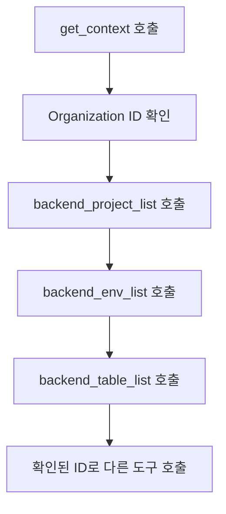

# 컨텍스트


💡 AI 도구가 bkend에 처음 연결될 때 자동으로 호출되는 `get_context`와 문서 검색 도구 `search_docs`를 안내합니다.


## get_context

AI 도구가 MCP 서버에 연결되면 가장 먼저 `get_context`를 호출해야 합니다. 이 도구는 세션 정보와 bkend 리소스 탐색 가이드를 반환합니다.

### 파라미터

파라미터 없이 호출합니다.

### 응답 내용

응답은 다음 내용을 포함하는 Markdown 형식 텍스트입니다:

**Your Session** — 현재 세션의 Organization ID와 REST API Base URL

| 항목 | 설명 |
|------|------|
| Organization ID | 현재 인증된 Organization의 ID |
| REST API Base URL | `https://api-client.bkend.ai` — REST API 호출 시 사용 |

**API Domains** — 도메인 혼동을 방지하기 위한 안내

| 도메인 | 용도 | 사용처 |
|--------|------|--------|
| `api-client.bkend.ai` | Consumer REST API 베이스 URL | 앱 코드 (fetch, axios, SDK) |
| `api.bkend.ai/mcp` | MCP 서버 연결 | AI 도구 설정만 |


🚨 **생성된 앱 코드에서 `api.bkend.ai`를 직접 사용하지 마세요.** REST API 호출에는 항상 `api-client.bkend.ai`를 사용하세요.


**Resource Hierarchy** — Organization에서 Table까지 탐색하는 방법

```
Organization → Project → Environment (dev/staging/prod) → Table
```

| 찾을 대상 | 호출 도구 | 사용 정보 |
|-----------|----------|----------|
| Organization ID | 위의 "Your Session" 참고 | - |
| Project ID | `backend_project_list` | organizationId |
| Environment | `backend_env_list` | projectId |
| Table | `backend_table_list` | projectId, environment |

### ID 조회 흐름

대부분의 MCP 도구는 `projectId`나 `tableId`를 필요로 합니다. 리소스 계층을 따라 이 값을 확인하세요.




⚠️ AI 도구가 `get_context`를 호출하지 않으면 잘못된 API URL을 사용할 수 있습니다. 매 세션마다 반드시 이 도구를 먼저 호출하세요.


***

## search_docs

GitBook을 통해 bkend 문서를 검색하는 도구입니다. Auth, Storage, 데이터 CRUD 등 구현 가이드를 찾을 때 사용합니다.

### 파라미터

| 파라미터 | 타입 | 필수 | 설명 |
|----------|------|:----:|------|
| `query` | string | Yes | 검색 키워드 (예: "회원가입 인증", "CRUD 필터링") |

### 사용 예시

```json
{
  "query": "이메일 회원가입 구현 방법"
}
```

### 응답 내용

응답은 최대 5개의 일치 페이지와 관련 섹션이 포함된 Markdown 형식 검색 결과입니다.

```text
## Search Results for "이메일 회원가입"

### 이메일 회원가입
**개요**
이메일과 비밀번호를 사용한 회원가입 방법...

---
```


💡 AI 도구에 "로그인 기능을 만들어줘"라고 요청하면 `search_docs`가 자동으로 호출되어 관련 문서를 찾고 REST API 코드를 생성합니다.


***

## 주의사항

### 데이터 응답 형식

MCP 도구로 데이터를 조회하면 다음 형식으로 반환됩니다:

- 목록 조회: `items` 배열과 `pagination` 객체
- 단건 조회: 객체 직접 반환
- ID 필드: `id` (`_id`가 아닌 `id`)

### 필수 참조 규칙

MCP 도구에서 데이터를 조회한 후 REST API 코드를 생성할 때:

| 항목 | 올바른 사용 |
|------|------------|
| API 엔드포인트 | `https://api-client.bkend.ai` |
| 필수 헤더 | `X-API-Key`, `Authorization` (인증 필요 시) |
| ID 필드 | `id` |
| 목록 응답 | `{ items, pagination }` |

***

## 다음 단계

- [MCP 도구 개요](01-overview.md) — 전체 도구 분류
- [프로젝트 도구](03-project-tools.md) — Organization, 프로젝트, 환경, 액세스 토큰 관리
- [테이블 도구](04-table-tools.md) — 테이블, 필드, 인덱스 관리
